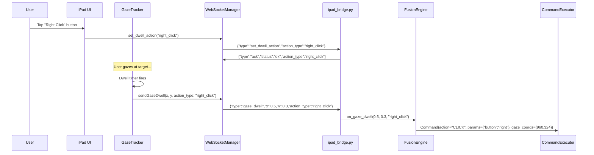
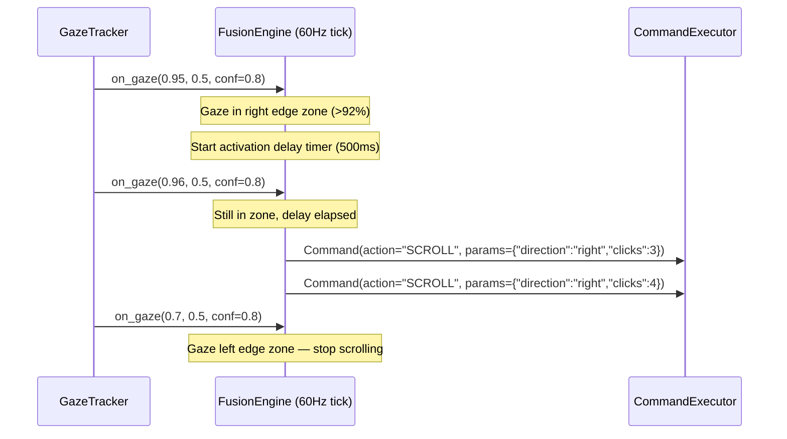

# Design Document: Enhanced Gaze Dwell Actions

## Overview

This design extends the Personal Desktop Agent's gaze dwell system from a single left-click action to a full action vocabulary: right-click, double-click, drag (start/end), and edge-scroll. It adds a feature toggle system for per-action enable/disable control and an optional gaze-to-cursor mode where the desktop cursor follows gaze position in real time.

The design preserves the existing architecture: the `Command` dataclass remains the sole DTO, `FusionEngine` remains the 60 Hz routing hub, and all new features degrade gracefully when sensors are unavailable. No new action verbs are introduced — the existing `CLICK`, `MOUSEDOWN`, `MOUSEUP`, and `SCROLL` vocabulary covers all new dwell action types through parameterization.

### Key Design Decisions

1. **Action type lives on iPad, travels via WebSocket** — The iPad holds the "active dwell action" state and includes it in every `gaze_dwell` message. The PC side is stateless with respect to action selection (except for drag-state tracking).
2. **Drag is a two-phase state machine** — `drag-start` emits `MOUSEDOWN`, auto-transitions to `drag-end` mode, then `drag-end` emits `MOUSEUP` and resets to `left-click`.
3. **Edge scroll is a FusionEngine concern** — It runs on the PC at 60 Hz using the continuous gaze stream, not the dwell timer. It's independent of the dwell action selector.
4. **Feature toggles sync bidirectionally** — iPad is the primary UI, but PC config is authoritative for persistence. Changes propagate via WebSocket with local-first semantics (apply immediately, sync when connected).
5. **Gaze-to-cursor suppresses tilt and head** — When active, it takes over cursor positioning entirely, preventing conflicting inputs from lower-priority sensors.

## Architecture

```mermaid
graph TD
    subgraph iPad
        UI[DwellActionToolbar]
        GT[GazeTracker.swift]
        SS[SettingsStore.swift]
        WS[WebSocketManager.swift]
    end

    subgraph PC
        IB[ipad_bridge.py]
        FE[FusionEngine]
        CE[CommandExecutor]
        FC[FusionConfig]
    end

    UI -->|set_dwell_action| WS
    GT -->|gaze_dwell + action_type| WS
    GT -->|gaze stream| WS
    SS -->|set_feature_toggle| WS
    WS -->|WebSocket| IB
    IB -->|on_gaze_dwell(x, y, action_type)| FE
    IB -->|on_gaze(x, y, conf)| FE
    IB -->|toggle state| FC
    FE -->|Command| CE
    FE -->|edge scroll detection| FE
    FE -->|gaze-to-cursor| CE
```

### Component Interaction Sequence (Dwell Action)



### Edge Scroll Data Flow



## Components and Interfaces

### iPad-Side Components

#### DwellActionSelector (new)

State machine managing the active dwell action type. Lives in `SettingsStore.swift` as published properties.

```swift
enum DwellActionType: String, Codable, CaseIterable {
    case leftClick = "left_click"
    case rightClick = "right_click"
    case doubleClick = "double_click"
    case dragStart = "drag_start"
    case dragEnd = "drag_end"
}

// Added to SettingsStore.swift
@Published var activeDwellAction: DwellActionType  // persisted to UserDefaults
@Published var oneShotEnabled: Bool                 // default: false
@Published var isDragging: Bool                     // transient, not persisted
```

**State transitions:**
- Any action selected → updates `activeDwellAction`, sends `set_dwell_action` via WebSocket
- `dragStart` fires → auto-set `activeDwellAction = .dragEnd`, set `isDragging = true`
- `dragEnd` fires → auto-set `activeDwellAction = .leftClick`, set `isDragging = false`
- One-shot enabled + non-default action fires → reset to `.leftClick`

#### DwellActionToolbar (new SwiftUI view)

```swift
struct DwellActionToolbar: View {
    @ObservedObject var settings: SettingsStore
    @ObservedObject var ws: WebSocketManager
    
    // 5 buttons: left-click, right-click, double-click, drag, scroll-toggle
    // Min touch target: 44x44 pt
    // Position: top-anchored | bottom-anchored | floating (persisted)
    // Drag indicator: pulsing animation when isDragging == true
}
```

#### GazeTracker.swift (modified)

Changes:
- `sendGazeDwell()` now includes `action_type` from `SettingsStore.activeDwellAction`
- After sending dwell, applies state transitions (drag auto-advance, one-shot reset)
- Dwell timer suppressed when all dwell actions are disabled (but gaze stream continues)

#### FeatureToggleStore (extension of SettingsStore)

```swift
// Added to SettingsStore.swift
@Published var gazeDwellClickEnabled: Bool      // default: true
@Published var gazeDwellRightClickEnabled: Bool  // default: true
@Published var gazeDwellDoubleClickEnabled: Bool // default: true
@Published var gazeDwellDragEnabled: Bool        // default: true
@Published var edgeScrollEnabled: Bool           // default: true
@Published var gazeCursorModeEnabled: Bool       // default: true

// Computed: are ALL dwell actions disabled?
var allDwellActionsDisabled: Bool { ... }
```

### PC-Side Components

#### FusionEngine (modified)

New responsibilities:
1. **Action-type-aware dwell routing** — Maps `action_type` string to appropriate `Command` action + params
2. **Edge scroll detection** — Monitors continuous gaze stream for edge zone occupancy
3. **Gaze-to-cursor mode** — Moves cursor to smoothed gaze position on every tick
4. **Feature toggle enforcement** — Discards events for disabled features

New state added to `FusionEngine`:

```python
# Edge scroll state
self._edge_scroll_active: bool = False
self._edge_scroll_start: float | None = None  # monotonic time entered zone
self._edge_scroll_direction: str | None = None  # "up"/"down"/"left"/"right"

# Gaze-to-cursor state
self._gaze_cursor_last: tuple[int, int] | None = None  # last smoothed pixel pos
self._gaze_cursor_ema: tuple[float, float] | None = None  # EMA state (norm coords)

# Drag state (PC-side tracking for safety)
self._drag_active: bool = False

# Feature toggles (synced from iPad via bridge)
self._feature_toggles: dict[str, bool] = {
    "gaze_dwell_click": True,
    "gaze_dwell_right_click": True,
    "gaze_dwell_double_click": True,
    "gaze_dwell_drag": True,
    "edge_scroll": True,
    "gaze_cursor_mode": True,
}
```

New method signatures:

```python
def on_gaze_dwell(self, x: float, y: float, action_type: str = "left_click") -> None:
    """Accept dwell event with action type. Replaces old on_gaze_dwell(x, y)."""

def set_feature_toggle(self, feature: str, enabled: bool) -> None:
    """Update a feature toggle. Called by IPadBridge on set_feature_toggle messages."""

def _check_edge_scroll(self, gaze_x: float, gaze_y: float) -> None:
    """Called every tick when gaze data available. Emits SCROLL commands if in edge zone."""

def _apply_gaze_cursor(self, gaze_x: float, gaze_y: float, conf: float) -> None:
    """Move cursor to smoothed gaze position when gaze-to-cursor mode is active."""
```

#### FusionConfig (extended)

```python
@dataclass
class FusionConfig:
    # ... existing fields ...
    
    # Edge scroll
    edge_scroll_zone_pct: float = 0.08       # 8% from each edge
    edge_scroll_delay_ms: int = 500          # activation delay
    edge_scroll_min_speed: int = 1           # scroll units/tick at inner boundary
    edge_scroll_max_speed: int = 10          # scroll units/tick at screen edge
    
    # Gaze-to-cursor
    gaze_cursor_ema_alpha: float = 0.3       # smoothing factor
    gaze_cursor_max_jump_pct: float = 0.05   # max 5% of screen diagonal per tick
    gaze_cursor_conf_min: float = 0.55       # minimum confidence to move cursor
    gaze_cursor_lost_timeout_s: float = 0.5  # hold position after this duration
```

#### IPadBridge (modified)

New message handlers:
- `set_dwell_action` — Updates active dwell action type, responds with ack
- `set_feature_toggle` — Updates feature toggle, responds with ack
- Modified `gaze_dwell` handler — Passes `action_type` field to FusionEngine
- Modified welcome message — Includes `active_dwell_action` field

### WebSocket Protocol Messages (new/modified)

| Message | Direction | Fields |
|---------|-----------|--------|
| `gaze_dwell` (modified) | iPad → PC | `type`, `id`, `x`, `y`, `action_type` |
| `set_dwell_action` (new) | iPad → PC | `type`, `action_type` |
| `set_feature_toggle` (new) | iPad → PC | `type`, `feature`, `enabled` |
| `ack` (extended) | PC → iPad | `type`, `id`, `status`, `action_type`/`feature`/`enabled`, `error` |
| `status` (extended) | PC → iPad | adds `active_dwell_action` field |

## Data Models

### Command Dataclass (unchanged structure, new usage patterns)

The existing `Command` dataclass handles all new dwell actions without modification:

| Dwell Action | Command.action | Command.params | Command.gaze_coords |
|---|---|---|---|
| left-click | `"CLICK"` | `{}` | `(px_x, px_y)` |
| right-click | `"CLICK"` | `{"button": "right"}` | `(px_x, px_y)` |
| double-click | `"CLICK"` | `{"clicks": "2"}` | `(px_x, px_y)` |
| drag-start | `"MOUSEDOWN"` | `{}` | `(px_x, px_y)` |
| drag-end | `"MOUSEUP"` | `{}` | `(px_x, px_y)` |
| edge-scroll | `"SCROLL"` | `{"direction": "...", "clicks": N}` | `None` |

### Coordinate Computation

All gaze-to-pixel conversion uses the same formula:
```
px_x = round(clamp(normalized_x, 0.0, 1.0) × screen_width)
px_y = round(clamp(normalized_y, 0.0, 1.0) × screen_height)
```

### Feature Toggle Persistence

**iPad (UserDefaults):**
```swift
// Keys: "gazeDwellClickEnabled", "gazeDwellRightClickEnabled", etc.
// Values: Bool (default true)
```

**PC (FusionConfig serialization):**
```python
# Stored in existing config mechanism alongside other FusionConfig fields
# Keys match WebSocket protocol: "gaze_dwell_click", "edge_scroll", etc.
```

### Edge Scroll Zone Geometry

```
┌─────────────────────────────────────────┐
│  ┌─────────────────────────────────┐    │
│  │         TOP ZONE (8%)           │    │
│  ├──┬──────────────────────────┬──┤    │
│  │L │                          │R │    │
│  │E │                          │I │    │
│  │F │      SAFE AREA           │G │    │
│  │T │      (no scroll)         │H │    │
│  │  │                          │T │    │
│  │8%│                          │8%│    │
│  ├──┴──────────────────────────┴──┤    │
│  │        BOTTOM ZONE (8%)        │    │
│  └─────────────────────────────────┘    │
└─────────────────────────────────────────┘
```

Corner regions (where two zones overlap) emit diagonal scroll combining both directions.

### Gaze-to-Cursor EMA Smoothing

```python
# On each tick with valid gaze:
ema_x = alpha * raw_x + (1 - alpha) * prev_ema_x
ema_y = alpha * raw_y + (1 - alpha) * prev_ema_y

# Clamp displacement to max_jump_pct of screen diagonal
displacement = hypot(ema_x - prev_x, ema_y - prev_y) * screen_diag
if displacement > max_jump_pct * screen_diag:
    # Scale back to max allowed
    scale = (max_jump_pct * screen_diag) / displacement
    ema_x = prev_x + (ema_x - prev_x) * scale
    ema_y = prev_y + (ema_y - prev_y) * scale
```

## Correctness Properties

*A property is a characteristic or behavior that should hold true across all valid executions of a system — essentially, a formal statement about what the system should do. Properties serve as the bridge between human-readable specifications and machine-verifiable correctness guarantees.*

### Property 1: Dwell action-to-Command mapping

*For any* valid action type in {"left_click", "right_click", "double_click", "drag_start", "drag_end"} and any normalized coordinates (x, y) in [0.0, 1.0]², the FusionEngine SHALL emit exactly one Command with the correct action verb, correct params, source="gaze_dwell", and gaze_coords equal to (round(x × screen_width), round(y × screen_height)).

**Validates: Requirements 2.1, 2.2, 2.3, 2.4, 2.5, 2.6**

### Property 2: Coordinate clamping invariant

*For any* normalized coordinates (x, y) where either value is outside [0.0, 1.0], the FusionEngine SHALL clamp both values to [0.0, 1.0] before computing pixel coordinates, such that the resulting gaze_coords are always within [0, screen_width] × [0, screen_height].

**Validates: Requirements 2.8**

### Property 3: Invalid action type rejection

*For any* string not in the set {"left_click", "right_click", "double_click", "drag_start", "drag_end"}, when received as an action_type in a gaze_dwell event, the FusionEngine SHALL emit no Command and SHALL log a warning.

**Validates: Requirements 2.7**

### Property 4: Drag state machine transitions

*For any* dwell action selector state, when a drag-start action fires the selector SHALL transition to drag-end mode, and when a drag-end action subsequently fires the selector SHALL reset to left-click mode — regardless of what action type was active before the drag sequence began.

**Validates: Requirements 1.3, 1.4**

### Property 5: One-shot reset behavior

*For any* non-default action type (right-click, double-click) with one-shot mode enabled, after the action fires exactly once, the dwell action selector SHALL reset to left-click mode.

**Validates: Requirements 1.5**

### Property 6: Voice command to action type mapping

*For any* voice command string and confidence value, if the string matches a supported action pattern AND confidence exceeds the threshold, the selector SHALL switch to the corresponding action type; if the string does not match OR confidence is below threshold, the selector SHALL remain unchanged.

**Validates: Requirements 1.6, 1.7**

### Property 7: Edge scroll activation after delay

*For any* gaze position within an Edge_Scroll_Zone that persists for longer than the configured activation delay, the FusionEngine SHALL emit one SCROLL Command per tick in the direction corresponding to the occupied edge zone.

**Validates: Requirements 3.1**

### Property 8: Edge scroll deactivation within one tick

*For any* active edge scroll state, when the gaze position moves outside all Edge_Scroll_Zones, the FusionEngine SHALL emit zero SCROLL Commands on the immediately following tick.

**Validates: Requirements 3.3**

### Property 9: Edge scroll speed linear interpolation

*For any* gaze position within an Edge_Scroll_Zone, the scroll speed (units per tick) SHALL equal a linear interpolation from edge_scroll_min_speed at the inner boundary to edge_scroll_max_speed at the screen edge, proportional to the depth into the zone.

**Validates: Requirements 3.4**

### Property 10: Corner diagonal scroll

*For any* gaze position that falls within two overlapping Edge_Scroll_Zones (a corner region), the FusionEngine SHALL emit SCROLL Commands combining both corresponding directions.

**Validates: Requirements 3.7**

### Property 11: Feature toggle enforcement

*For any* feature that is disabled in the Feature_Toggle_Store, and any incoming event that would normally trigger that feature, the FusionEngine SHALL discard the event without emitting a Command, and SHALL not alter the state of other active features.

**Validates: Requirements 3.5, 4.2**

### Property 12: Toggle persistence round-trip

*For any* combination of feature toggle states (each independently true or false), after persisting to storage and reloading, all toggle states SHALL match their pre-persistence values exactly.

**Validates: Requirements 4.1, 4.6**

### Property 13: Gaze-to-cursor EMA displacement cap

*For any* sequence of raw gaze positions fed to the gaze-to-cursor system, the frame-to-frame cursor displacement SHALL never exceed 5% of the screen diagonal in a single tick, regardless of how large the raw gaze position jump is.

**Validates: Requirements 5.3**

### Property 14: Gaze-to-cursor suppresses tilt and head

*For any* tick where Gaze_Cursor_Mode is enabled, tilt events and head tracking events SHALL not cause any cursor movement, even when gaze tracking is temporarily lost.

**Validates: Requirements 5.2**

### Property 15: Low-confidence gaze holds cursor position

*For any* gaze sample with confidence below the configured minimum threshold (default 0.55) while Gaze_Cursor_Mode is enabled, the cursor position SHALL remain at its last known position (unchanged from the previous tick).

**Validates: Requirements 5.5**

### Property 16: Dwell fires at smoothed cursor position

*For any* dwell event that fires while Gaze_Cursor_Mode is enabled, the gaze_coords in the emitted Command SHALL equal the current EMA-smoothed cursor position, not the raw gaze position.

**Validates: Requirements 5.7**

### Property 17: WebSocket set_dwell_action protocol correctness

*For any* `set_dwell_action` message: if action_type is in the valid set, the bridge SHALL respond with ack status "ok" echoing the action_type and update internal state; if action_type is not in the valid set, the bridge SHALL respond with ack status "error" and retain the previous action type unchanged. For any `gaze_dwell` message missing the action_type field, the bridge SHALL use the currently active action type.

**Validates: Requirements 7.2, 7.4, 7.5**

### Property 18: Edge scroll zone boundary computation

*For any* configurable edge_scroll_zone_pct value in [0.02, 0.20], the Edge_Scroll_Zone boundaries SHALL be computed as exactly (edge_scroll_zone_pct × screen_dimension) pixels from each screen edge, applied independently to all four edges.

**Validates: Requirements 3.2**

## Error Handling

### iPad-Side Errors

| Error Condition | Handling |
|---|---|
| ARKit face tracking unavailable | GazeTracker logs warning, does not start. Dwell toolbar remains visible but non-functional. System continues with other input modalities. |
| WebSocket disconnected during action selection | Queue action type locally in SettingsStore. Send on reconnection. Toolbar remains interactive. |
| WebSocket disconnected during drag | iPad shows "dragging" indicator. On reconnection, send current drag state. If reconnection fails for >10s, auto-cancel drag (reset to left-click). |
| Invalid toolbar position in UserDefaults | Fall back to bottom-anchored default. Log warning. |

### PC-Side Errors

| Error Condition | Handling |
|---|---|
| Unrecognized action_type in gaze_dwell message | Discard event, log warning with the invalid value. Do not crash or alter state. |
| Coordinates outside [0.0, 1.0] | Clamp to valid range. Log at DEBUG level (common during calibration). |
| pyautogui fails during cursor move (gaze-to-cursor) | Catch exception, log error, hold cursor at last known position. Do not disable mode. |
| Feature toggle message with unknown feature name | Respond with ack status "error", do not modify any toggle state. |
| FusionEngine tick exceeds 16ms budget | Log warning. Skip edge scroll computation for that tick to maintain responsiveness. Dwell events still processed (higher priority). |
| Mouse stuck in down state (drag-start without drag-end) | Safety timeout: if no drag-end received within 30s, auto-release mouse button and reset to left-click. Log error. |

### Graceful Degradation

- If gaze tracking is unavailable, all gaze-dependent features (dwell actions, edge scroll, gaze-to-cursor) are inert. Other input modalities continue.
- If WebSocket is down, iPad applies changes locally. PC retains last-known toggle state.
- If pyautogui is unavailable (e.g., locked screen), Commands are logged but not executed. System resumes when desktop is accessible.

## Testing Strategy

### Property-Based Testing

**Library:** [Hypothesis](https://hypothesis.readthedocs.io/) (Python, for PC-side logic)

Property-based tests validate the correctness properties defined above. Each test runs a minimum of 100 iterations with randomized inputs.

**Tag format:** `Feature: enhanced-gaze-dwell, Property {N}: {title}`

**PC-side properties to test (Hypothesis):**
- Property 1: Action-to-Command mapping (generate random valid action types + coordinates)
- Property 2: Coordinate clamping (generate floats in [-1.0, 2.0] range)
- Property 3: Invalid action type rejection (generate arbitrary strings excluding valid set)
- Property 7–10: Edge scroll behavior (generate gaze position sequences + timing)
- Property 11: Feature toggle enforcement (generate events + toggle states)
- Property 12: Toggle persistence round-trip (generate random toggle combinations)
- Property 13: EMA displacement cap (generate random gaze jump sequences)
- Property 14: Tilt/head suppression (generate tilt/head events with gaze-cursor enabled)
- Property 15: Low-confidence hold (generate gaze samples with varying confidence)
- Property 16: Dwell at smoothed position (generate gaze sequences leading to dwell)
- Property 17: WebSocket protocol (generate valid/invalid action types + missing fields)
- Property 18: Zone boundary computation (generate zone percentages in valid range)

**iPad-side properties (Swift, using SwiftCheck or swift-testing with randomization):**
- Property 4: Drag state machine transitions
- Property 5: One-shot reset behavior
- Property 6: Voice command mapping

### Unit Tests (Example-Based)

- Toolbar renders exactly 5 buttons with correct labels
- Toolbar defaults to bottom-anchored on fresh install
- Minimum touch target size (44×44 pt) for all buttons
- Welcome message includes `active_dwell_action` field
- Drag timeout safety release after 30s
- Gaze loss >500ms holds cursor and logs warning

### Integration Tests

- End-to-end: iPad tap → WebSocket → FusionEngine → Command emission
- Toggle sync: change on iPad → propagate to PC → verify FusionEngine state
- Reconnection: disconnect during drag → reconnect → verify state consistency
- Latency: set_dwell_action ack within 100ms, toggle propagation within 500ms

