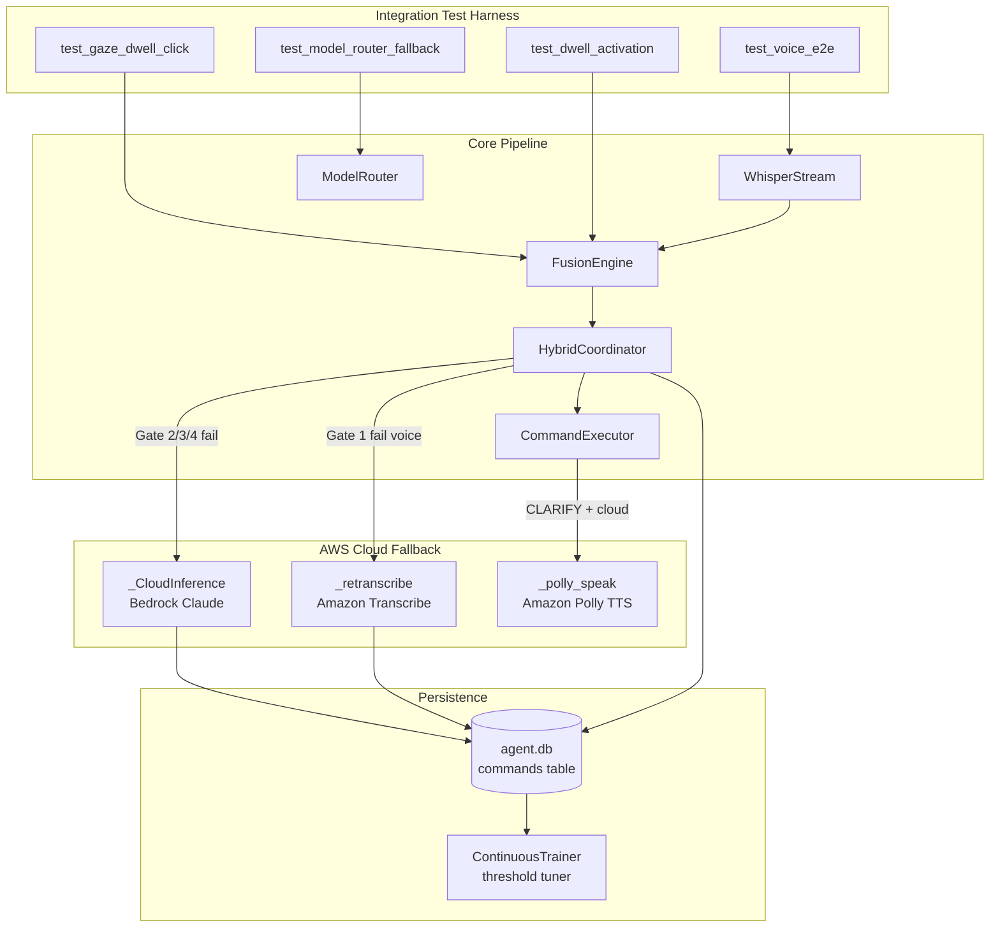
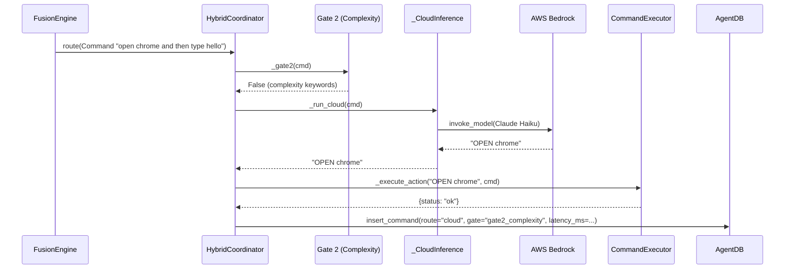
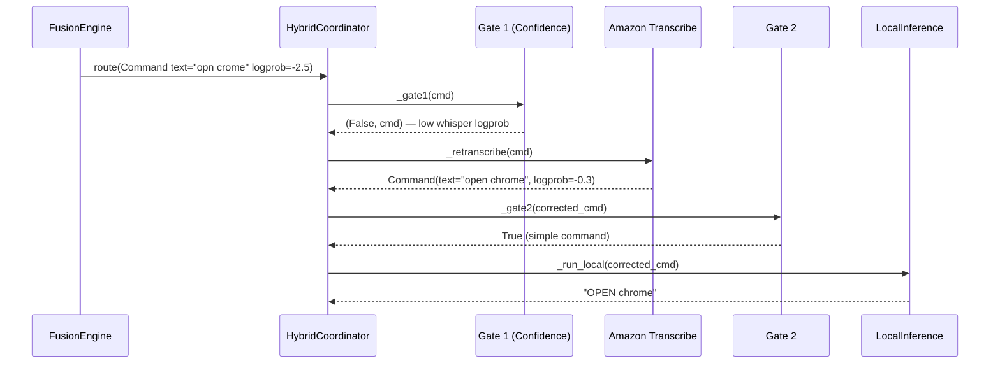
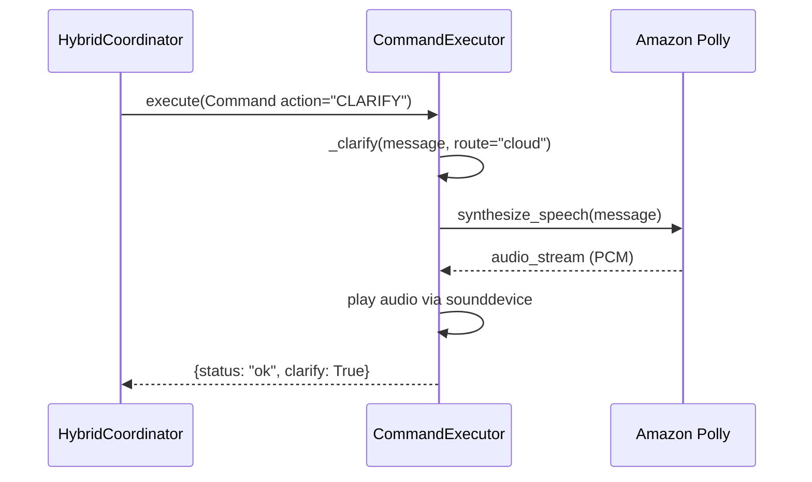
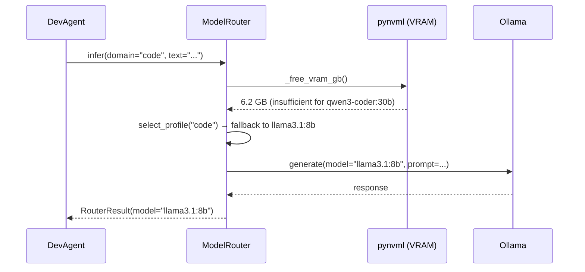

# Design Document: Integration Tests & Cloud Fallback

## Overview

This feature completes two related gaps in the Personal Desktop Agent: four incomplete integration tests that validate core accessibility paths (gaze dwell click, dwell activation timeout, voice e2e, ModelRouter VRAM fallback), and the Phase 6 AWS cloud fallback wiring (Bedrock inference, Transcribe re-transcription, Polly TTS clarification, and cloud latency logging that feeds the threshold tuner).

The integration tests use the project's established standalone async pattern — no pytest, just `asyncio.run()` with mocked hardware and assertions. The cloud fallback extends the existing `_CloudInference` and `_retranscribe()` stubs in `hybrid_coordinator.py`, adds Polly TTS to `CommandExecutor._clarify()`, and ensures all cloud latency data flows into `agent.db` for ContinuousTrainer adaptation.

Both halves share a design principle: cloud calls are last-resort fallbacks only, all sensor access degrades gracefully, and the `Command` dataclass remains the sole DTO crossing pipeline boundaries.

## Architecture



## Sequence Diagrams

### Gate 2 Fires → Bedrock Cloud Inference



### Gate 1 Fires → Transcribe Re-transcription



### Polly TTS Clarification (Cloud Path)



### ModelRouter VRAM Fallback



## Components and Interfaces

### Component 1: CloudInference (Enhanced)

**Purpose**: Route commands to AWS Bedrock Claude when local gates fail. Currently implemented but needs credential configuration and latency logging integration.

```python
class _CloudInference:
    def __init__(self, model_id: str, region: str) -> None: ...
    def _get_client(self) -> "botocore.client.BedrockRuntime": ...
    async def infer(self, cmd: Command) -> str: ...
```

**Responsibilities**:
- Lazy-initialize boto3 Bedrock client with configured region
- Send command text to Claude Haiku via `invoke_model`
- Return first-line action string
- Log latency to AgentDB via coordinator

### Component 2: TranscribeRetranscription (New Implementation)

**Purpose**: Replace the `_retranscribe()` stub with a real Amazon Transcribe streaming call when Gate 1 fires for voice commands with low Whisper confidence.

```python
async def _retranscribe(cmd: Command, region: str = "us-east-1") -> Command:
    """Re-transcribe audio via Amazon Transcribe streaming API.
    
    Args:
        cmd: Command with params['audio_bytes'] containing raw PCM.
        region: AWS region for Transcribe endpoint.
    
    Returns:
        New Command with corrected text and updated logprob.
        Falls back to original cmd if Transcribe fails.
    """
```

**Responsibilities**:
- Extract `audio_bytes` from `cmd.params`
- Stream to Amazon Transcribe via boto3 `start_stream_transcription`
- Return new Command with corrected text
- Graceful fallback: return original cmd on any failure

### Component 3: PollyTTS (New)

**Purpose**: Speak clarification messages aloud when the cloud path produces a CLARIFY action, providing audio feedback without requiring the user to look at the screen.

```python
async def _polly_speak(message: str, region: str = "us-east-1") -> bool:
    """Synthesize speech via Amazon Polly and play through speakers.
    
    Args:
        message: Text to speak.
        region: AWS region.
    
    Returns:
        True if audio played successfully, False on failure.
    """
```

**Responsibilities**:
- Call Polly `synthesize_speech` with Neural voice (e.g., "Matthew")
- Stream PCM audio to `sounddevice` for playback
- Non-blocking (runs in thread)
- Graceful degradation: log warning and return False on failure

### Component 4: Integration Test Suite

**Purpose**: Four standalone async tests validating core accessibility paths.

```python
# tests/test_gaze_dwell_e2e.py — already exists, needs completion
# tests/test_dwell_activation.py — new
# tests/test_voice_e2e.py — new
# tests/test_model_router_fallback.py — new
```

**Responsibilities**:
- Each test file is self-contained with `asyncio.run()`
- Mock hardware (pyautogui, pynvml, sounddevice, boto3)
- Assert correct pipeline traversal and action execution
- Exit code 0/1 for CI compatibility

## Data Models

### Command (Existing — No Changes)

```python
@dataclass
class Command:
    text: str
    action: str
    source: str
    whisper_logprob: float = 0.0
    gesture_confidence: float = 1.0
    session_context: list[str] = field(default_factory=list)
    gaze_coords: tuple[int, int] | None = None
    params: dict[str, Any] = field(default_factory=dict)
```

**Validation Rules**:
- `source` must be one of: touch, sound_action, gaze_dwell, multimodal, tilt, head_track, gesture, voice_local, voice
- `action` must be one of the 11 accessibility verbs or 5 dev verbs
- `params['audio_bytes']` present when source="voice" (for Transcribe fallback)

### Cloud Routing Log Entry (in agent.db commands table)

```python
# Existing schema — cloud routes are distinguished by:
#   route = "cloud"
#   gate_that_decided = "gate2_complexity" | "gate3_vram" | "gate4_latency"
#   latency_ms = total round-trip including network
```

### CoordinatorConfig (Extended)

```python
@dataclass
class CoordinatorConfig:
    # ... existing fields ...
    
    # AWS Transcribe (Gate 1 voice fallback)
    transcribe_region: str = "us-east-1"
    transcribe_language: str = "en-US"
    
    # Amazon Polly (TTS for cloud CLARIFY)
    polly_region: str = "us-east-1"
    polly_voice_id: str = "Matthew"
    polly_engine: str = "neural"
```

## Algorithmic Pseudocode

### Main Cloud Routing Algorithm

```python
async def route(self, cmd: Command) -> dict:
    """Full gate decision tree with cloud fallback."""
    # Gate 0 — Privacy: sensitive data forces local
    if not self._gate0(cmd):
        action = await self._run_local(cmd)
        gate = "gate0_privacy"
        route_label = "local"
    
    # Bypass sources (touch, sound_action, gaze_dwell, multimodal)
    elif cmd.source in _BYPASS_SOURCES:
        action = await self._run_local(cmd)
        gate = "bypass"
        route_label = "local"
    
    # Full 4-gate evaluation
    else:
        # Gate 1 — Confidence
        passed, cmd = await self._gate1(cmd)
        if passed is None:
            return {"status": "discarded"}  # gesture low conf
        if not passed:
            cmd = await _retranscribe(cmd, self._cfg.transcribe_region)
        
        # Gates 2-4 — Complexity, VRAM, Latency
        action, gate, route_label = await self._gates_2_to_4(cmd)
    
    # Execute and log
    result = await self._execute_action(action, cmd)
    await self._log_to_db(cmd, action, route_label, gate, latency_ms)
    return result
```

**Preconditions:**
- `cmd` is a valid Command with non-empty `text`
- AWS credentials configured in environment or ~/.aws/credentials
- boto3 installed and importable

**Postconditions:**
- Returns dict with `status` key ("ok", "error", or "discarded")
- Command logged to agent.db with route and gate info
- Latency EMA updated for Gate 4 adaptation

### Transcribe Re-transcription Algorithm

```python
async def _retranscribe(cmd: Command, region: str = "us-east-1") -> Command:
    """Re-transcribe via Amazon Transcribe when Whisper confidence is low."""
    audio_bytes = cmd.params.get("audio_bytes")
    if not audio_bytes:
        log.debug("No audio_bytes in cmd.params — returning original")
        return cmd
    
    try:
        import boto3
        client = boto3.client("transcribe-streaming", region_name=region)
        
        # Stream audio to Transcribe
        response = await asyncio.to_thread(
            _transcribe_sync, client, audio_bytes
        )
        
        if response and response.strip():
            return Command(
                text=response,
                action=cmd.action,
                source=cmd.source,
                whisper_logprob=-0.3,  # Transcribe doesn't give logprob; use neutral
                gesture_confidence=cmd.gesture_confidence,
                session_context=cmd.session_context,
                gaze_coords=cmd.gaze_coords,
                params=cmd.params,
            )
    except Exception as exc:
        log.warning("Transcribe fallback failed: %s", exc)
    
    return cmd  # graceful fallback to original
```

**Preconditions:**
- `cmd.params['audio_bytes']` contains valid 16kHz PCM audio (or is absent)
- AWS credentials available for Transcribe service

**Postconditions:**
- Returns a Command with corrected text if Transcribe succeeds
- Returns original cmd unchanged on any failure
- Never raises — always degrades gracefully

### Polly TTS Algorithm

```python
async def _polly_speak(message: str, region: str = "us-east-1",
                       voice_id: str = "Matthew", engine: str = "neural") -> bool:
    """Speak a clarification message via Amazon Polly."""
    try:
        import boto3
        import sounddevice as sd
        import numpy as np
        
        client = boto3.client("polly", region_name=region)
        
        response = await asyncio.to_thread(
            client.synthesize_speech,
            Text=message,
            OutputFormat="pcm",
            SampleRate="16000",
            VoiceId=voice_id,
            Engine=engine,
        )
        
        audio_stream = response["AudioStream"].read()
        samples = np.frombuffer(audio_stream, dtype=np.int16)
        
        await asyncio.to_thread(
            sd.play, samples, samplerate=16000, blocking=True
        )
        return True
        
    except ImportError as exc:
        log.warning("Polly TTS unavailable (missing dep): %s", exc)
        return False
    except Exception as exc:
        log.warning("Polly TTS failed: %s", exc)
        return False
```

**Preconditions:**
- `message` is non-empty string
- sounddevice and numpy installed
- Audio output device available

**Postconditions:**
- Returns True if audio played successfully
- Returns False on any failure (never raises)
- Audio plays through default output device

### ModelRouter VRAM Fallback Algorithm

```python
def select_profile(self, domain: str) -> ModelProfile:
    """Choose best model that fits in available VRAM."""
    free_gb = _free_vram_gb()
    chain = _FALLBACK.get(domain, ["llama3.1:8b"])
    
    for model_name in chain:
        profile = self._find_profile(model_name)
        if profile and profile.vram_gb <= free_gb + 2.0:
            return profile
    
    # Ultimate fallback — smallest model
    return self._profiles["command"]  # llama3.1:8b (4.6 GB)
```

**Preconditions:**
- pynvml available (or returns 999.0 GB as safe default)
- At least one model in fallback chain fits in VRAM

**Postconditions:**
- Returns a ModelProfile that fits in current VRAM (with 2 GB tolerance)
- Never returns None — always falls back to command profile
- Logs the selection decision

**Loop Invariants:**
- Each iteration checks a progressively smaller model
- Chain is ordered largest → smallest VRAM requirement

## Key Functions with Formal Specifications

### Function 1: _retranscribe()

```python
async def _retranscribe(cmd: Command, region: str = "us-east-1") -> Command
```

**Preconditions:**
- `cmd` is a valid Command instance
- `cmd.source` == "voice" (only called for voice commands)

**Postconditions:**
- Returns Command with `text` updated if Transcribe succeeds
- Returns original `cmd` unchanged if audio_bytes missing or Transcribe fails
- `whisper_logprob` set to -0.3 (neutral) for Transcribe results
- No side effects on input `cmd`

### Function 2: _polly_speak()

```python
async def _polly_speak(message: str, region: str, voice_id: str, engine: str) -> bool
```

**Preconditions:**
- `message` is non-empty string
- Audio output device exists on system

**Postconditions:**
- Returns `True` iff audio was played to completion
- Returns `False` on any failure (import, network, audio device)
- Never raises exceptions
- Blocks calling coroutine until playback completes (via to_thread)

### Function 3: CommandExecutor._clarify() (Enhanced)

```python
async def _clarify(self, message: str, route: str = "local") -> dict
```

**Preconditions:**
- `message` is the clarification text from LLM
- `route` is "local" or "cloud"

**Postconditions:**
- If `route == "cloud"`: calls `_polly_speak(message)` for audio feedback
- Always returns `{"clarify": True, "message": message, "spoken": bool}`
- Polly failure does not prevent the clarify result from returning

### Function 4: HybridCoordinator._run_cloud()

```python
async def _run_cloud(self, cmd: Command) -> str
```

**Preconditions:**
- At least one cloud backend available (AgentCore or raw Bedrock)
- AWS credentials configured

**Postconditions:**
- Returns action string (e.g., "OPEN chrome")
- Falls back AgentCore → raw Bedrock → "CLARIFY cloud unavailable"
- Latency recorded in EMA for Gate 4 adaptation

## Example Usage

```python
# --- Test: Gaze dwell fires click ---
async def test_gaze_dwell_fires_click():
    mock_infer = AsyncMock(return_value="CLICK")
    mock_click = MagicMock(return_value={"clicked": True})
    
    fusion = FusionEngine(1920, 1080)
    coordinator = HybridCoordinator(local=mock_infer_wrapper)
    fusion.set_coordinator(coordinator)
    
    # Simulate iPad sending gaze_dwell
    fusion.on_gaze_dwell(0.5, 0.5)
    await fusion._tick()
    
    assert mock_click.called
    assert mock_click.call_args[0] == (960, 540)


# --- Test: Cloud fallback on Gate 2 ---
async def test_cloud_on_complexity():
    cmd = Command(
        text="open chrome and then type hello world and then click submit",
        action="DICTATE",
        source="voice",
    )
    
    with patch.object(_CloudInference, "infer", return_value="OPEN chrome"):
        coordinator = HybridCoordinator(config=CoordinatorConfig())
        result = await coordinator.route(cmd)
        
        assert result["status"] == "ok"
        # Verify cloud was used (gate2_complexity)


# --- Test: Transcribe fallback on low confidence ---
async def test_transcribe_on_low_confidence():
    cmd = Command(
        text="opn crome",
        action="DICTATE",
        source="voice",
        whisper_logprob=-2.5,  # below threshold
        params={"audio_bytes": b"\x00" * 32000},
    )
    
    with patch("hybrid_coordinator._retranscribe") as mock_rt:
        mock_rt.return_value = Command(
            text="open chrome", action="DICTATE", source="voice",
            whisper_logprob=-0.3,
        )
        coordinator = HybridCoordinator()
        result = await coordinator.route(cmd)
        
        mock_rt.assert_called_once()


# --- Test: ModelRouter VRAM fallback ---
async def test_model_router_vram_fallback():
    with patch("model_router._free_vram_gb", return_value=6.0):
        router = ModelRouter()
        profile = router.select_profile("code")
        
        # qwen3-coder:30b needs 18 GB, should fall back to llama3.1:8b
        assert profile.name == "llama3.1:8b"
        assert profile.vram_gb <= 8.0
```

## Correctness Properties

*A property is a characteristic or behavior that should hold true across all valid executions of a system — essentially, a formal statement about what the system should do. Properties serve as the bridge between human-readable specifications and machine-verifiable correctness guarantees.*

### Property 1: Bypass sources never invoke cloud

*For any* Command where source is one of {gaze_dwell, touch, sound_action, multimodal}, routing that Command through HybridCoordinator SHALL never call _run_cloud() or any AWS service, regardless of gate state or command content.

**Validates: Requirements 1.2, 9.5**

### Property 2: Gaze coordinate mapping preserves proportionality

*For any* normalized coordinate pair (x, y) where 0 ≤ x ≤ 1 and 0 ≤ y ≤ 1, the FusionEngine SHALL produce gaze_coords equal to (int(x * screen_width), int(y * screen_height)) in the emitted Command.

**Validates: Requirement 1.1**

### Property 3: Dwell activation requires stable duration

*For any* gaze sequence that remains within the stability threshold, a gaze_dwell Command SHALL be emitted if and only if the stable duration meets or exceeds dwell_duration_s. Sequences shorter than dwell_duration_s SHALL NOT produce a Command.

**Validates: Requirements 2.1, 2.2, 2.3**

### Property 4: Low-confidence voice triggers retranscription before gates 2-4

*For any* Command with source="voice" and whisper_logprob below the configured threshold, the HybridCoordinator SHALL invoke _retranscribe() before evaluating Gates 2-4.

**Validates: Requirements 6.1, 3.2**

### Property 5: Retranscription never raises and returns Command unchanged on failure

*For any* input Command (with or without audio_bytes, with or without Transcribe availability), _retranscribe() SHALL never raise an exception and SHALL return the original Command unchanged when audio_bytes is absent or when Transcribe fails.

**Validates: Requirements 6.4, 6.5, 6.6, 9.2**

### Property 6: Successful retranscription sets neutral logprob

*For any* Command where _retranscribe() successfully obtains a Transcribe result, the returned Command SHALL have whisper_logprob set to -0.3.

**Validates: Requirement 6.3**

### Property 7: ModelRouter always returns a fitting model

*For any* domain and *for any* VRAM state (including pynvml failure), ModelRouter.select_profile() SHALL return a non-None ModelProfile where profile.vram_gb ≤ free_vram_gb + 2.0.

**Validates: Requirements 4.2, 4.3, 4.4**

### Property 8: Gate 2/3/4 failure routes to cloud

*For any* Command that fails Gate_2 (complexity), Gate_3 (VRAM), or Gate_4 (latency EMA), the HybridCoordinator SHALL invoke CloudInference or AgentCore to process the Command.

**Validates: Requirement 5.1**

### Property 9: Cloud routing produces complete log entry

*For any* Command routed to a cloud service, the HybridCoordinator SHALL insert a row into AgentDB with route="cloud", a non-empty gate_that_decided field, and latency_ms > 0.

**Validates: Requirements 5.5, 8.1, 8.2, 8.3**

### Property 10: Cloud clarifications attempt Polly TTS

*For any* CLARIFY action that originated from a cloud route, the CommandExecutor SHALL invoke _polly_speak() with the clarification message text.

**Validates: Requirement 7.1**

### Property 11: Polly TTS never raises and returns False on failure

*For any* failure mode (missing credentials, unavailable audio device, import error, network timeout), _polly_speak() SHALL return False without raising an exception, and the CommandExecutor SHALL still return the clarification result with spoken=False.

**Validates: Requirements 7.4, 7.5, 9.3**

### Property 12: Gate 0 prevents sensitive data from reaching cloud

*For any* Command whose text matches a Gate_0 sensitive pattern, the HybridCoordinator SHALL force local routing and SHALL never invoke CloudInference, Transcribe, or Polly for that Command.

**Validates: Requirement 9.5**

## Error Handling

### Error Scenario 1: AWS Credentials Missing

**Condition**: boto3 client creation fails due to missing credentials
**Response**: `_CloudInference.infer()` returns "CLARIFY cloud unavailable: {error}"
**Recovery**: Command falls through to CLARIFY action; user sees message; system continues operating locally

### Error Scenario 2: Transcribe Timeout

**Condition**: Amazon Transcribe streaming call exceeds timeout (10s default)
**Response**: `_retranscribe()` catches exception, logs warning, returns original cmd
**Recovery**: Original (low-confidence) text proceeds through gates 2-4; may route to Bedrock anyway

### Error Scenario 3: Polly Audio Device Unavailable

**Condition**: `sounddevice.play()` fails (no output device)
**Response**: `_polly_speak()` returns False; `_clarify()` still returns the text result
**Recovery**: Clarification message is available in the result dict for visual display; no audio

### Error Scenario 4: VRAM Check Fails (pynvml unavailable)

**Condition**: `pynvml.nvmlInit()` raises (driver not loaded, WSL, etc.)
**Response**: `_free_vram_gb()` returns 999.0 (assume unlimited)
**Recovery**: ModelRouter selects the preferred specialist model; if it actually OOMs, Ollama returns an error which becomes a CLARIFY

### Error Scenario 5: Bedrock Rate Limiting

**Condition**: AWS Bedrock returns ThrottlingException
**Response**: `_CloudInference.infer()` catches, returns "CLARIFY cloud error: throttled"
**Recovery**: User gets clarification; next command may succeed if rate limit window passes

## Testing Strategy

### Unit Testing Approach

Not applicable — this project uses standalone async integration tests rather than unit test frameworks. Each test file validates a complete pipeline path with mocked I/O boundaries.

### Integration Test Pattern

All tests follow the established pattern from `tests/test_touch_scroll_e2e.py`:

```python
"""Test file structure:
1. sys.path setup
2. Mock creation (AsyncMock for async, MagicMock for sync)
3. Pipeline assembly (real objects with mocked backends)
4. WebSocket or direct method calls to trigger pipeline
5. Assertions on mock call args
6. Cleanup (cancel tasks, close connections)
7. Exit code 0/1
"""

async def run_tests() -> int:
    tests = [("name", test_fn), ...]
    passed = failed = 0
    for name, fn in tests:
        ok, detail = await fn()
        # print results
    return 0 if failed == 0 else 1

if __name__ == "__main__":
    sys.exit(asyncio.run(run_tests()))
```

### Test Coverage Matrix

| Test File | Pipeline Path | Mocked | Asserted |
|-----------|--------------|--------|----------|
| test_gaze_dwell_e2e.py | FusionEngine Rule 3 → Coordinator bypass → Executor CLICK | OllamaInference, mouse.mouse_click | Click at gaze coords |
| test_dwell_activation.py | Gaze stability buffer → dwell timer → CLICK after timeout | pyautogui, time | Click fires after dwell_duration_s, not before |
| test_voice_e2e.py | WhisperStream → FusionEngine Rule 10 → Coordinator → Executor | faster_whisper, sounddevice, OllamaInference | End-to-end < 600ms, correct action |
| test_model_router_fallback.py | ModelRouter.select_profile with low VRAM → fallback chain | pynvml, Ollama HTTP | Smaller model selected |
| test_cloud_bedrock.py | Gate 2 fail → _CloudInference → Bedrock | boto3 | Action returned, latency logged |
| test_cloud_transcribe.py | Gate 1 fail → _retranscribe → Transcribe | boto3 | Corrected text in returned Command |
| test_cloud_polly.py | CLARIFY on cloud path → _polly_speak | boto3, sounddevice | Audio synthesis attempted |
| test_cloud_latency_logging.py | Cloud route → agent.db → ContinuousTrainer reads | boto3 | Row in commands table with route="cloud" |

### Property-Based Testing Approach

**Property Test Library**: N/A — this project uses assertion-based integration tests. Property-based testing is not applicable to the hardware-mocking integration test pattern used here.

## Performance Considerations

- **Voice e2e budget**: 600ms total = ~400ms Whisper + ~50ms FusionEngine tick + ~100ms LLM + ~50ms execution overhead. Tests validate the non-Whisper portion stays under 200ms.
- **Cloud latency**: Bedrock Claude Haiku typically responds in 300-800ms. This is acceptable because cloud is only used when local fails.
- **Polly TTS**: Neural voice synthesis adds ~200-400ms before audio starts. Non-blocking via `asyncio.to_thread` so it doesn't block the main pipeline.
- **Transcribe streaming**: Adds 500-1500ms to the voice path. Acceptable because it only fires on low-confidence transcriptions that would otherwise fail.
- **Gate 4 EMA**: Cloud latencies feed into the EMA. If cloud is consistently slow, Gate 4 will route more aggressively to cloud (since local EMA stays low), which is the correct behavior — it means local is fast enough.

## Security Considerations

- **AWS credentials**: Never hardcoded. Use environment variables (`AWS_ACCESS_KEY_ID`, `AWS_SECRET_ACCESS_KEY`, `AWS_DEFAULT_REGION`) or `~/.aws/credentials` profile.
- **Gate 0 privacy**: Sensitive data patterns (passwords, API keys, SSNs) force local routing — never sent to cloud. This gate runs before any cloud decision.
- **Audio data**: Raw PCM sent to Transcribe may contain ambient sounds. Only sent when Whisper confidence is genuinely low (logprob < -1.0).
- **Polly output**: TTS audio is played locally only. No recording or logging of synthesized speech.

## Dependencies

| Package | Purpose | Already Installed |
|---------|---------|-------------------|
| boto3 | AWS SDK (Bedrock, Transcribe, Polly) | Yes (1.38.28) |
| aiohttp | WebSocket client for tests | Yes (3.13.5) |
| sounddevice | Polly audio playback | Yes (0.5.5) |
| numpy | PCM audio buffer manipulation | Yes (via faster-whisper) |
| pynvml (nvidia-ml-py) | VRAM monitoring for ModelRouter | Yes (13.595.45) |
| aiosqlite | AgentDB persistence | Yes (0.22.1) |
