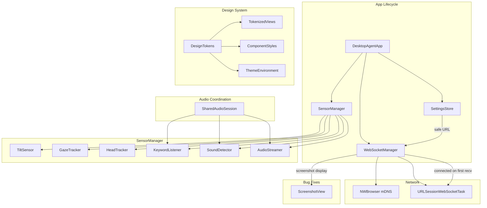
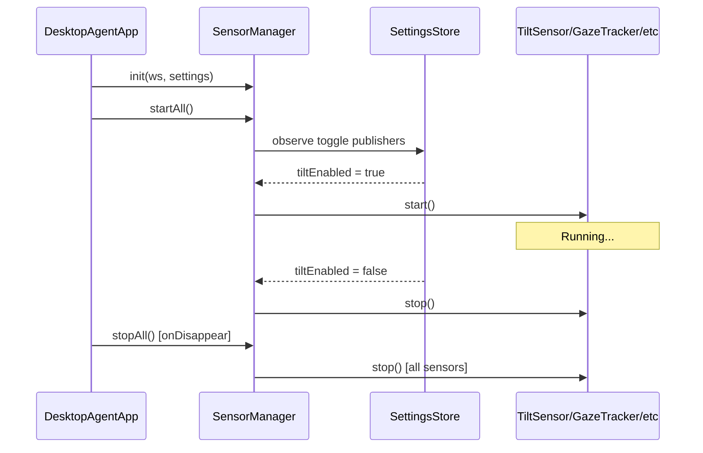
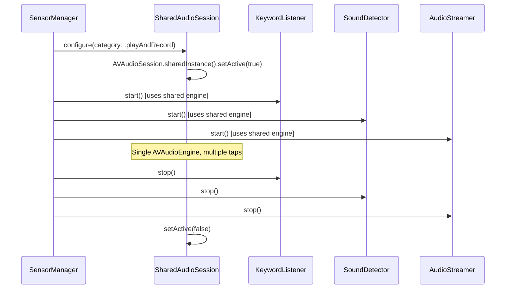
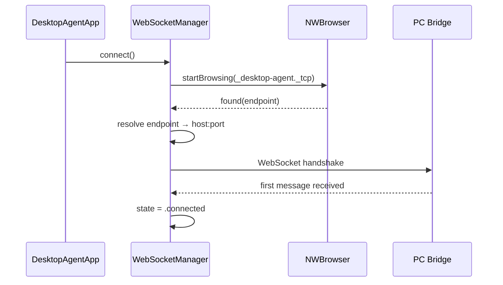

# Design Document: iPad App Hardening

## Overview

This spec hardens the Desktop Agent iPad app across three axes: (1) wiring five implemented-but-dead sensors into the app lifecycle with settings-driven start/stop, (2) fixing five critical bugs that cause crashes, resource conflicts, missing UI, and broken discovery, and (3) introducing a token-based design system that enforces 80pt minimum touch targets, consistent visual language, dark/high-contrast support, conditional Liquid Glass on iPadOS 26+, and proper accessibility annotations.

The design prioritizes graceful degradation — every sensor remains optional, every bug fix adds safety without changing happy-path behavior, and the design system is additive (existing views adopt tokens incrementally).

## Architecture



## Sequence Diagrams

### Sensor Lifecycle Management



### Audio Session Coordination



### mDNS Discovery Flow



## Components and Interfaces

### Component 1: SensorManager

**Purpose**: Centralized lifecycle controller for all sensors. Observes SettingsStore toggles and starts/stops sensors reactively. Owns the shared AVAudioEngine.

```swift
@MainActor
final class SensorManager: ObservableObject {
    // Sensors
    let tiltSensor: TiltSensor
    let gazeTracker: GazeTracker
    let headTracker: HeadTracker
    let keywordListener: KeywordListener
    let soundDetector: SoundDetector
    let audioStreamer: AudioStreamer

    // Shared audio infrastructure
    private let sharedEngine: AVAudioEngine
    private var cancellables: Set<AnyCancellable>

    init(ws: WebSocketManager, settings: SettingsStore)
    func startAll()
    func stopAll()
}
```

**Responsibilities**:
- Instantiate all sensors with shared dependencies
- Subscribe to SettingsStore `@Published` toggles via Combine
- Start/stop individual sensors when their toggle changes
- Manage shared AVAudioEngine lifecycle
- Ensure clean teardown on app backgrounding/termination

### Component 2: SharedAudioSession

**Purpose**: Configures and manages the single AVAudioSession and AVAudioEngine shared by KeywordListener, SoundDetector, and AudioStreamer.

```swift
@MainActor
final class SharedAudioSession {
    let engine: AVAudioEngine
    private var activeConsumers: Set<String>

    init()
    func activate() throws
    func deactivate()
    func addConsumer(_ id: String)
    func removeConsumer(_ id: String)
    var isActive: Bool { get }
}
```

**Responsibilities**:
- Configure AVAudioSession category (.playAndRecord, mixWithOthers)
- Manage single AVAudioEngine instance
- Track active consumers; deactivate only when all consumers stop
- Handle audio interruptions (phone calls, Siri)

### Component 3: DesignTokens

**Purpose**: Single source of truth for all visual constants — spacing, sizing, colors, typography, corner radii. Enforces 80pt minimum touch targets at the token level.

```swift
enum DesignTokens {
    // Sizing
    enum Size {
        static let touchTargetMin: CGFloat = 80
        static let touchTargetCompact: CGFloat = 64
        static let iconSize: CGFloat = 24
        static let iconSizeLarge: CGFloat = 32
    }

    // Spacing
    enum Spacing {
        static let xs: CGFloat = 4
        static let sm: CGFloat = 8
        static let md: CGFloat = 12
        static let lg: CGFloat = 16
        static let xl: CGFloat = 24
        static let xxl: CGFloat = 32
    }

    // Corner Radii
    enum Radius {
        static let sm: CGFloat = 8
        static let md: CGFloat = 12
        static let lg: CGFloat = 16
        static let xl: CGFloat = 20
    }

    // Typography
    enum Typography {
        static let headline: Font = .system(.title2, design: .rounded).weight(.semibold)
        static let body: Font = .system(.body, design: .default)
        static let caption: Font = .system(.caption, design: .default)
        static let mono: Font = .system(.body, design: .monospaced)
    }
}
```

### Component 4: ThemeEnvironment

**Purpose**: Provides adaptive colors and conditional Liquid Glass support via SwiftUI Environment.

```swift
struct AppTheme {
    // Semantic colors (adapt to dark mode + high contrast automatically)
    let surfacePrimary: Color
    let surfaceSecondary: Color
    let surfaceTertiary: Color
    let textPrimary: Color
    let textSecondary: Color
    let accent: Color
    let destructive: Color
    let success: Color
    let warning: Color

    // Connection status colors
    let connected: Color
    let connecting: Color
    let disconnected: Color
}

struct AppThemeKey: EnvironmentKey {
    static let defaultValue = AppTheme.default
}

extension EnvironmentValues {
    var appTheme: AppTheme { get set }
}
```

### Component 5: NWBrowserDiscovery

**Purpose**: Implements mDNS/Bonjour service discovery using Network framework's NWBrowser to find the PC bridge automatically.

```swift
@MainActor
final class ServiceDiscovery: ObservableObject {
    @Published var discoveredHost: String?
    @Published var discoveredPort: Int?
    @Published var isSearching: Bool = false

    private var browser: NWBrowser?

    func startBrowsing()
    func stopBrowsing()
}
```

### Component 6: ScreenshotOverlay

**Purpose**: Displays screenshots received from the PC bridge. Currently parsed but never shown.

```swift
@MainActor
final class ScreenshotStore: ObservableObject {
    @Published var latestScreenshot: UIImage?
    @Published var showScreenshot: Bool = false

    func handleScreenshot(base64: String, mime: String)
    func dismiss()
}
```

## Data Models

### SensorState

```swift
struct SensorState: Identifiable {
    let id: String          // "tilt", "gaze", "head", "keyword", "sound", "audio"
    var isEnabled: Bool     // from SettingsStore toggle
    var isRunning: Bool     // actual runtime state
    var isAvailable: Bool   // hardware capability check
    var lastError: String?  // most recent failure reason
}
```

### ConnectionInfo (enhanced)

```swift
struct ConnectionInfo {
    var state: ConnectionState
    var host: String
    var port: Int
    var discoveryMethod: DiscoveryMethod  // .manual, .mdns, .lastKnown
    var lastConnected: Date?
    var latency: TimeInterval?  // ping measurement
}

enum DiscoveryMethod {
    case manual
    case mdns
    case lastKnown
}
```

### DesignToken Color Palette

```swift
extension AppTheme {
    static let `default` = AppTheme(
        surfacePrimary: Color(.systemBackground),
        surfaceSecondary: Color(.secondarySystemGroupedBackground),
        surfaceTertiary: Color(.tertiarySystemGroupedBackground),
        textPrimary: Color(.label),
        textSecondary: Color(.secondaryLabel),
        accent: Color.accentColor,
        destructive: Color.red,
        success: Color.green,
        warning: Color.orange,
        connected: Color.green,
        connecting: Color.yellow,
        disconnected: Color.red
    )
}
```

## Algorithmic Pseudocode

### Sensor Lifecycle Algorithm

```swift
// SensorManager — reactive lifecycle based on settings toggles
func observeSettings() {
    settings.$tiltEnabled
        .removeDuplicates()
        .sink { [weak self] enabled in
            guard let self else { return }
            if enabled { self.tiltSensor.start() }
            else { self.tiltSensor.stop() }
        }
        .store(in: &cancellables)

    // Repeat for gazeEnabled, headEnabled, keywordList (non-empty = enabled),
    // audioStreamEnabled, soundMappings (non-empty = enabled)
}
```

**Preconditions:**
- `ws` is initialized and injected
- `settings` is initialized with persisted values
- Sensors are instantiated but not started

**Postconditions:**
- Each sensor's running state matches its settings toggle
- Toggling a setting immediately starts/stops the corresponding sensor
- Stopping all sensors releases all hardware resources

### Audio Session Coordination Algorithm

```swift
// SharedAudioSession — reference-counted activation
func activate() throws {
    let session = AVAudioSession.sharedInstance()
    try session.setCategory(.playAndRecord, mode: .default, options: [.mixWithOthers, .defaultToSpeaker])
    try session.setActive(true, options: [])

    if !engine.isRunning {
        try engine.start()
    }
}

func addConsumer(_ id: String) {
    activeConsumers.insert(id)
    if !engine.isRunning {
        try? activate()
    }
}

func removeConsumer(_ id: String) {
    activeConsumers.remove(id)
    if activeConsumers.isEmpty {
        engine.stop()
        deactivate()
    }
}
```

**Preconditions:**
- AVAudioSession is available (always true on iPad)
- No other app has exclusive audio session

**Postconditions:**
- Engine runs while at least one consumer is active
- Engine stops and session deactivates when last consumer removes itself
- Audio interruptions are handled gracefully (re-activate on interruption end)

**Loop Invariants:**
- `activeConsumers.count > 0` ⟹ `engine.isRunning == true`
- `activeConsumers.isEmpty` ⟹ `engine.isRunning == false`

### Safe URL Construction Algorithm

```swift
// SettingsStore.wsURL — safe construction, no force-unwrap
var wsURL: URL? {
    // Validate host is non-empty and port is in valid range
    guard !serverHost.trimmingCharacters(in: .whitespaces).isEmpty,
          serverPort > 0, serverPort <= 65535 else {
        return nil
    }
    return URL(string: "ws://\(serverHost):\(serverPort)/ws")
}

// Fallback for WebSocketManager
var wsURLOrDefault: URL {
    wsURL ?? URL(string: "ws://192.168.1.100:8765/ws")!
}
```

**Preconditions:**
- `serverHost` and `serverPort` are loaded from UserDefaults (may be malformed)

**Postconditions:**
- Returns nil for malformed input instead of crashing
- `wsURLOrDefault` always returns a valid URL (fallback is compile-time constant)
- No force-unwrap on user-provided data

### WebSocket Connection State Algorithm

```swift
// WebSocketManager — connected only after first successful receive
private func _connect() {
    let url = settings?.wsURLOrDefault ?? URL(string: "ws://192.168.1.100:8765/ws")!
    let session = URLSession(configuration: .default)
    let wsTask = session.webSocketTask(with: url)
    self.task = wsTask
    wsTask.resume()

    state = .connecting  // NOT .connected yet

    receiveTask = Task { [weak self] in
        guard let self else { return }
        do {
            // Wait for first message to confirm connection
            let firstMessage = try await wsTask.receive()
            await MainActor.run {
                self.state = .connected
                self.reconnectAttempt = 0
            }
            self._handle(message: firstMessage)
            try await self._receiveLoop(task: wsTask)
        } catch {
            await MainActor.run {
                self._handleDisconnect(error: error)
            }
        }
    }
}
```

**Preconditions:**
- State is `.disconnected` or `.reconnecting`
- URL is valid (guaranteed by `wsURLOrDefault`)

**Postconditions:**
- State transitions: `.disconnected` → `.connecting` → `.connected` (only after first recv)
- On error: state → `.reconnecting` with exponential backoff
- No optimistic `.connected` state before data flows

### mDNS Discovery Algorithm

```swift
// ServiceDiscovery — NWBrowser for _desktop-agent._tcp
func startBrowsing() {
    let params = NWParameters()
    params.includePeerToPeer = true

    browser = NWBrowser(for: .bonjour(type: "_desktop-agent._tcp", domain: nil), using: params)

    browser?.stateUpdateHandler = { [weak self] state in
        Task { @MainActor in
            switch state {
            case .ready:
                self?.isSearching = true
            case .failed, .cancelled:
                self?.isSearching = false
            default: break
            }
        }
    }

    browser?.browseResultsChangedHandler = { [weak self] results, changes in
        Task { @MainActor in
            guard let result = results.first else { return }
            // Resolve endpoint to host:port
            if case .service(let name, let type, let domain, _) = result.endpoint {
                self?.resolve(name: name, type: type, domain: domain)
            }
        }
    }

    browser?.start(queue: .main)
}

private func resolve(name: String, type: String, domain: String) {
    let connection = NWConnection(to: .service(name: name, type: type, domain: domain, interface: nil), using: .tcp)
    connection.stateUpdateHandler = { [weak self] state in
        if case .ready = state {
            if let endpoint = connection.currentPath?.remoteEndpoint,
               case .hostPort(let host, let port) = endpoint {
                Task { @MainActor in
                    self?.discoveredHost = "\(host)"
                    self?.discoveredPort = Int(port.rawValue)
                }
            }
            connection.cancel()
        }
    }
    connection.start(queue: .global())
}
```

**Preconditions:**
- Network framework available (iPadOS 17+)
- Local network permission granted (Info.plist NSLocalNetworkUsageDescription)
- NSBonjourServices includes `_desktop-agent._tcp`

**Postconditions:**
- `discoveredHost` and `discoveredPort` populated when bridge found
- Browser stops when discovery succeeds or is explicitly cancelled
- Graceful no-op if no bridge is advertising

## Key Functions with Formal Specifications

### SensorManager.startAll()

```swift
func startAll()
```

**Preconditions:**
- `ws` is connected or connecting
- `settings` is initialized
- Sensors are instantiated but not running

**Postconditions:**
- Each sensor whose toggle is enabled AND whose hardware is available is started
- Sensors whose toggle is disabled remain stopped
- Sensors whose hardware is unavailable log a warning and remain stopped
- SharedAudioSession is activated if any audio sensor is enabled

### SharedAudioSession.activate()

```swift
func activate() throws
```

**Preconditions:**
- No exclusive audio session held by another app

**Postconditions:**
- AVAudioSession category is `.playAndRecord` with `.mixWithOthers`
- AVAudioEngine is running
- Audio route is configured for built-in mic + speaker

**Loop Invariants:** N/A

### DesignTokens.touchTarget(for:)

```swift
static func touchTarget(for context: TouchContext) -> CGFloat
```

**Preconditions:**
- `context` specifies the interaction type (primary action, secondary, navigation)

**Postconditions:**
- Returns >= 80pt for primary actions
- Returns >= 64pt for secondary/compact contexts
- Never returns below 44pt (Apple HIG absolute minimum)

### WebSocketManager.connect()

```swift
func connect()
```

**Preconditions:**
- State is `.disconnected`
- `settings` is injected (or fallback URL used)

**Postconditions:**
- State transitions to `.connecting` immediately
- State transitions to `.connected` only after first successful message receive
- On failure: state transitions to `.reconnecting` with exponential backoff
- No crash regardless of URL validity

## Example Usage

### Sensor Wiring in App Entry Point

```swift
@main
struct DesktopAgentApp: App {
    @StateObject private var wsManager = WebSocketManager()
    @StateObject private var settings = SettingsStore()
    @StateObject private var sensorManager: SensorManager

    init() {
        let ws = WebSocketManager()
        let s = SettingsStore()
        _wsManager = StateObject(wrappedValue: ws)
        _settings = StateObject(wrappedValue: s)
        _sensorManager = StateObject(wrappedValue: SensorManager(ws: ws, settings: s))
    }

    var body: some Scene {
        WindowGroup {
            ContentView()
                .environmentObject(wsManager)
                .environmentObject(settings)
                .environmentObject(sensorManager)
                .onAppear {
                    wsManager.settings = settings
                    sensorManager.startAll()
                    wsManager.connect()
                }
                .onDisappear {
                    sensorManager.stopAll()
                    wsManager.disconnect()
                }
        }
    }
}
```

### Design Token Usage in Views

```swift
struct DAButton: View {
    let label: String
    let icon: String
    let action: () -> Void

    @Environment(\.appTheme) private var theme
    @Environment(\.colorSchemeContrast) private var contrast

    var body: some View {
        Button(action: action) {
            VStack(spacing: DesignTokens.Spacing.sm) {
                Image(systemName: icon)
                    .font(.system(size: DesignTokens.Size.iconSize))
                Text(label)
                    .font(DesignTokens.Typography.caption)
            }
            .frame(minWidth: DesignTokens.Size.touchTargetMin,
                   minHeight: DesignTokens.Size.touchTargetMin)
            .background(theme.surfaceSecondary)
            .clipShape(RoundedRectangle(cornerRadius: DesignTokens.Radius.md))
            .contentShape(Rectangle())
            .accessibilityLabel(label)
            .accessibilityHint("Double-tap to activate")
        }
        .buttonStyle(.plain)
    }
}
```

### Conditional Liquid Glass (iPadOS 26+)

```swift
extension View {
    @ViewBuilder
    func adaptiveGlass() -> some View {
        if #available(iOS 26, *) {
            self.glassEffect()
        } else {
            self.background(.regularMaterial)
        }
    }
}
```

### Screenshot Display

```swift
struct ScreenshotOverlayView: View {
    @EnvironmentObject var screenshotStore: ScreenshotStore

    var body: some View {
        if screenshotStore.showScreenshot, let image = screenshotStore.latestScreenshot {
            ZStack {
                Color.black.opacity(0.6).ignoresSafeArea()
                Image(uiImage: image)
                    .resizable()
                    .scaledToFit()
                    .clipShape(RoundedRectangle(cornerRadius: DesignTokens.Radius.lg))
                    .padding(DesignTokens.Spacing.xl)
                    .accessibilityLabel("Screenshot from PC")
            }
            .onTapGesture { screenshotStore.dismiss() }
            .accessibilityAddTraits(.isModal)
        }
    }
}
```

## Correctness Properties

1. **∀ sensor s, toggle t**: `t.isEnabled == false` ⟹ `s.isRunning == false` — disabling a toggle always stops the sensor
2. **∀ sensor s, toggle t**: `t.isEnabled == true ∧ s.isAvailable == true` ⟹ `s.isRunning == true` — enabling a toggle starts the sensor if hardware supports it
3. **∀ audio consumers c**: `c.isEmpty` ⟹ `sharedEngine.isRunning == false` — no audio engine running when no consumers
4. **∀ URL input u**: `SettingsStore.wsURL` never force-unwraps — malformed input returns nil
5. **∀ connection state transitions**: `.connected` is only reached after receiving at least one WebSocket message
6. **∀ screenshot messages m**: `m.type == "screenshot"` ⟹ UI displays the image (no silent drops)
7. **∀ touch targets t in the app**: `t.frame.height >= 80 ∧ t.frame.width >= 80` for primary actions
8. **∀ views v**: `v` has `.accessibilityLabel` set for interactive elements
9. **∀ sensors s**: `s.start()` on unsupported hardware logs warning and returns without crash
10. **mDNS discovery**: `NWBrowser` is instantiated and browsing when app launches (if local network permission granted)

## Error Handling

### Error Scenario 1: Malformed WebSocket URL

**Condition**: User enters invalid host/port in Settings (e.g., empty string, special characters)
**Response**: `wsURL` returns nil; `wsURLOrDefault` provides safe fallback; UI shows validation warning
**Recovery**: User corrects input; next reconnect uses valid URL

### Error Scenario 2: Audio Session Conflict

**Condition**: Another app (FaceTime, Music) holds exclusive audio session
**Response**: `SharedAudioSession.activate()` throws; sensors that need audio log warning and remain stopped
**Recovery**: Subscribe to `AVAudioSession.interruptionNotification`; re-activate when interruption ends

### Error Scenario 3: ARKit Unavailable

**Condition**: Device lacks TrueDepth camera (older iPad models)
**Response**: `ARFaceTrackingConfiguration.isSupported` returns false; GazeTracker and HeadTracker log warning, remain stopped
**Recovery**: No recovery needed — graceful degradation. UI shows sensor as "unavailable" in settings.

### Error Scenario 4: WebSocket Disconnect During Sensor Stream

**Condition**: Network drops while sensors are streaming data
**Response**: `WebSocketManager.send()` silently drops messages when not connected; sensors continue running
**Recovery**: Automatic reconnection with exponential backoff; sensors resume streaming when connection restores

### Error Scenario 5: Screenshot Decode Failure

**Condition**: Received base64 string is corrupted or truncated
**Response**: `Data(base64Encoded:)` returns nil; `ScreenshotStore` logs warning, does not update UI
**Recovery**: Next valid screenshot replaces the failed one; no stale state

## Testing Strategy

### Unit Testing Approach

- **SensorManager**: Mock SettingsStore publishers, verify sensors start/stop in response to toggle changes
- **SharedAudioSession**: Verify reference counting — add 3 consumers, remove 2, engine still runs; remove last, engine stops
- **DesignTokens**: Verify all touch target values >= 80pt for primary, >= 64pt for compact
- **URL Safety**: Fuzz `serverHost` and `serverPort` with edge cases (empty, unicode, negative port, port > 65535)
- **WebSocket State Machine**: Verify state transitions never skip `.connecting` → `.connected` without a receive

### Property-Based Testing Approach

**Property Test Library**: swift-testing with custom generators

- **Property**: For any combination of sensor toggles, `SensorManager` state is consistent with `SettingsStore` state after all Combine publishers fire
- **Property**: For any string input to `serverHost` and any integer to `serverPort`, `wsURL` either returns a valid URL or nil (never crashes)
- **Property**: For any sequence of `addConsumer`/`removeConsumer` calls, `SharedAudioSession.isActive` equals `!activeConsumers.isEmpty`

### Integration Testing Approach

- **End-to-end sensor flow**: Enable tilt in settings → verify `TiltSensor.start()` called → verify WebSocket receives `tilt` messages
- **mDNS discovery**: Start bridge on local network → verify `ServiceDiscovery` finds it within 5 seconds
- **Screenshot round-trip**: Send screenshot from bridge → verify `ScreenshotStore.latestScreenshot` is non-nil

## Performance Considerations

- **Sensor start/stop latency**: ARKit session start takes ~200ms; acceptable for toggle-driven lifecycle (not per-frame)
- **Audio engine sharing**: Single AVAudioEngine with multiple taps is more efficient than 3 separate engines (current bug)
- **mDNS browsing**: NWBrowser is lightweight; runs on main queue with minimal CPU
- **Design tokens**: All values are static constants — zero runtime cost
- **Screenshot display**: Base64 decode + UIImage creation happens off-main-thread; only final UIImage assignment is on MainActor

## Security Considerations

- **Local network only**: WebSocket connects only to local network addresses; NSAppTransportSecurity allows local networking
- **No credentials in UserDefaults**: Only host/port stored; no tokens or passwords
- **Audio permission gating**: All audio sensors check authorization before starting; graceful denial handling
- **Camera permission gating**: ARKit checks `ARFaceTrackingConfiguration.isSupported` which implicitly requires camera permission

## Dependencies

- **Network.framework** (NWBrowser) — system framework, no external dependency
- **ARKit** — system framework, TrueDepth camera required for gaze/head
- **AVFoundation** — system framework, microphone access
- **Speech** — system framework, on-device speech recognition
- **CoreMotion** — system framework, accelerometer/gyroscope
- **Combine** — system framework, reactive settings observation
- **No external UI libraries** — pure SwiftUI with custom design tokens
