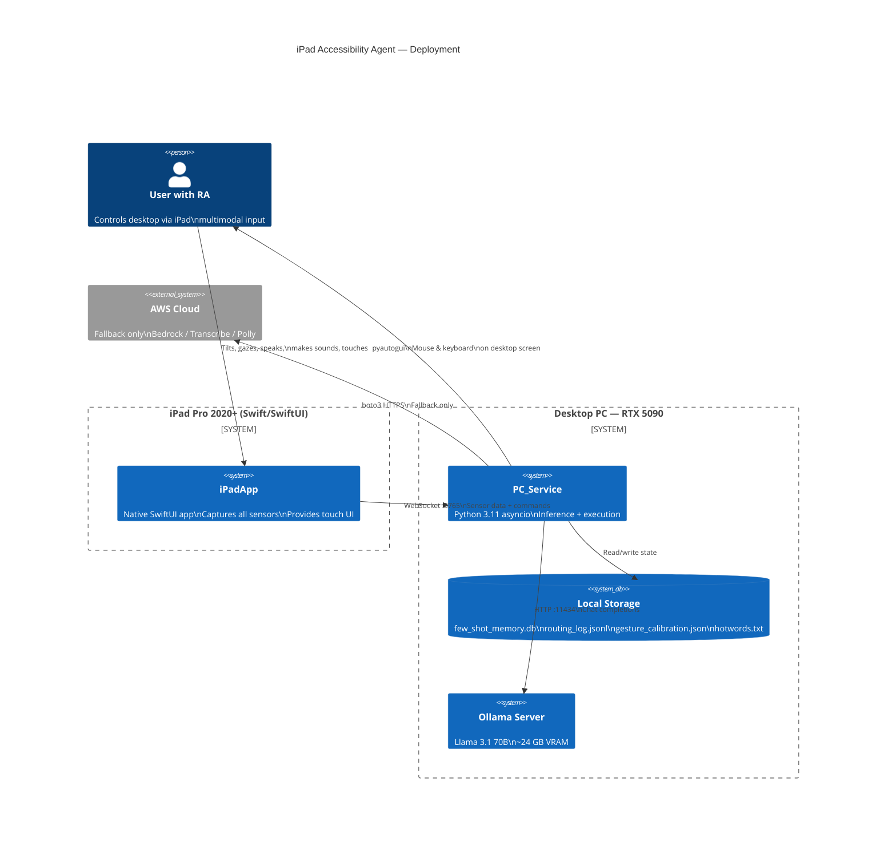
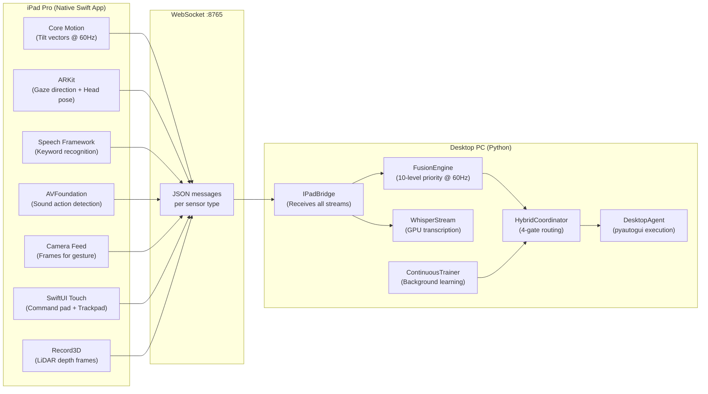
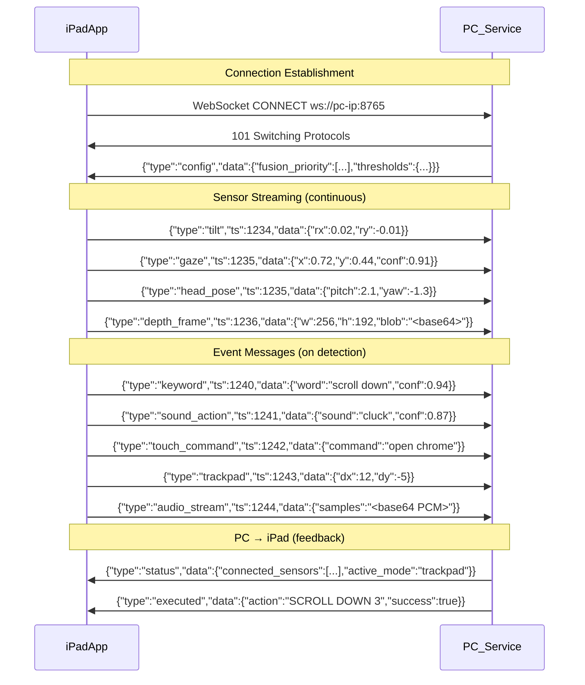
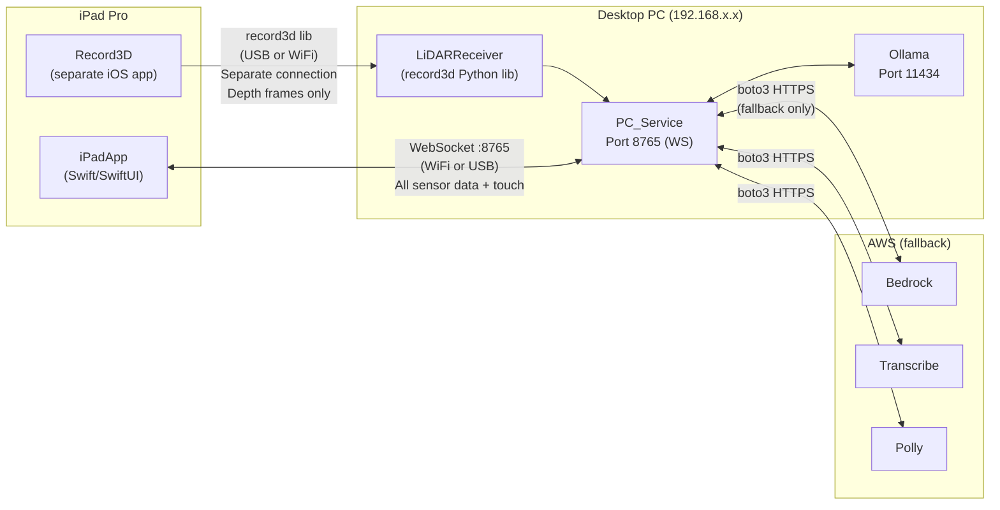

# System Architecture — iPad-Focused

---

## 1. Deployment Context

---

## 2. iPad ↔ PC Split

---

## 3. WebSocket Protocol

---

## 4. Network Topology

### Dual-Connection Note

The iPad runs **two independent connections** to the PC:

1. **iPadApp WebSocket** (port 8765) — carries all sensor data (tilt, gaze, head, keywords, sounds, touch, camera frames, audio)
2. **Record3D USB/WiFi stream** — carries LiDAR depth frames via the `record3d` Python library on a separate channel

This is intentional: Record3D is a third-party app with its own optimized streaming protocol. Routing depth frames through the iPadApp WebSocket would add unnecessary encoding overhead and latency. The `LiDARReceiver` on the PC merges depth data into the `GestureProcessor` pipeline alongside camera frames from the WebSocket.

If Record3D is not running, the system degrades gracefully — gesture recognition falls back to 2D MediaPipe classification without depth.
