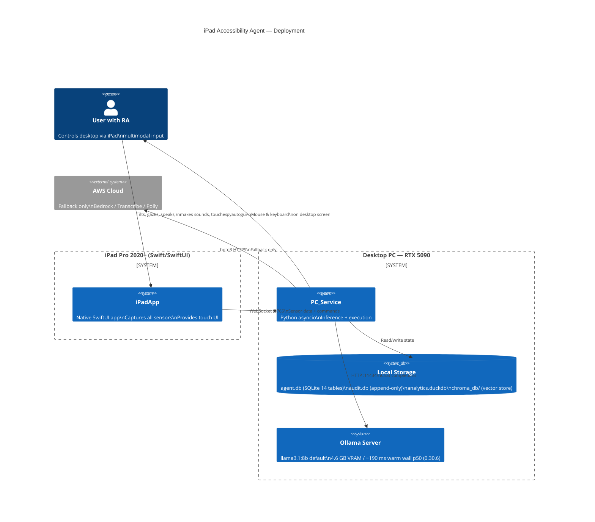
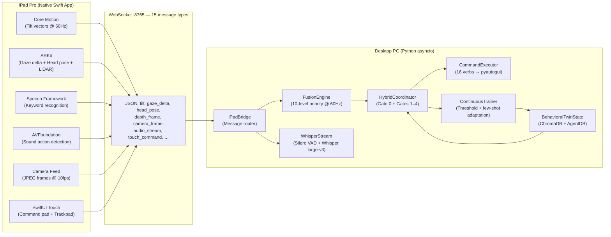
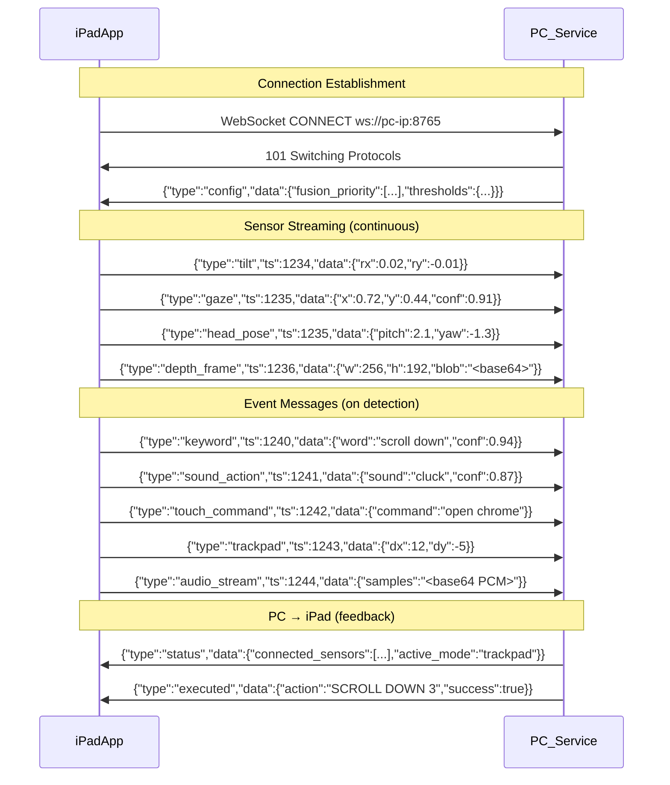
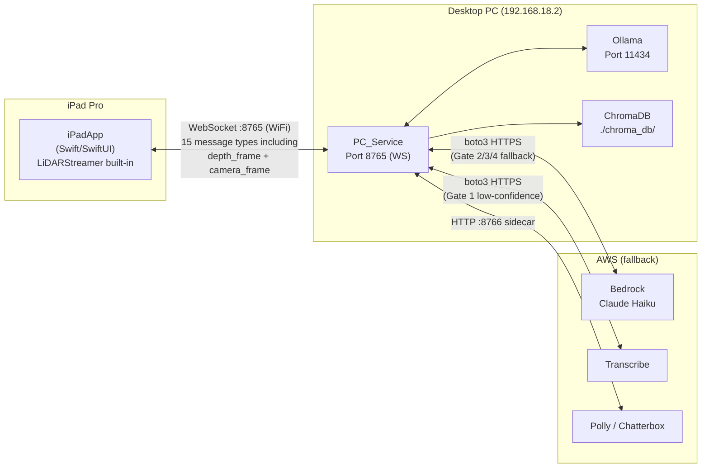

# System Architecture — iPad-Focused

---

## 1. Deployment Context

---

## 2. iPad ↔ PC Split

---

## 3. WebSocket Protocol

---

## 4. Network Topology

### Single-Connection Architecture

All sensor data — including LiDAR `depth_frame` and `camera_frame` — streams through a **single WebSocket connection** on port 8765. `LiDARStreamer.swift` uses `ARWorldTrackingConfiguration` + `.smoothedSceneDepth` and serialises depth frames directly in the iPadApp message protocol. Record3D is no longer required.
