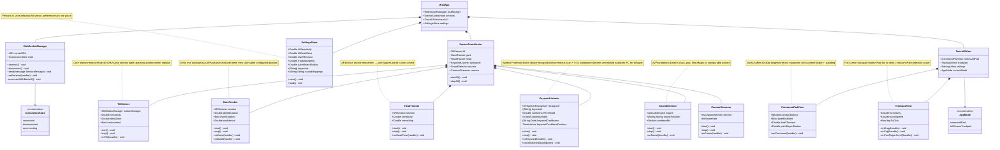
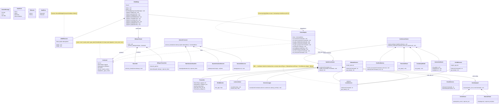

# Class Diagram — iPad-Focused Architecture

---

## 1. iPad-Side Classes (Swift/SwiftUI)

```mermaid
classDiagram
    direction TB

    class iPadApp {
        +WebSocketManager wsManager
        +SensorCoordinator sensors
        +TouchUIView touchUI
        +SettingsStore settings
    }

    class WebSocketManager {
        +URL serverURL
        +ConnectionState state
        +connect() void
        +disconnect() void
        +send(message SensorMessage) void
        +onReceive(handler) void
        -reconnectWithBackoff() void
    }

    class ConnectionState {
        <<enumeration>>
        connected
        disconnected
        reconnecting
    }

    class SensorCoordinator {
        +TiltSensor tilt
        +GazeTracker gaze
        +HeadTracker head
        +KeywordListener keywords
        +SoundDetector sounds
        +CameraStreamer camera
        +startAll() void
        +stopAll() void
    }

    class TiltSensor {
        +CMMotionManager motionManager
        +Double sensitivity
        +Double deadZone
        +Bool axisInverted
        +start() void
        +stop() void
        +onTilt(handler) void
    }
    note for TiltSensor "Core Motion\nrotationRate @ 60Hz\nAlso detects table taps\nvia accelerometer impulse"

    class GazeTracker {
        +ARSession session
        +Double dwellDuration
        +Bool dwellEnabled
        +Double confidence
        +start() void
        +stop() void
        +onGaze(handler) void
        +onDwell(handler) void
    }
    note for GazeTracker "ARKit eye tracking\nvia ARFaceAnchor\nDwell timer fires click\nafter configured duration"

    class HeadTracker {
        +ARSession session
        +Double sensitivity
        +Double smoothing
        +start() void
        +stop() void
        +onHeadPose(handler) void
    }
    note for HeadTracker "ARKit face anchor\ntransform → pitch/yaw\nCoarse cursor control"

    class KeywordListener {
        +SFSpeechRecognizer recognizer
        +[String] keywords
        +Double confidenceThreshold
        -Int lastScannedLength
        -[String:Date] keywordCooldowns
        -TimeInterval keywordCooldownDuration
        +start() void
        +stop() void
        +onKeyword(handler) void
        +onUnmatched(audioBuffer) void
    }
    note for KeywordListener "Speech Framework\nOn-device recognition\nIncremental scan + 0.5s cooldown\nStreams unmatched audio\nto PC for Whisper"

    class SoundDetector {
        +AVAudioEngine engine
        +[String:String] soundToAction
        +Double cooldownMs
        +start() void
        +stop() void
        +onSound(handler) void
    }
    note for SoundDetector "AVFoundation\nDetects cluck, pop, hiss\nMaps to configurable actions"

    class CameraStreamer {
        +AVCaptureSession session
        +Int frameRate
        +start() void
        +stop() void
        +onFrame(handler) void
    }

    class TouchUIView {
        +CommandPadView commandPad
        +TrackpadView trackpad
        +SettingsView settings
        +AppMode currentMode
    }

    class CommandPadView {
        +[[ButtonConfig]] buttons
        +Bool dwellEnabled
        +Double dwellTimeout
        +Double palmRejectRadius
        +onCommand(handler) void
    }
    note for CommandPadView "SwiftUI\nMin 80x80pt targets\nHit box expansion via\n.contentShape + .padding"

    class TrackpadView {
        +Double sensitivity
        +Double scrollSpeed
        +Bool tapToClick
        +onDrag(handler) void
        +onTap(handler) void
        +onTwoFingerScroll(handler) void
    }
    note for TrackpadView "Full-screen trackpad mode\niPad flat on desk = mouse\nPalm rejection active"

    class SettingsStore {
        +Double tiltSensitivity
        +Double tiltDeadZone
        +Double dwellTimeout
        +Double trackpadSpeed
        +Double palmRejectRadius
        +[String] keywords
        +[String:String] soundMappings
        +save() void
        +load() void
    }
    note for SettingsStore "Persists to UserDefaults\nAll sensor preferences\nin one place"

    class AppMode {
        <<enumeration>>
        commandPad
        fullScreenTrackpad
    }

    iPadApp *-- WebSocketManager
    iPadApp *-- SensorCoordinator
    iPadApp *-- TouchUIView
    iPadApp *-- SettingsStore
    WebSocketManager --> ConnectionState
    SensorCoordinator *-- TiltSensor
    SensorCoordinator *-- GazeTracker
    SensorCoordinator *-- HeadTracker
    SensorCoordinator *-- KeywordListener
    SensorCoordinator *-- SoundDetector
    SensorCoordinator *-- CameraStreamer
    TouchUIView *-- CommandPadView
    TouchUIView *-- TrackpadView
    TouchUIView --> AppMode

```

---

## 2. PC-Side Classes (Python)

```mermaid
classDiagram
    direction TB

    %% ─────────────────────────────────────────
    %%  SHARED DATA TYPES
    %% ─────────────────────────────────────────
    class Command {
        +str text
        +float whisper_logprob
        +float gesture_confidence
        +str source
        +list~str~ session_context
        +tuple|None _gaze_coords
    }
    note for Command "source: touch | sound_action | gaze_dwell |\nmultimodal | tilt | head_track |\ngesture | voice_local | voice"

    class SensorMessage {
        +str type
        +int ts
        +dict data
    }

    class Thresholds {
        +float whisper_logprob_min
        +float gesture_confidence_min
        +int max_local_tokens
        +float vram_free_min_gb
        +float latency_budget_ms
    }

    class GazePoint {
        +float x
        +float y
        +bool valid
        +float confidence
    }

    class TiltVector {
        +float rx
        +float ry
    }

    class HeadPose {
        +float pitch
        +float yaw
    }

    %% ─────────────────────────────────────────
    %%  IPAD BRIDGE
    %% ─────────────────────────────────────────
    class IPadBridge {
        +int port
        +start() void
        +stop() void
        +on_message(msg SensorMessage) void
        -_dispatch_tilt(data dict) void
        -_dispatch_gaze(data dict) void
        -_dispatch_head(data dict) void
        -_dispatch_keyword(data dict) void
        -_dispatch_sound(data dict) void
        -_dispatch_touch(data dict) void
        -_dispatch_trackpad(data dict) void
        -_dispatch_audio(data dict) void
        -_dispatch_depth(data dict) void
    }

    class LiDARReceiver {
        +start() void
        +stop() void
        +latest_depth ndarray|None
    }
    note for LiDARReceiver "Receives Record3D\ndepth frames\nConfidence filtering"

    %% ─────────────────────────────────────────
    %%  FUSION ENGINE (10-level)
    %% ─────────────────────────────────────────
    class FusionEngine {
        +tick() Command|None
        +on_touch(cmd Command) void
        +on_sound_action(cmd Command) void
        +on_gaze_dwell(cmd Command) void
        +on_gaze_voice(cmd Command) void
        +on_gaze_gesture(cmd Command) void
        +on_tilt(vector TiltVector) void
        +on_head(pose HeadPose) void
        +on_gesture(cmd Command) void
        +on_voice_local(cmd Command) void
        +on_voice(cmd Command) void
    }
    note for FusionEngine "10-level priority\nEmits at most 1 Command per tick\nRuns at 60 Hz"

    %% ─────────────────────────────────────────
    %%  VOICE PIPELINE
    %% ─────────────────────────────────────────
    class WhisperStream {
        +run() void
        -_process_audio(pcm bytes) Command
    }

    class SileroVAD {
        +process_chunk(chunk ndarray) bool
    }

    class WhisperTranscriber {
        +transcribe(audio ndarray) tuple~str_float~
        +hotwords_path str
    }

    WhisperStream *-- SileroVAD
    WhisperStream *-- WhisperTranscriber
    WhisperStream ..> Command : produces

    %% ─────────────────────────────────────────
    %%  GESTURE PROCESSING (PC-side from camera frames)
    %% ─────────────────────────────────────────
    class GestureProcessor {
        +process_frame(frame ndarray, depth ndarray|None) Command|None
    }

    class StaticGestureClassifier {
        +classify(landmarks list) tuple~str_float~
    }

    class DynamicGestureDetector {
        +update(centroid tuple) str|None
    }

    class GestureDebouncer {
        +allow(gesture str) bool
    }

    GestureProcessor *-- StaticGestureClassifier
    GestureProcessor *-- DynamicGestureDetector
    GestureProcessor *-- GestureDebouncer
    GestureProcessor ..> Command : produces

    %% ─────────────────────────────────────────
    %%  COORDINATOR
    %% ─────────────────────────────────────────
    class HybridCoordinator {
        +route(cmd Command) str
        +update_thresholds(t Thresholds) void
        +status() dict
    }

    class VRAMMonitor {
        +free_gb() float
    }

    class LatencyTracker {
        +record(ms float) void
        +current_ms() float
    }

    class OutcomeLogger {
        +record(cmd Command, action str, outcome str, latency_ms float) void
    }

    class LocalInference {
        <<abstract>>
        +infer(cmd Command) str*
        +get_status() dict*
    }
    note for LocalInference "ABC — coordinator holds this interface\nnot a concrete class.\nPhase 1: OllamaInference\nPhase 2: VLLMInference (target ~280ms)"

    class OllamaInference {
        +model_name str
        +infer(cmd Command) str
        +get_status() dict
    }

    class VLLMInference {
        +engine_args dict
        +infer(cmd Command) str
        +get_status() dict
    }

    class CloudInference {
        +infer(cmd Command) str
        +transcribe(audio bytes) str
    }

    OllamaInference --|> LocalInference
    VLLMInference --|> LocalInference

    HybridCoordinator *-- Thresholds
    HybridCoordinator *-- VRAMMonitor
    HybridCoordinator *-- LatencyTracker
    HybridCoordinator *-- OutcomeLogger
    HybridCoordinator o-- LocalInference : holds ABC ref
    HybridCoordinator *-- CloudInference

    %% ─────────────────────────────────────────
    %%  DESKTOP AGENT
    %% ─────────────────────────────────────────
    class DesktopAgent {
        +execute(action_str str, cmd Command) void
    }

    class ActionParser {
        +parse(action_str str) tuple~str_str~
    }

    class ElementFinder {
        +find(target str) tuple~int_int~|None
    }

    DesktopAgent *-- ActionParser
    DesktopAgent *-- ElementFinder

    %% ─────────────────────────────────────────
    %%  CONTINUOUS TRAINER
    %% ─────────────────────────────────────────
    class ContinuousTrainer {
        +start(coordinator HybridCoordinator) void
        +outcome_hook(cmd Command, action str, outcome str) void
    }

    class FewShotMemory {
        +record_success(cmd Command, action str) void
        +retrieve(cmd Command, k int) list
    }

    class ThresholdTuner {
        +run_pass() void
    }

    class VocabularyBuilder {
        +run_pass() void
    }

    class GestureCalibrator {
        +run_pass() void
        +save(path str) void
        +load(path str) void
    }

    ContinuousTrainer *-- FewShotMemory
    ContinuousTrainer *-- ThresholdTuner
    ContinuousTrainer *-- VocabularyBuilder
    ContinuousTrainer *-- GestureCalibrator
    ContinuousTrainer --> HybridCoordinator : hooks into route()

    %% ─────────────────────────────────────────
    %%  RELATIONSHIPS
    %% ─────────────────────────────────────────
    IPadBridge *-- LiDARReceiver
    IPadBridge --> FusionEngine : dispatches to
    IPadBridge --> WhisperStream : sends audio
    FusionEngine --> HybridCoordinator : routes Command
    HybridCoordinator --> DesktopAgent : action string
    FusionEngine ..> Command : emits
```
