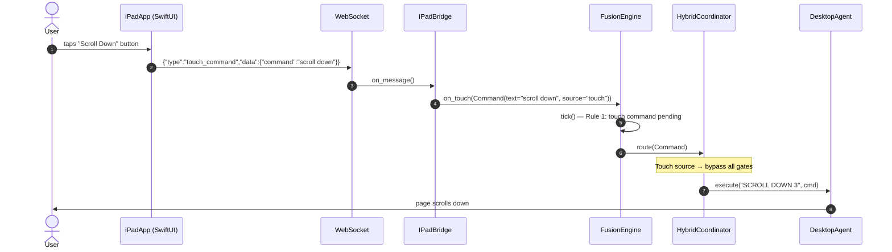
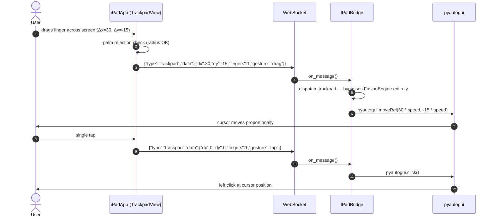
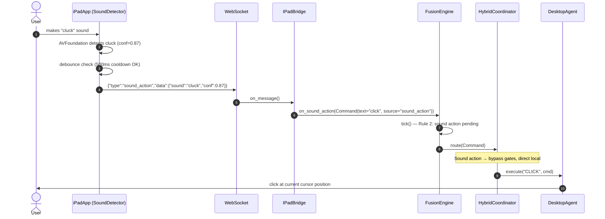
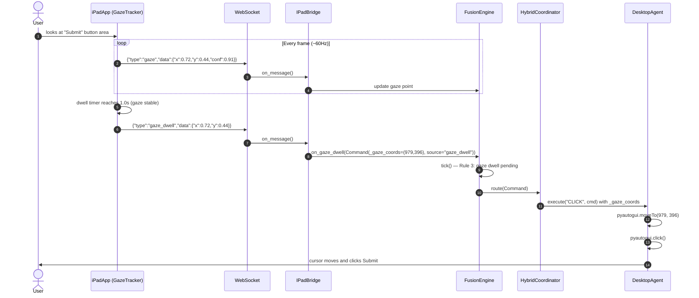
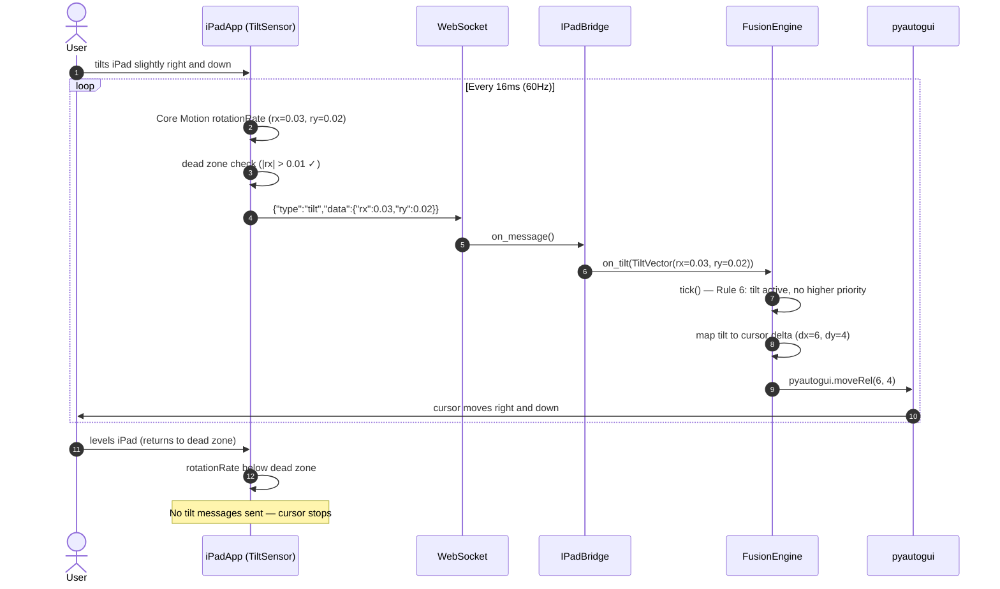
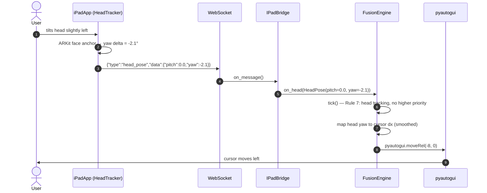
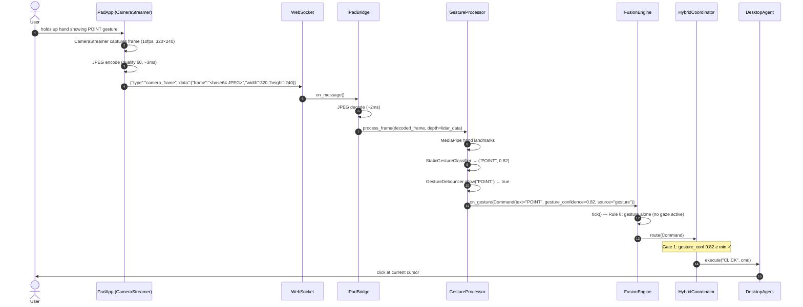
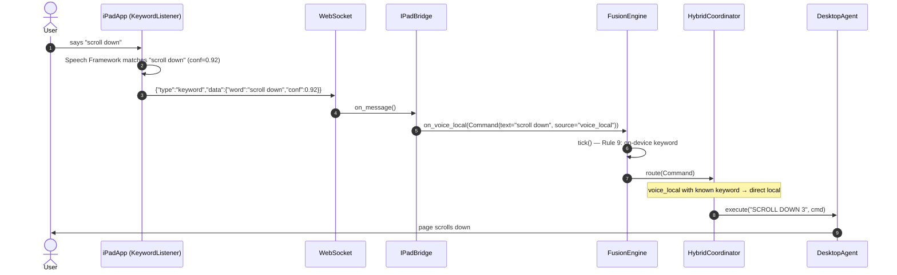
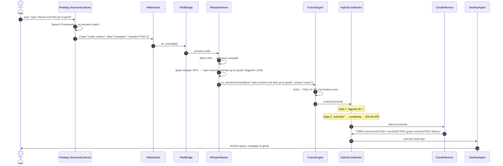
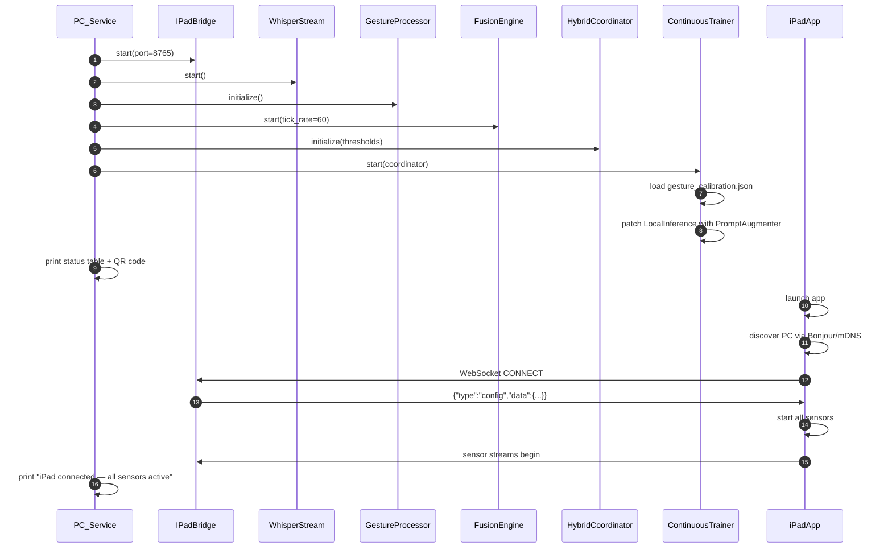

# Sequence Diagrams — iPad-Focused Flows

---

## 1. Touch Command (highest priority — bypasses everything)



---

## 2. Full-Screen Trackpad (direct path — no LLM)



---

## 3. Sound Action (cluck → click)



---

## 4. Gaze Dwell Click (look at target for 1 second)



---

## 5. Gaze + Voice Click

```mermaid
sequenceDiagram
    autonumber
    actor User
    participant iPad as iPadApp
    participant WS as WebSocket
    participant Bridge as IPadBridge
    participant Fusion as FusionEngine
    participant Coord as HybridCoordinator
    participant Agent as DesktopAgent

    User->>iPad: looks at target (ARKit gaze)
    iPad->>WS: {"type":"gaze","data":{"x":0.65,"y":0.30,"conf":0.88}}
    Bridge->>Fusion: update gaze (stable, spread < 4%)

    User->>iPad: says "click"
    iPad->>iPad: Speech Framework matches keyword "click"
    iPad->>WS: {"type":"keyword","data":{"word":"click","conf":0.95}}
    WS->>Bridge: on_message()
    Bridge->>Fusion: on_voice_local(Command(text="click", source="voice_local"))

    Fusion->>Fusion: tick() — Rule 4: gaze stable + "click" keyword
    Fusion->>Fusion: resolve pixels (0.65*W, 0.30*H) = (884, 270)
    Fusion->>Coord: Command(text="click", _gaze_coords=(884,270), source="multimodal")
    Note over Coord: Multimodal → bypass gates
    Coord->>Agent: execute("CLICK", cmd) with _gaze_coords
    Agent->>Agent: pyautogui.moveTo(884, 270); pyautogui.click()
    Agent->>User: clicks at gaze target
```

---

## 6. Tilt Navigation (cursor movement)



---

## 7. Head Tracking (coarse cursor)



---

## 8. Gesture via iPad Camera (PC-side MediaPipe)



---

## 9. On-Device Voice Keyword (fast path)



---

## 10. Full Whisper Transcription (complex command)



---

## 11. Startup and Connection


