# State Machine Diagrams — iPad-Focused Architecture

State machines for both the iPad app (Swift) and the PC agent backend (Python).
All diagrams use [Mermaid](https://mermaid.js.org/) `stateDiagram-v2` syntax.

> **Currency:** refreshed 2026-06-13. Gaze-dwell, head-pose, and mouth-sound
> machines were **removed** (the standard iPad lacks a TrueDepth sensor; the
> sound surface was unreliable). The FusionEngine is now **6-level**. The
> backend agent machines (§6–§12) reflect the post-AIOS-alignment kernel:
> circuit breaker, gyro calibrator, resource governor, supervisor, and the
> durable goal/run lifecycles.

**Contents**

| # | Machine | Layer | Source |
|---|---------|-------|--------|
| 1 | App top-level lifecycle | iPad (Swift) | `DesktopAgentApp`, `SensorManager` |
| 2 | WebSocket connection | iPad (Swift) | `WebSocketManager.swift` |
| 3 | Tilt navigation | iPad (Swift) | `TiltSensor.swift` |
| 4 | Keyword listener | iPad (Swift) | `KeywordListener.swift` |
| 5 | UI view mode | iPad (Swift) | SwiftUI views |
| 6 | FusionEngine 6-level tick | PC | `core/fusion_engine.py` |
| 7 | Gyro bias calibrator | PC | `calibration/gyro_bias_calibrator.py` |
| 8 | Circuit breaker | PC | `core/circuit_breaker.py` |
| 9 | Resource governor (flare) | PC | `core/resource_governor.py` |
| 10 | Supervisor (per subsystem) | PC | `core/supervisor.py` |
| 11 | Goal-queue row lifecycle | PC | `storage/db.py` (`goal_queue`) |
| 12 | Agent-run lifecycle | PC | `storage/db.py` (`agent_runs`) |

---

## 1. iPadApp — Top-Level Application Lifecycle

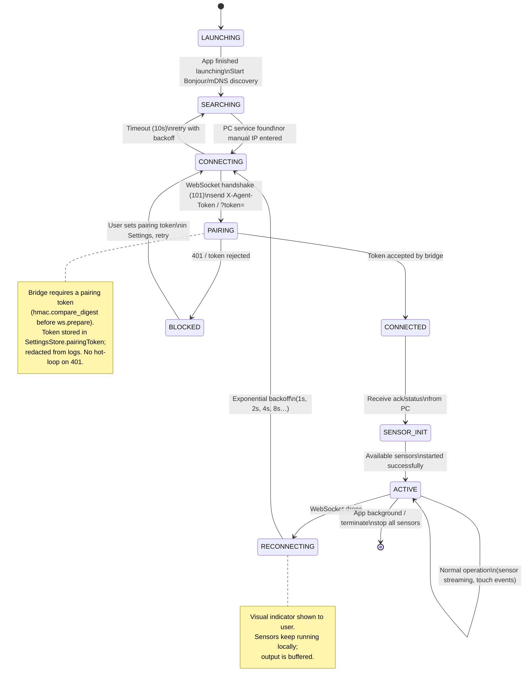

---

## 2. WebSocketManager — Connection State Machine (Swift)

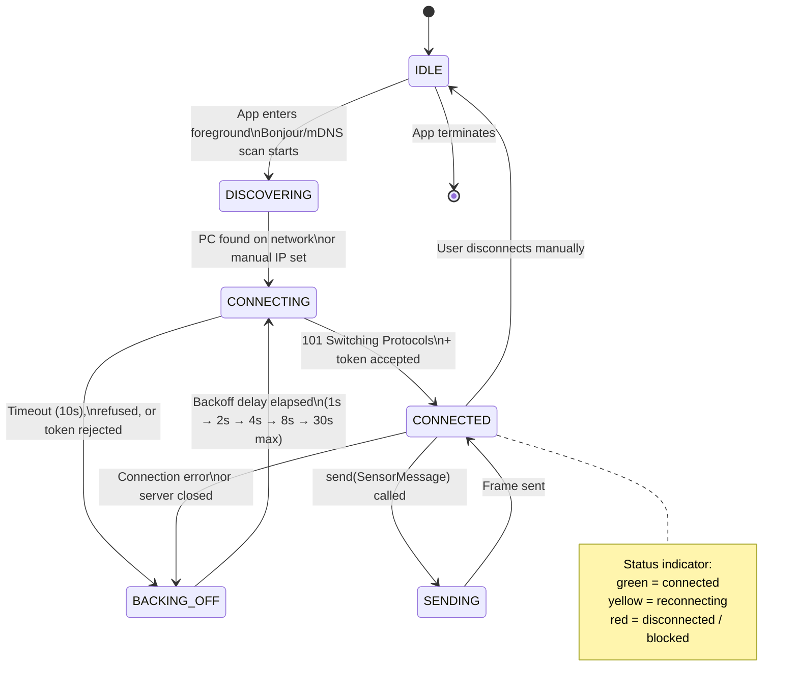

---

## 3. TiltSensor (Core Motion) — Navigation State Machine

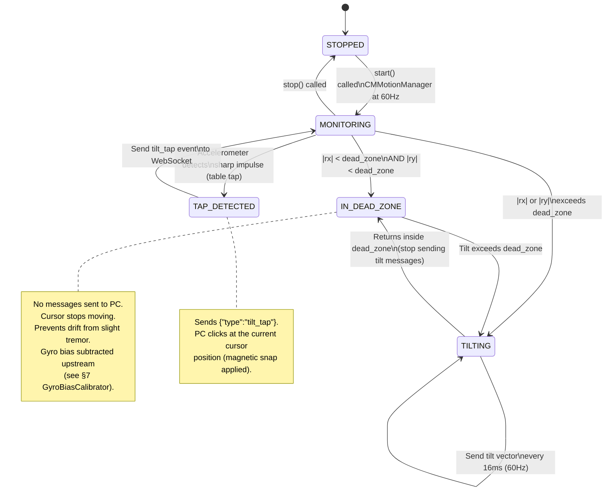

---

## 4. KeywordListener (Speech Framework) — Recognition State Machine

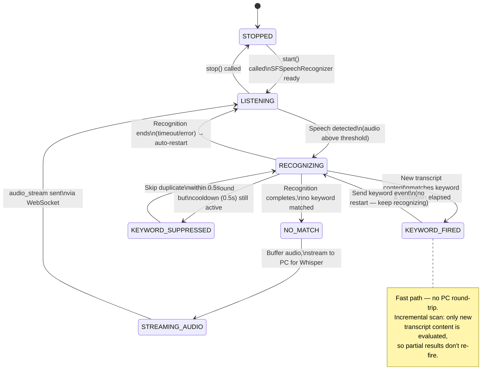

---

## 5. AppMode — UI View State Machine (SwiftUI)

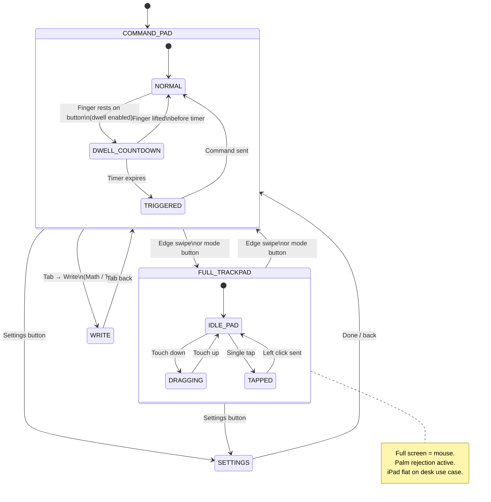

---

## 6. FusionEngine (PC) — 6-Level Priority Tick

The 60 Hz tick evaluates inputs in strict priority order; the first match wins
and the rest are skipped for that tick. *(Gaze dwell, gaze+voice, gaze+gesture,
head-pose, and mouth-sound branches were all removed — 10 levels → 6.)*

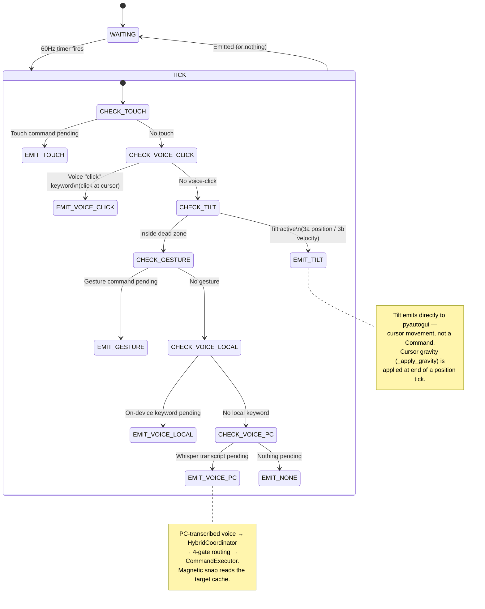

---

## 7. GyroBiasCalibrator — Tilt Drift Compensation

Detects stationary periods, averages the gyro zero-rate offset, and lerps to the
new bias so tilt-velocity mode doesn't drift. Source: `BiasState` enum.

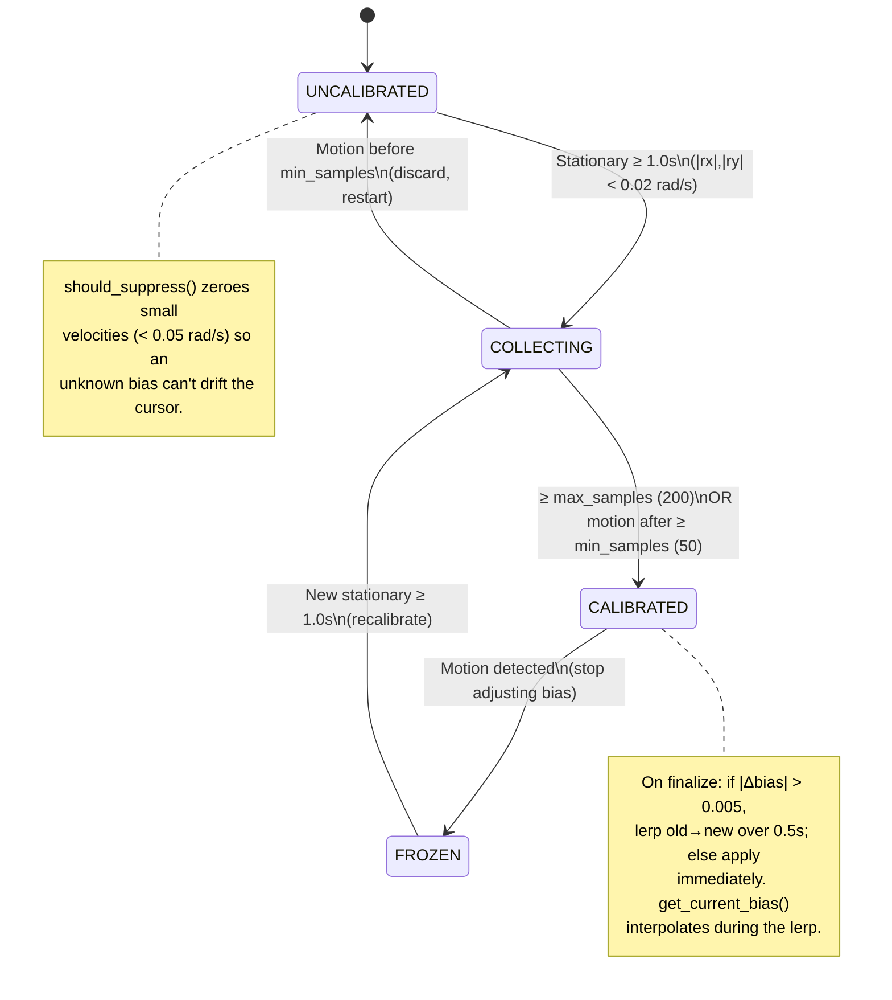

---

## 8. CircuitBreaker — Inference Backend Latch

Stops a down backend from costing a full timeout on every call. Source:
`core/circuit_breaker.py` (`closed` / `open` / `half_open`).

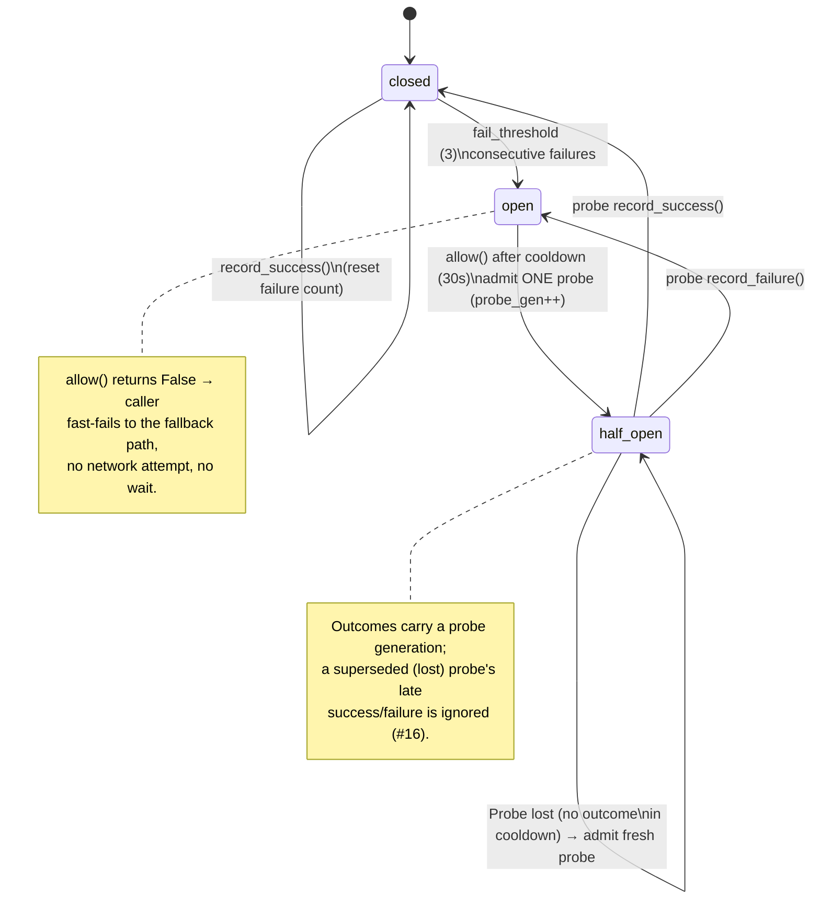

---

## 9. ResourceGovernor — Pain-Aware Flare Mode

A kernel primitive that reacts to the pain-day score with hysteresis. Source:
`core/resource_governor.py` (activate ≥ 0.6, deactivate < 0.4).

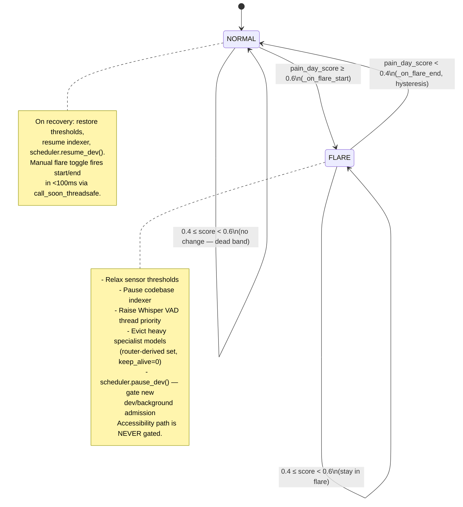

---

## 10. Supervisor — Per-Subsystem Restart Policy

One-for-one liveness watchdog (Erlang-style) over critical loops (scheduler
worker, governor loop). Source: `core/supervisor.py`.

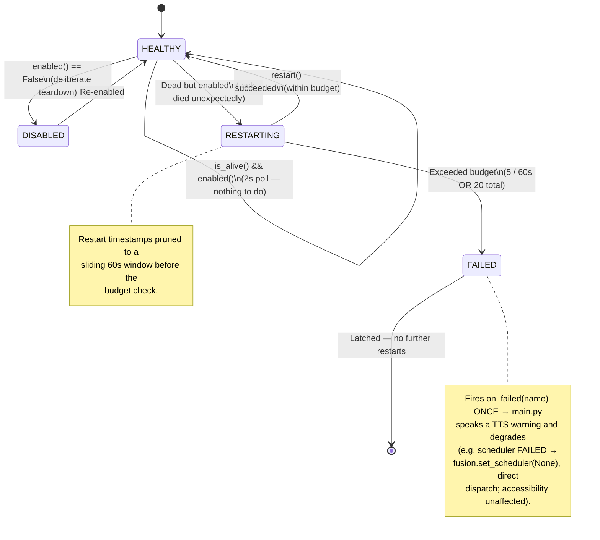

---

## 11. Goal-Queue Row Lifecycle

Durable goal backlog with N+2 proactivity (future-dated + recurring goals).
Source: `storage/db.py` (`goal_queue`).

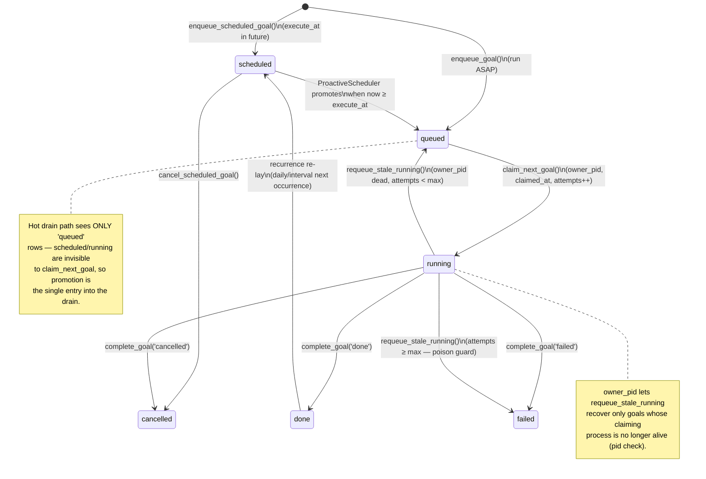

---

## 12. Agent-Run Lifecycle

Tracks each DevAgent plan execution with crash reconciliation. Source:
`storage/db.py` (`agent_runs`) + `inference/dev_agent.py`.

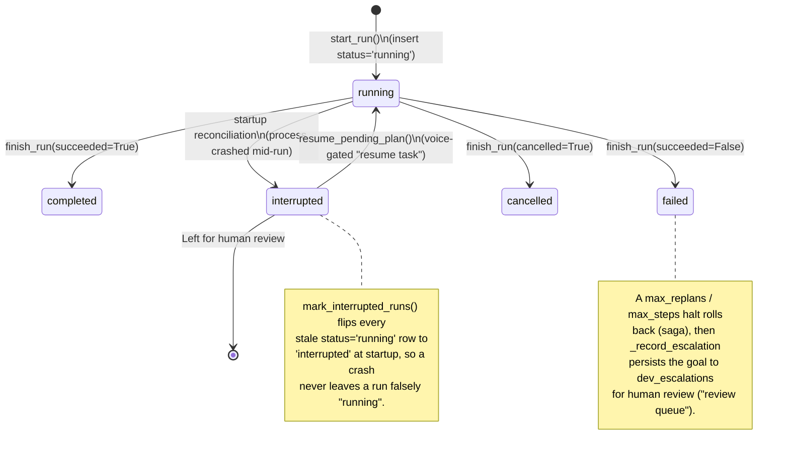

---

## Removed machines (historical note)

These were documented in earlier revisions and have been **deleted** from the
codebase — do not re-add diagrams for them:

- **GazeTracker dwell** — gaze tracking removed 2026-05-30 (no TrueDepth sensor).
- **HeadTracker / head-pose** — removed 2026-05-30 (same reason).
- **SoundDetector (cluck/pop/hiss)** — removed 2026-06-05 (unreliable surface).

The FusionEngine priority dropped from 10 levels to 6 as a result (see §6).
