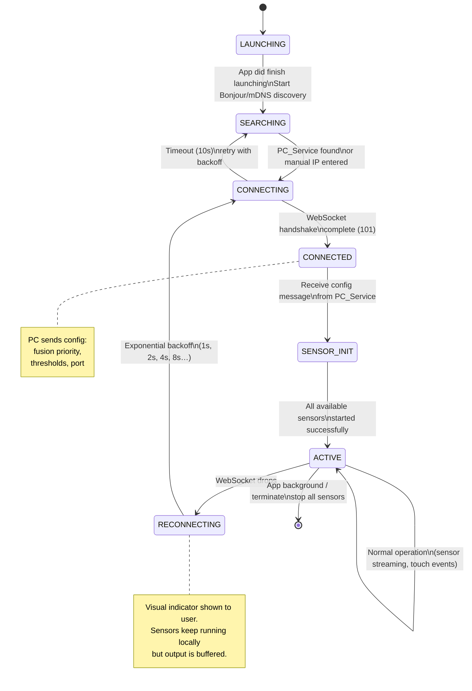
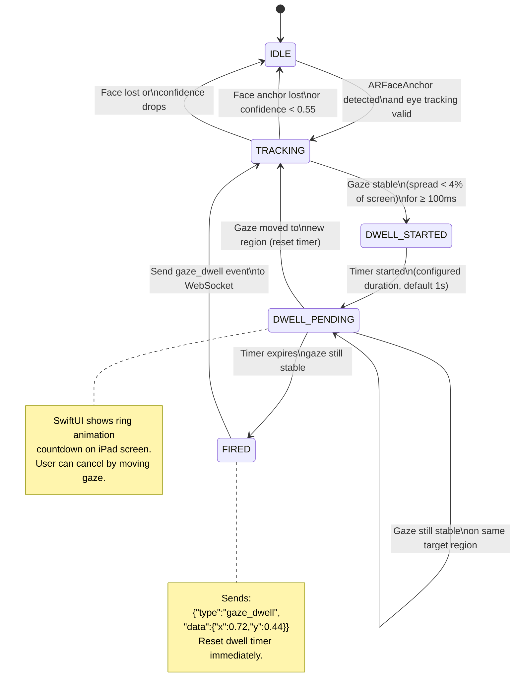
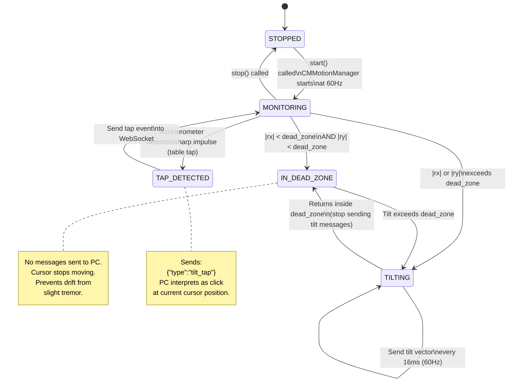
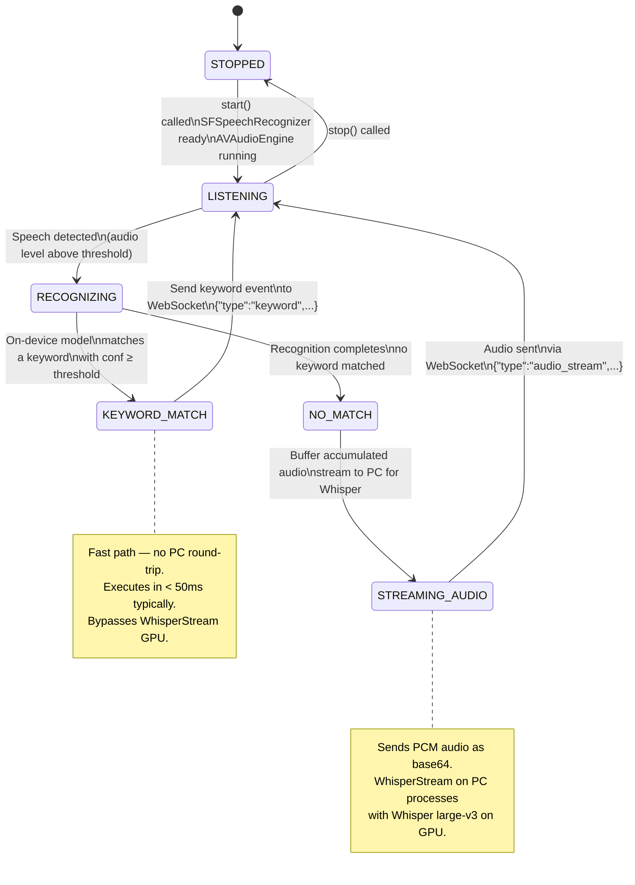
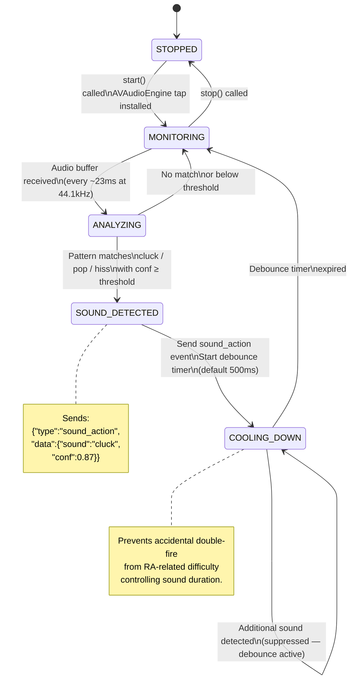
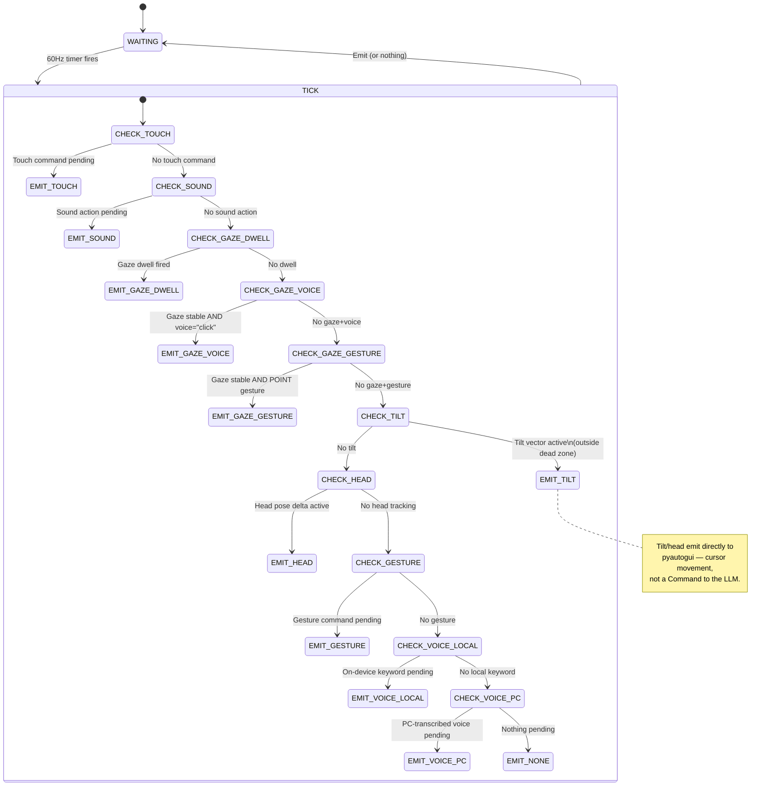
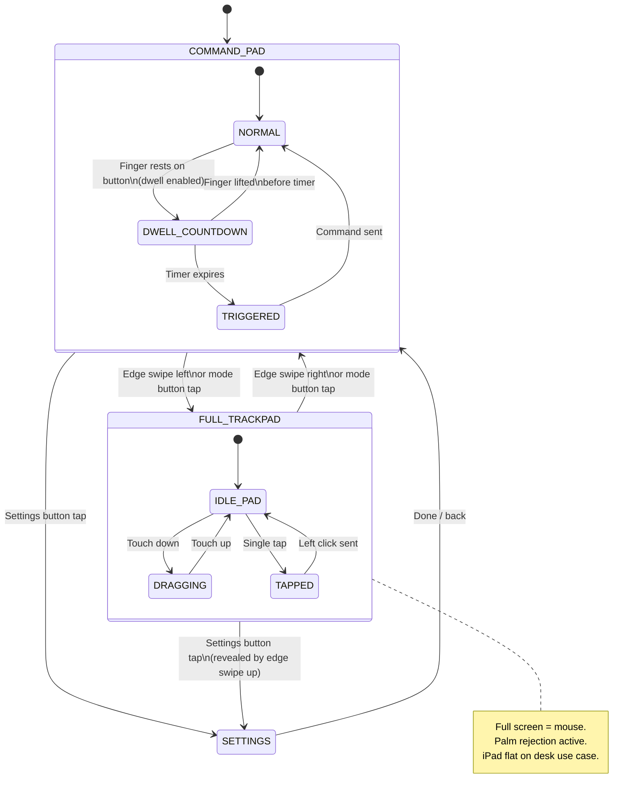
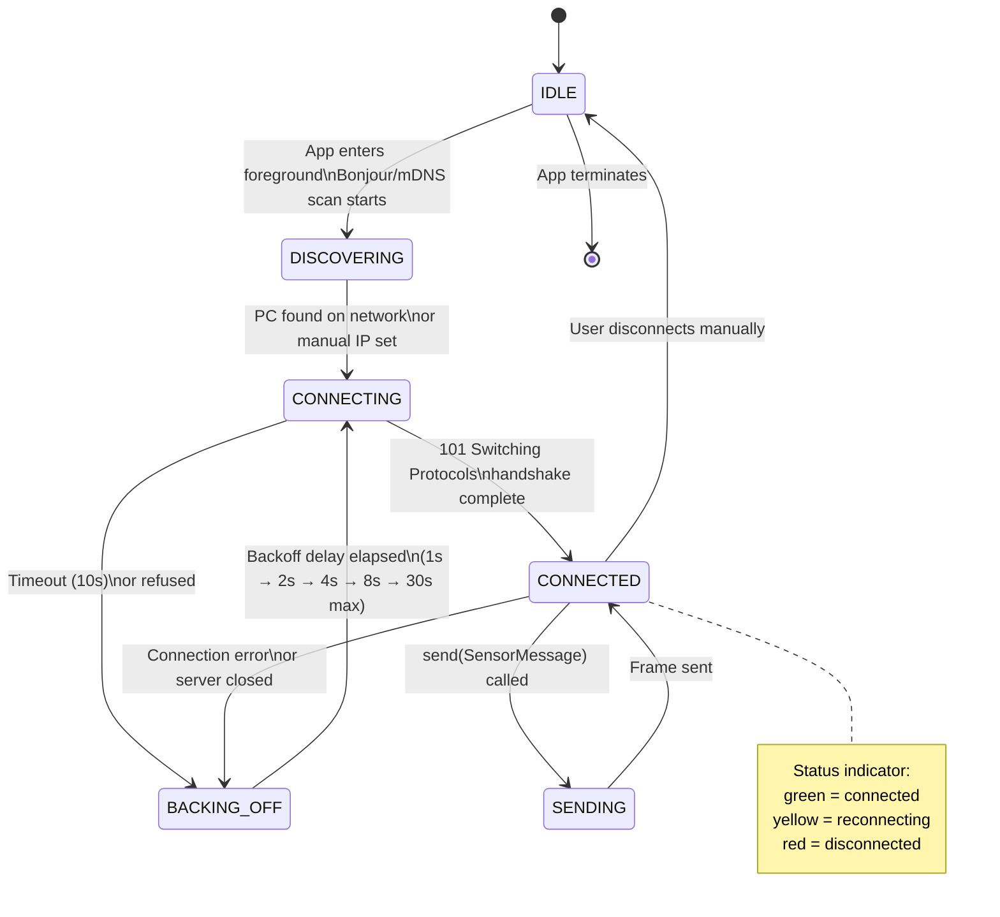

# State Machine Diagrams — iPad-Focused Architecture

---

## 1. iPadApp — Top-Level Application State

---

## 2. GazeTracker (ARKit) — Dwell State Machine

---

## 3. TiltSensor (Core Motion) — Navigation State Machine

---

## 4. KeywordListener (Speech Framework) — Recognition State Machine

---

## 5. SoundDetector (AVFoundation) — Detection State Machine

---

## 6. FusionEngine (PC-side) — 10-Level Priority Evaluation

---

## 7. AppMode — UI View State Machine (SwiftUI)

---

## 8. WebSocketManager — Connection State Machine (Swift)

