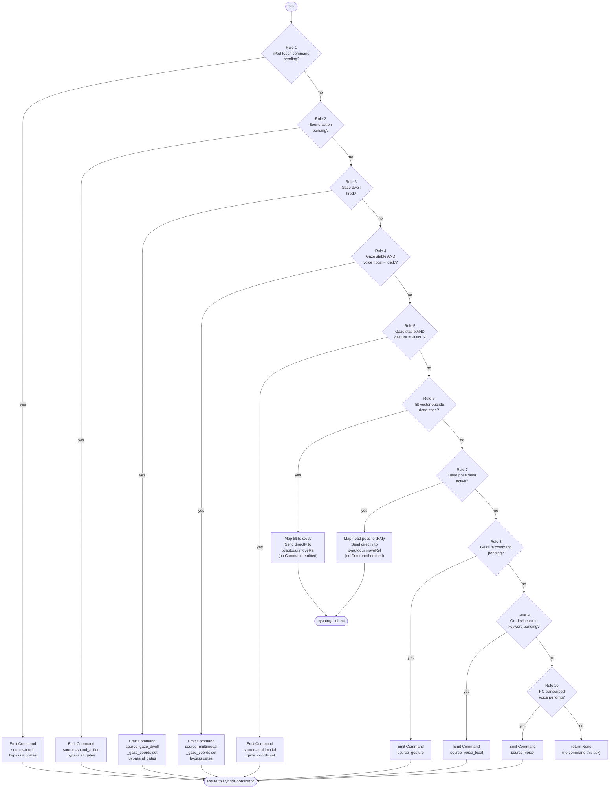
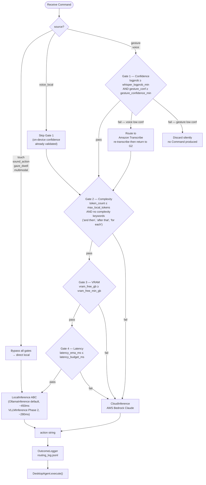
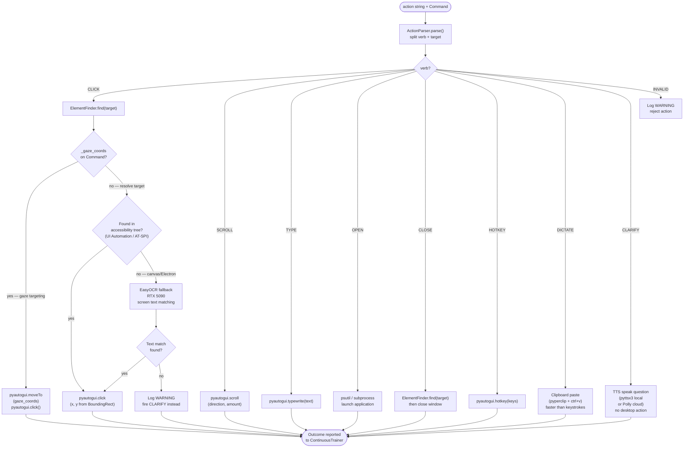
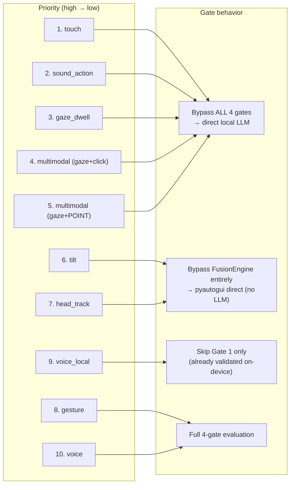

# Fusion & Routing Flowcharts — iPad-Focused Architecture

---

## 1. FusionEngine — 10-Level Priority Decision (60 Hz tick)



---

## 2. HybridCoordinator — 4-Gate Routing Decision



---

## 3. DesktopAgent — Action Dispatch and Target Resolution



---

## 4. Touch Input Routing — Full Decision Tree

```mermaid
flowchart TD
    A([WebSocket message\nfrom iPadApp]) --> B{"type?"}

    B -->|trackpad\ngesture=drag| C["IPadBridge._dispatch_trackpad\nBYPASS FusionEngine entirely"]
    B -->|trackpad\ngesture=tap, fingers=1| C2["IPadBridge → pyautogui.click()"]
    B -->|trackpad\ngesture=tap, fingers=2| C3["IPadBridge → pyautogui.rightClick()"]
    B -->|trackpad\ngesture=scroll, fingers=2| C4["IPadBridge → pyautogui.scroll(dy)"]
    B -->|touch_command| D["IPadBridge → FusionEngine.on_touch\nRule 1 — highest priority"]
    B -->|gaze| E["IPadBridge → FusionEngine gaze buffer\nused by Rules 3/4/5"]
    B -->|gaze_dwell| F["IPadBridge → FusionEngine.on_gaze_dwell\nRule 3"]
    B -->|tilt| G["IPadBridge → FusionEngine.on_tilt\nRule 6 → pyautogui direct"]
    B -->|tilt_tap| G2["IPadBridge → pyautogui.click()\nat current cursor position"]
    B -->|head_pose| H["IPadBridge → FusionEngine.on_head\nRule 7 → pyautogui direct"]
    B -->|keyword| I{"keyword = 'click'\nAND gaze stable?"}
    I -->|yes| I1["FusionEngine.on_gaze_voice\nRule 4 → multimodal click"]
    I -->|no| I2["FusionEngine.on_voice_local\nRule 9 → standard routing"]
    B -->|sound_action| J["IPadBridge → FusionEngine.on_sound_action\nRule 2"]
    B -->|audio_stream| K["IPadBridge → WhisperStream\nSileroVAD + GPU transcription\n→ Rule 10"]
    B -->|camera_frame| L["IPadBridge → GestureProcessor\nMediaPipe + LiDAR depth\n→ Rule 8"]
    B -->|depth_frame| M["LiDARReceiver.update\nused by GestureProcessor\nfor 3D gesture distances"]

    C --> DIRECT["Direct to pyautogui\nno LLM involved"]
    C2 --> DIRECT
    C3 --> DIRECT
    C4 --> DIRECT
    G --> DIRECT
    G2 --> DIRECT
    H --> DIRECT
    D --> FUSION["FusionEngine\n→ HybridCoordinator\n→ DesktopAgent"]
    E --> FUSION
    F --> FUSION
    I1 --> FUSION
    I2 --> FUSION
    J --> FUSION
    K --> FUSION
    L --> FUSION
```



---

## 5. Gaze Confidence and Stability Logic

```mermaid
flowchart TD
    A([Gaze update received\n{x, y, conf}]) --> B{"conf ≥ 0.55?"}
    B -->|no| DISC["Discard — not used\nfor targeting"]
    B -->|yes| C["Add to stability\nbuffer (last N frames)"]

    C --> D{"Spread of last N\ngaze points < 4%\nof screen diagonal?"}
    D -->|no| UNSTABLE["Gaze valid\nbut NOT stable\nno targeting active"]
    D -->|yes| STABLE["Gaze STABLE\nRules 4/5 can fire"]

    STABLE --> E["Start or continue\ndwell timer"]
    E --> F{"Dwell timer\n≥ configured duration?"}
    F -->|no| STABLE
    F -->|yes| DWELL["Fire gaze_dwell event\nRule 3 — auto click\nno voice/gesture needed"]

    UNSTABLE --> G["Dwell timer resets\nRules 4/5 cannot fire\nuntil stability restored"]
```

---

## 6. Source Priority vs Gate Bypass Summary


