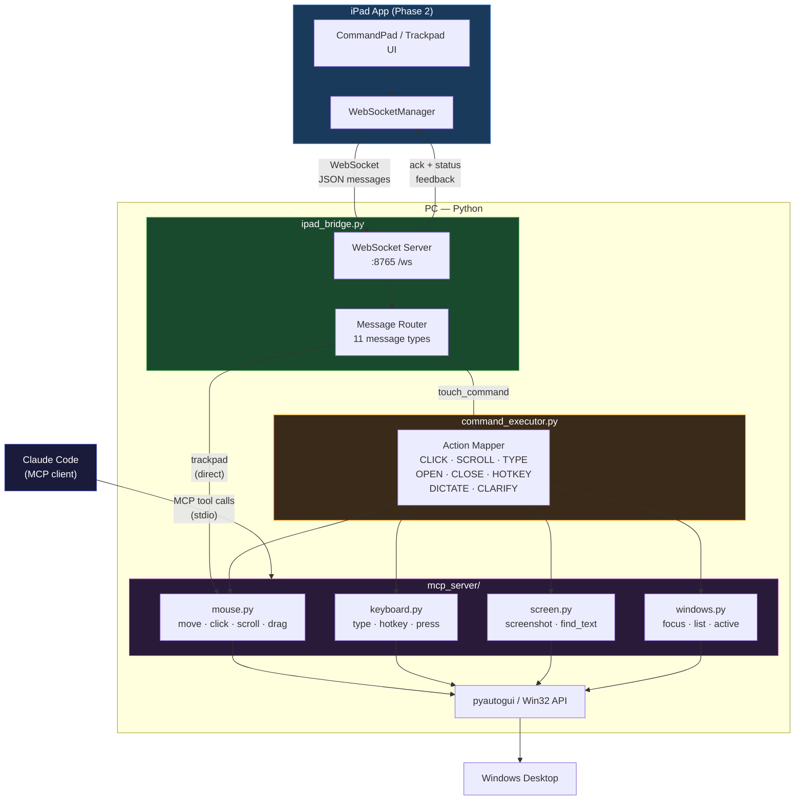

# Bridge Architecture Overview

```mermaid
flowchart TB
    subgraph iPad ["iPad App (Phase 2)"]
        UI["CommandPad / Trackpad UI"]
        WS_CLIENT["WebSocketManager"]
    end

    subgraph PC ["PC — Python"]
        subgraph BRIDGE ["ipad_bridge.py"]
            WS_SERVER["WebSocket Server\n:8765 /ws"]
            ROUTER["Message Router\n11 message types"]
        end

        subgraph EXECUTOR ["command_executor.py"]
            MAP["Action Mapper\nCLICK · SCROLL · TYPE\nOPEN · CLOSE · HOTKEY\nDICTATE · CLARIFY"]
        end

        subgraph MCP ["mcp_server/"]
            MOUSE["mouse.py\nmove · click · scroll · drag"]
            KB["keyboard.py\ntype · hotkey · press"]
            SCR["screen.py\nscreenshot · find_text"]
            WIN["windows.py\nfocus · list · active"]
        end

        PYAUTO["pyautogui / Win32 API"]
    end

    DESKTOP["Windows Desktop"]
    CLAUDE["Claude Code\n(MCP client)"]

    UI --> WS_CLIENT
    WS_CLIENT -- "WebSocket\nJSON messages" --> WS_SERVER
    WS_SERVER --> ROUTER

    ROUTER -- "touch_command" --> MAP
    ROUTER -- "trackpad\n(direct)" --> MOUSE

    MAP --> MOUSE
    MAP --> KB
    MAP --> SCR
    MAP --> WIN

    MOUSE --> PYAUTO
    KB --> PYAUTO
    SCR --> PYAUTO
    WIN --> PYAUTO

    PYAUTO --> DESKTOP

    CLAUDE -- "MCP tool calls\n(stdio)" --> MCP

    WS_SERVER -- "ack + status\nfeedback" --> WS_CLIENT

    style iPad fill:#1a3a5c,color:#fff,stroke:#4a90d9
    style BRIDGE fill:#1a4a2e,color:#fff,stroke:#4caf50
    style EXECUTOR fill:#3a2a1a,color:#fff,stroke:#ff9800
    style MCP fill:#2a1a3a,color:#fff,stroke:#9c27b0
    style CLAUDE fill:#1a1a3a,color:#fff,stroke:#3f51b5
```
