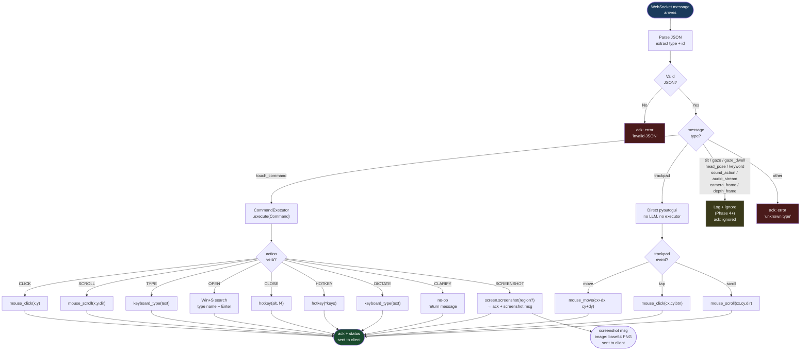

# Bridge Message Routing

```mermaid
flowchart TD
    IN(["WebSocket message\narrives"]) --> PARSE["Parse JSON\nextract type + id"]

    PARSE --> BAD{"Valid\nJSON?"}
    BAD -- No --> ERR_JSON["ack: error\n'invalid JSON'"]

    BAD -- Yes --> TYPE{"message\ntype?"}

    TYPE -- touch_command --> TC["CommandExecutor\n.execute(Command)"]
    TYPE -- trackpad --> TP["Direct pyautogui\nno LLM, no executor"]

    TYPE -- "tilt / gaze / gaze_dwell\nhead_pose / keyword\nsound_action / audio_stream\ncamera_frame / depth_frame" --> FUTURE["Log + ignore\n(Phase 4+)\nack: ignored"]

    TYPE -- other --> UNK["ack: error\n'unknown type'"]

    TC --> ACTION{"action\nverb?"}
    ACTION -- CLICK --> CLICK["mouse_click(x,y)"]
    ACTION -- SCROLL --> SCROLL["mouse_scroll(x,y,dir)"]
    ACTION -- TYPE --> TYPE2["keyboard_type(text)"]
    ACTION -- OPEN --> OPEN["Win+S search\ntype name + Enter"]
    ACTION -- CLOSE --> CLOSE["hotkey(alt, f4)"]
    ACTION -- HOTKEY --> HOTKEY["hotkey(*keys)"]
    ACTION -- DICTATE --> DICTATE["keyboard_type(text)"]
    ACTION -- CLARIFY --> CLARIFY["no-op\nreturn message"]
    ACTION -- SCREENSHOT --> SCREENSHOT["screen.screenshot(region?)\n→ ack + screenshot msg"]

    TP --> TPEV{"trackpad\nevent?"}
    TPEV -- move --> MOVE["mouse_move(cx+dx, cy+dy)"]
    TPEV -- tap --> TAP["mouse_click(cx,cy,btn)"]
    TPEV -- scroll --> TSCROLL["mouse_scroll(cx,cy,dir)"]

    CLICK & SCROLL & TYPE2 & OPEN & CLOSE & HOTKEY & DICTATE & CLARIFY & SCREENSHOT & MOVE & TAP & TSCROLL --> ACK(["ack + status\nsent to client"])
    SCREENSHOT --> IMG(["screenshot msg\nimage: base64 PNG\nsent to client"])

    style IN fill:#1a3a5c,color:#fff
    style ACK fill:#1a4a2e,color:#fff
    style FUTURE fill:#3a3a1a,color:#fff,stroke:#888
    style ERR_JSON fill:#4a1a1a,color:#fff
    style UNK fill:#4a1a1a,color:#fff
```
