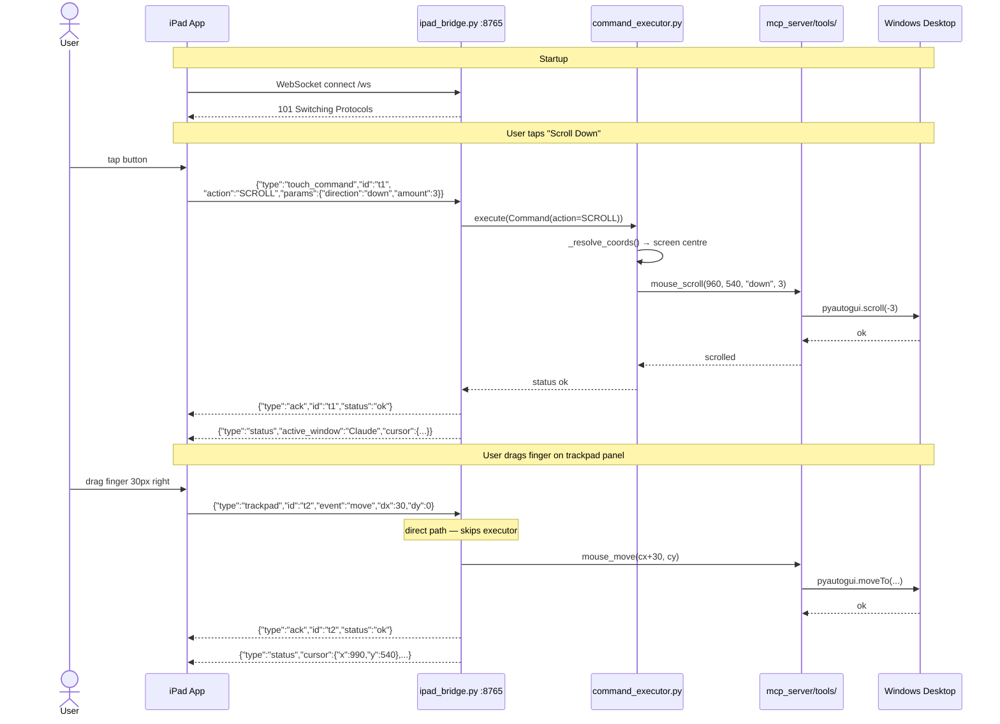

# Bridge Sequence — Touch Command End-to-End

```mermaid
sequenceDiagram
    actor User
    participant App as iPad App
    participant Bridge as ipad_bridge.py :8765
    participant Exec as command_executor.py
    participant Tools as mcp_server/tools/
    participant OS as Windows Desktop

    Note over App,OS: Startup
    App->>Bridge: WebSocket connect /ws
    Bridge-->>App: 101 Switching Protocols

    Note over App,OS: User taps "Scroll Down"
    User->>App: tap button
    App->>Bridge: {"type":"touch_command","id":"t1",<br/>"action":"SCROLL","params":{"direction":"down","amount":3}}
    Bridge->>Exec: execute(Command(action=SCROLL))
    Exec->>Exec: _resolve_coords() → screen centre
    Exec->>Tools: mouse_scroll(960, 540, "down", 3)
    Tools->>OS: pyautogui.scroll(-3)
    OS-->>Tools: ok
    Tools-->>Exec: scrolled
    Exec-->>Bridge: status ok
    Bridge-->>App: {"type":"ack","id":"t1","status":"ok"}
    Bridge-->>App: {"type":"status","active_window":"Claude","cursor":{...}}

    Note over App,OS: User drags finger on trackpad panel
    User->>App: drag finger 30px right
    App->>Bridge: {"type":"trackpad","id":"t2","event":"move","dx":30,"dy":0}
    Note over Bridge: direct path — skips executor
    Bridge->>Tools: mouse_move(cx+30, cy)
    Tools->>OS: pyautogui.moveTo(...)
    OS-->>Tools: ok
    Bridge-->>App: {"type":"ack","id":"t2","status":"ok"}
    Bridge-->>App: {"type":"status","cursor":{"x":990,"y":540},...}
```
