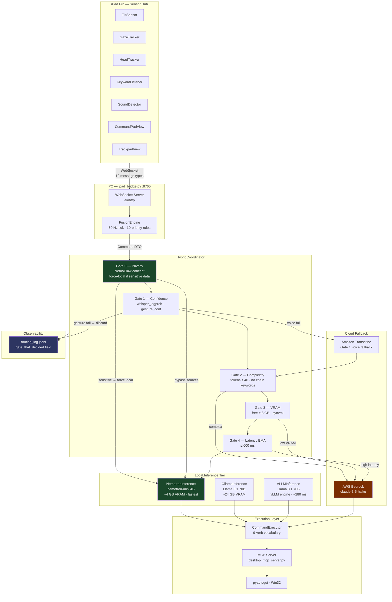

# Diagram 10 — NemoClaw Integration: System Architecture

End-to-end view showing how NemoClaw concepts (Gate 0 privacy routing,
`NemotronInference`, and `gate_that_decided` logging) slot into the full pipeline.
Green nodes = NemoClaw additions. Dark red = cloud paths. Blue = observability.

