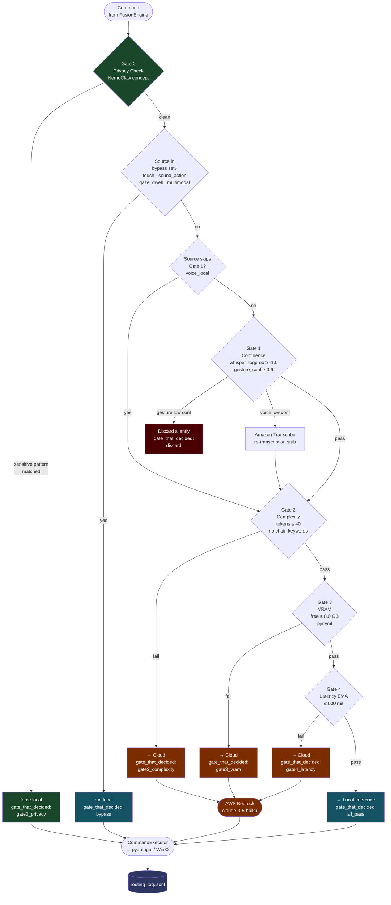

# Diagram 11 — NemoClaw Integration: Gate Decision Flow

Detailed flowchart of every routing decision in `HybridCoordinator`.
Gate 0 (green) is the NemoClaw privacy concept — a sensitive-data match
short-circuits all other gates and forces local inference.
Each terminal node shows the `gate_that_decided` string written to `routing_log.jsonl`.

