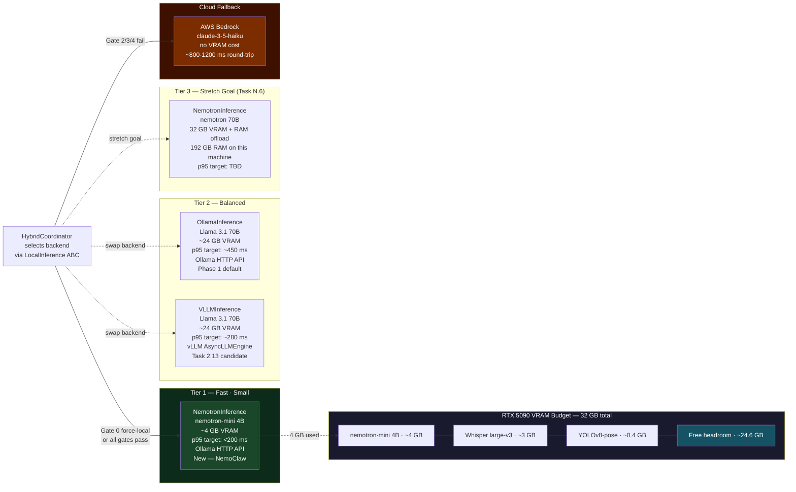

# Diagram 12 — NemoClaw Integration: Local Inference Backend Tiers

Shows the three local inference backends mapped against the RTX 5090 VRAM budget.
All three implement `LocalInference` ABC — swapping is one constructor argument.
`NemotronInference` (green, Tier 1) is the NemoClaw addition; with nemotron-mini (4B)
the VRAM floor drops to ~7.4 GB total, effectively eliminating Gate 3 failures.



## Backend Selection Guide

| Situation | Recommended backend | Why |
|---|---|---|
| Default / benchmarking | `NemotronInference("nemotron-mini")` | 4B model, ~4 GB VRAM, Gate 3 never fires |
| Quality concerns on edge cases | `OllamaInference("llama3.1:70b")` | Larger model, more reasoning depth |
| Lowest latency needed | `VLLMInference(...)` | vLLM engine optimised for throughput |
| 32 GB VRAM fully available | `NemotronInference("nemotron")` | 70B Nemotron, RAM offload path |

## Swapping backends

```python
# In ipad_bridge.py or wherever HybridCoordinator is constructed:
from local_inference import NemotronInference, OllamaInference, VLLMInference

coordinator = HybridCoordinator(
    local=NemotronInference("nemotron-mini"),   # swap this line only
    config=CoordinatorConfig(),
)
```
