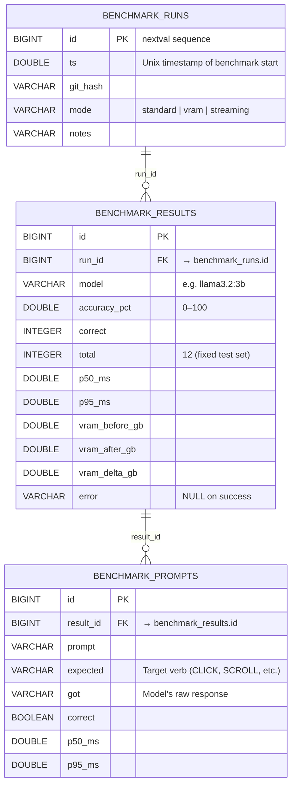

# Database Schema Diagrams

Two stores make up the persistence layer:
- **`agent.db`** (SQLite) — all operational pipeline writes; 12 tables
- **`analytics.duckdb`** (DuckDB) — benchmark history; attaches `agent.db` for OLAP queries

---

## 1. `agent.db` — Full Entity-Relationship Diagram

```mermaid
erDiagram
    SESSIONS {
        INTEGER id          PK  "AUTOINCREMENT"
        REAL    started_at      "Unix timestamp"
        REAL    ended_at        "NULL until shutdown"
        TEXT    mode            "normal | safe | benchmark | migration"
        TEXT    git_hash        "Short SHA of HEAD at startup"
        TEXT    agent_version
        TEXT    notes
    }

    COMMANDS {
        INTEGER id                  PK  "AUTOINCREMENT"
        INTEGER session_id          FK  "→ sessions.id"
        REAL    ts                      "Unix timestamp"
        TEXT    source                  "touch | gaze_dwell | voice | gesture | sound_action | keyword | trackpad"
        TEXT    text                    "Raw command text"
        TEXT    action                  "Executed verb; NULL if CLARIFY before dispatch"
        TEXT    params                  "JSON action params"
        TEXT    route                   "local | cloud | bypass | discard"
        TEXT    gate_that_decided       "bypass | gate0_privacy | gate2_complexity | gate3_vram | gate4_latency | all_pass"
        REAL    latency_ms
        REAL    whisper_logprob         "0.0 for non-voice sources"
        REAL    gesture_confidence      "1.0 for non-gesture sources"
        REAL    gaze_x                  "Normalised 0-1; NULL if not gaze-sourced"
        REAL    gaze_y
        INTEGER success                 "1=ok  0=failed  NULL=not recorded"
        TEXT    error_msg
        TEXT    corrected_to            "Verb supplied by user correction"
    }

    INFERENCES {
        INTEGER id          PK  "AUTOINCREMENT"
        INTEGER command_id  FK  "→ commands.id; NULL for standalone calls"
        REAL    ts
        TEXT    model           "e.g. llama3.2:3b"
        TEXT    domain          "command | code | math | vision | plan | general"
        TEXT    prompt_hash     "SHA-256[:16] of full prompt"
        TEXT    response
        INTEGER tokens_in
        INTEGER tokens_out
        REAL    latency_ms
        TEXT    backend         "ollama | vllm | bedrock | agentcore"
        TEXT    error
    }

    AGENT_RUNS {
        INTEGER id               PK  "AUTOINCREMENT"
        INTEGER command_id       FK  "→ commands.id; NULL if invoked standalone"
        REAL    ts
        TEXT    goal                 "Original user query"
        TEXT    domain               "plan | code | math | vision | general"
        TEXT    model_used
        INTEGER step_count
        INTEGER success
        REAL    total_latency_ms
        TEXT    error
    }

    AGENT_STEPS {
        INTEGER id          PK  "AUTOINCREMENT"
        INTEGER run_id      FK  "→ agent_runs.id"
        INTEGER step_num
        TEXT    action          "WRITE_FILE | RUN_TERMINAL | EXPLAIN | SEARCH_WEB | READ_SCREEN"
        TEXT    args
        TEXT    body            "Multi-line content (file bodies, terminal output)"
        TEXT    result
        INTEGER success
        REAL    latency_ms
    }

    FEW_SHOT_EXAMPLES {
        INTEGER id          PK  "AUTOINCREMENT"
        INTEGER command_id  FK  "→ commands.id; back-reference to source command"
        TEXT    text            "Command text"
        TEXT    action          "Action executed"
        TEXT    source
        TEXT    domain          "Default: command"
        REAL    ts
        INTEGER usage_count     "Incremented on each re-use"
        BLOB    embedding       "NULL until sentence transformer wired up; f32 384-dim MiniLM"
    }

    WORD_COUNTS {
        TEXT    word        PK  "Unique token"
        INTEGER count           "Cumulative occurrence count across all successes"
    }

    HOTWORDS {
        TEXT    word        PK
        REAL    added           "Timestamp when promoted from word_counts"
    }

    GESTURE_SAMPLES {
        INTEGER id              PK  "AUTOINCREMENT"
        INTEGER command_id      FK  "→ commands.id; NULL if recorded without a command"
        REAL    ts
        TEXT    gesture             "POINT | PINCH | OPEN_PALM | FIST"
        REAL    confidence          "MediaPipe landmark confidence"
        REAL    lidar_depth_m       "Pinch depth from LiDARReceiver; NULL if unavailable"
    }

    GESTURE_CALIBRATION {
        INTEGER id               PK  "AUTOINCREMENT — append-only, never updated"
        REAL    ts
        TEXT    gesture
        REAL    confidence_floor     "p10(samples) − 0.05"
        INTEGER sample_count
        REAL    p10
    }

    SENSOR_EVENTS {
        INTEGER id          PK  "AUTOINCREMENT"
        INTEGER command_id  FK  "→ commands.id; NULL if no command fired from this event"
        REAL    ts
        TEXT    event_type      "gaze_dwell | gesture | sound_action | keyword | tilt_tap"
        REAL    x               "Normalised 0-1 screen coord"
        REAL    y
        REAL    confidence
        TEXT    value           "Keyword word | sound name | gesture class | etc."
        TEXT    params          "JSON for additional event fields"
    }

    SETTINGS_VERSIONS {
        INTEGER id          PK  "AUTOINCREMENT — append-only change log"
        REAL    ts
        TEXT    component       "coordinator | fusion | trainer | ipad"
        TEXT    key
        TEXT    old_value       "JSON-serialised; NULL for first-ever set"
        TEXT    new_value       "JSON-serialised"
        TEXT    changed_by      "user | adaptation_loop | benchmark"
    }

    SESSIONS         ||--o{ COMMANDS          : "session_id"
    COMMANDS         ||--o{ INFERENCES        : "command_id"
    COMMANDS         ||--o{ SENSOR_EVENTS     : "command_id"
    COMMANDS         ||--o{ FEW_SHOT_EXAMPLES : "command_id"
    COMMANDS         ||--o{ GESTURE_SAMPLES   : "command_id"
    COMMANDS         ||--o{ AGENT_RUNS        : "command_id"
    AGENT_RUNS       ||--o{ AGENT_STEPS       : "run_id"
    WORD_COUNTS      ||--o{ HOTWORDS          : "promotes-to"
```



---

## 2. `analytics.duckdb` — Benchmark Schema

DuckDB is attached to `agent.db` at query time (`ATTACH 'agent.db' AS ops (TYPE SQLITE)`), so it can reference any table above as `ops.<table>` without replication.



---

## 3. Pipeline Write Topology

Which component writes to which table, and why.

```mermaid
flowchart TD
    subgraph pipeline["Hot-path pipeline (60 Hz)"]
        FE["FusionEngine"]
        HC["HybridCoordinator"]
        LI["LocalInference\n(OllamaInference)"]
        MR["ModelRouter"]
        DA["DevAgent"]
        CT["ContinuousTrainer"]
    end

    subgraph agentdb["agent.db (SQLite / aiosqlite)"]
        S["sessions"]
        C["commands"]
        I["inferences"]
        FSE["few_shot_examples"]
        WC["word_counts"]
        HW["hotwords"]
        GS["gesture_samples"]
        GC["gesture_calibration"]
        SE["sensor_events"]
        SV["settings_versions"]
        AR["agent_runs"]
        AS["agent_steps"]
    end

    subgraph analyticsdb["analytics.duckdb (DuckDB)"]
        BR["benchmark_runs"]
        BRE["benchmark_results"]
        BP["benchmark_prompts"]
    end

    MP["main.py\n(startup / shutdown)"] -->|"INSERT / UPDATE"| S

    HC -->|"INSERT every routed command"| C
    HC -->|"INSERT after each LLM call"| I

    FE -->|"INSERT gaze_dwell / gesture\n/ sound / keyword events"| SE

    CT -->|"UPSERT on record_success"| FSE
    CT -->|"UPDATE ON CONFLICT count++"| WC
    CT -->|"INSERT OR IGNORE when count≥3"| HW
    CT -->|"INSERT per gesture frame"| GS
    CT -->|"INSERT every adapt cycle\n(append-only)"| GC

    DA -->|"INSERT on handle/plan_and_run"| AR
    DA -->|"INSERT per plan step"| AS

    MR -->|"INSERT after specialist infer"| I

    BM["benchmark_models.py\n(offline, sync)"] -->|"INSERT run + results + prompts"| BR
    BM --> BRE
    BM --> BP

    style agentdb fill:#1a3a5c,color:#fff
    style analyticsdb fill:#2d1a5c,color:#fff
    style pipeline fill:#1a3a2a,color:#fff
```



---

## 4. Key Index Coverage

```
agent.db indexes:
  commands(session_id)          — fetch all commands for a session
  commands(ts)                  — time-range queries for adaptation loop
  commands(source)              — filter by input modality
  commands(action)              — filter by executed verb
  inferences(command_id)        — join command → its LLM calls
  inferences(model)             — per-model latency aggregation
  inferences(ts)                — time-range latency analysis
  agent_steps(run_id)           — fetch all steps for a plan run
  few_shot_examples(ts)         — recency-weighted retrieval
  few_shot_examples(domain)     — domain-scoped few-shot lookup
  gesture_samples(gesture, ts)  — per-gesture time-series for calibration
  gesture_calibration(gesture, ts) — latest floor per gesture (MAX(ts) query)
  sensor_events(ts)             — time-range event replay
  sensor_events(event_type)     — filter by modality
  settings_versions(component, key, ts) — settings change history per key
```
