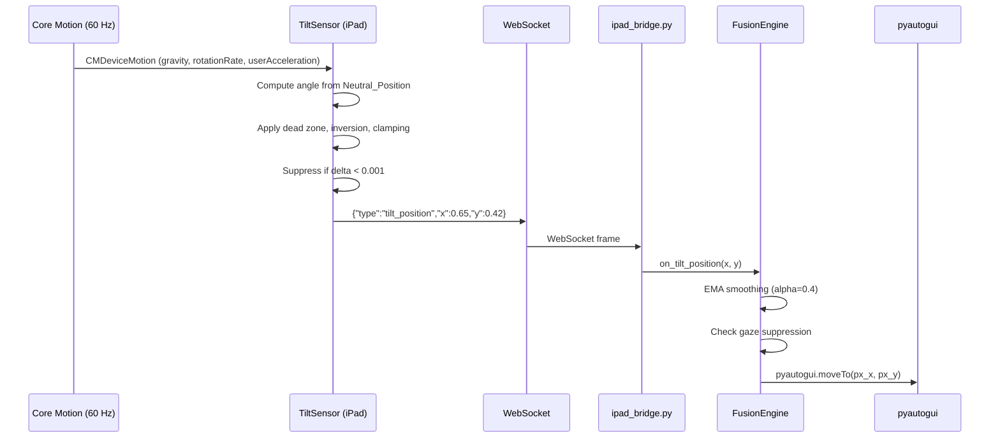
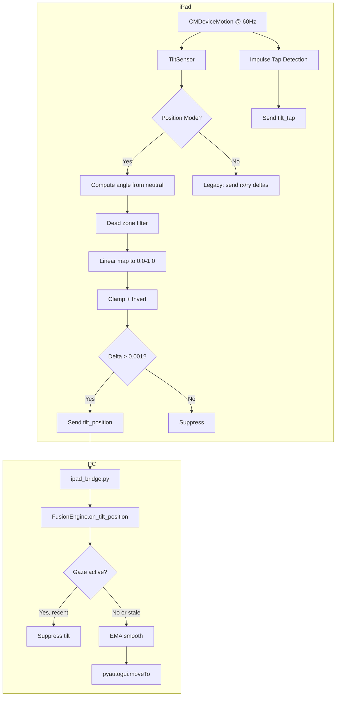

# Design Document: Tilt Position Mapping

## Overview

This design replaces the TiltSensor's velocity-based cursor control (streaming rotation-rate deltas integrated on the PC) with a **position-mapped model** where the iPad's physical tilt angle maps directly to an absolute screen position. The cursor rests wherever the iPad is angled — no sustained tilt required.

**Key benefits for Brad's JIA:**
- Eliminates sustained effort to keep cursor moving
- Holding the iPad at any comfortable angle parks the cursor at a predictable position
- Configurable tilt range accommodates limited range of motion
- Dead zone prevents micro-jitter when holding still

**Latency budget:** iPad computation (< 1ms) + WebSocket send (< 5ms) + PC EMA + moveTo (< 10ms) = well under the 100ms target.

## Architecture





## Components and Interfaces

### iPad Side

#### TiltSensor (modified)

```swift
@MainActor
final class TiltSensor {
    // Existing
    private let motion: CMMotionManager
    private weak var ws: WebSocketManager?
    private var settings: SettingsStore?
    
    // New: position-mapping state
    private var neutralGravity: SIMD3<Double>  // calibrated neutral gravity vector
    private var lastSentX: Double = 0.5        // for suppression check
    private var lastSentY: Double = 0.5
    private var stationaryStartTime: Date?     // for stationary lock
    private var lockedCoords: (x: Double, y: Double)?  // frozen output during stationary
    
    // Public API
    func start()
    func stop()
    func calibrate()  // captures current gravity as neutral
    
    // Internal
    private func handle(_ data: CMDeviceMotion)
    private func computePosition(gravity: CMAcceleration) -> (x: Double, y: Double)
    private func shouldSuppress(x: Double, y: Double) -> Bool
    private func detectImpulseTap(_ data: CMDeviceMotion)
}
```

**`computePosition` algorithm (pseudocode):**

```
func computePosition(gravity: CMAcceleration) -> (x: Double, y: Double):
    // 1. Convert gravity to SIMD3 unit vector
    g = normalize(SIMD3(gravity.x, gravity.y, gravity.z))
    
    // 2. Compute angular displacement from neutral
    // Roll: rotation around the device's Z-axis (left/right tilt)
    // Pitch: rotation around the device's X-axis (forward/back tilt)
    
    neutralPitch = atan2(-neutralGravity.x, -neutralGravity.z)
    neutralRoll  = atan2(-neutralGravity.y, -neutralGravity.z)
    
    currentPitch = atan2(-g.x, -g.z)
    currentRoll  = atan2(-g.y, -g.z)
    
    deltaPitch = currentPitch - neutralPitch  // radians
    deltaRoll  = currentRoll - neutralRoll    // radians
    
    // 3. Convert to degrees
    deltaPitchDeg = deltaPitch * (180.0 / .pi)
    deltaRollDeg  = deltaRoll * (180.0 / .pi)
    
    // 4. Apply dead zone (map to zero if within threshold)
    deadZone = settings.tiltDeadZone  // degrees, default 1.5
    if abs(deltaPitchDeg) < deadZone: deltaPitchDeg = 0
    if abs(deltaRollDeg) < deadZone:  deltaRollDeg = 0
    
    // 5. Linear map to [0.0, 1.0]
    tiltRange = settings.tiltRange  // degrees, default 25
    x = 0.5 + (deltaRollDeg / tiltRange) * 0.5   // roll right → x increases
    y = 0.5 - (deltaPitchDeg / tiltRange) * 0.5  // pitch forward → y decreases (toward top)
    
    // 6. Apply inversion
    if settings.tiltInverted:
        x = 1.0 - x
        y = 1.0 - y
    
    // 7. Clamp to [0.0, 1.0]
    x = max(0.0, min(1.0, x))
    y = max(0.0, min(1.0, y))
    
    return (x, y)
```

#### SettingsStore (additions)

```swift
// New properties added to SettingsStore
@Published var tiltRange: Double {          // degrees, default 25, clamped [5, 60]
    didSet {
        let clamped = max(5.0, min(60.0, tiltRange))
        if clamped != tiltRange { tiltRange = clamped }
        defaults.set(clamped, forKey: "tiltRange")
    }
}

@Published var tiltPositionMode: Bool {     // true = position-mapped, false = legacy velocity
    didSet { defaults.set(tiltPositionMode, forKey: "tiltPositionMode") }
}

// Neutral position persistence (stored as 3 doubles)
var neutralGravityX: Double { get/set via defaults }
var neutralGravityY: Double { get/set via defaults }
var neutralGravityZ: Double { get/set via defaults }
var hasPersistedNeutral: Bool { defaults has "neutralGravityX" }
```

#### WebSocketManager (additions)

```swift
extension WebSocketManager {
    func sendTiltPosition(x: Double, y: Double) {
        send(["type": "tilt_position", "x": x, "y": y])
    }
}
```

### PC Side

#### ipad_bridge.py (additions)

```python
# New message handler in _handle_message
if msg_type == "tilt_position":
    try:
        if self._fusion:
            x = float(msg.get("x", 0.5))
            y = float(msg.get("y", 0.5))
            self._fusion.on_tilt_position(x, y)
    except (ValueError, TypeError) as exc:
        log.debug("Bad tilt_position data: %s", exc)
    return
```

#### FusionEngine (additions)

```python
class FusionEngine:
    # New state for position-based tilt
    _tilt_position: Optional[tuple[float, float]] = None  # (x, y) normalized
    _tilt_pos_ema_x: float = 0.5
    _tilt_pos_ema_y: float = 0.5
    _tilt_pos_alpha: float = 0.4  # EMA smoothing factor
    _tilt_pos_initialized: bool = False
    
    def on_tilt_position(self, x: float, y: float) -> None:
        """Receive absolute position from iPad tilt sensor."""
        self._tilt_position = (x, y)
    
    # In _tick(), Rule 6 becomes:
    async def _handle_tilt_position(self) -> None:
        """Rule 6 variant: absolute positioning from tilt_position messages."""
        import pyautogui
        
        x, y = self._tilt_position
        self._tilt_position = None
        
        # EMA smoothing
        if not self._tilt_pos_initialized:
            self._tilt_pos_ema_x = x
            self._tilt_pos_ema_y = y
            self._tilt_pos_initialized = True
        else:
            a = self._tilt_pos_alpha
            self._tilt_pos_ema_x = a * x + (1 - a) * self._tilt_pos_ema_x
            self._tilt_pos_ema_y = a * y + (1 - a) * self._tilt_pos_ema_y
        
        # Convert to pixels
        px_x = round(self._tilt_pos_ema_x * self._w)
        px_y = round(self._tilt_pos_ema_y * self._h)
        
        # Clamp to screen bounds
        px_x = max(0, min(self._w - 1, px_x))
        px_y = max(0, min(self._h - 1, px_y))
        
        await asyncio.to_thread(pyautogui.moveTo, px_x, px_y, duration=0)
```

## Data Models

### WebSocket Messages

#### Position Message (new)

```json
{
    "type": "tilt_position",
    "x": 0.65,
    "y": 0.42
}
```

- `x`: Float in [0.0, 1.0]. 0.0 = left edge, 1.0 = right edge.
- `y`: Float in [0.0, 1.0]. 0.0 = top edge, 1.0 = bottom edge.
- Sent at up to 60 Hz, suppressed when delta < 0.001 on both axes.

#### Legacy Tilt Message (unchanged, still supported)

```json
{
    "type": "tilt",
    "rx": -0.23,
    "ry": 0.15
}
```

#### Tilt Tap Message (unchanged)

```json
{
    "type": "tilt_tap",
    "id": "tt-42"
}
```

### Settings Model (iPad UserDefaults)

| Key | Type | Default | Range | Description |
|-----|------|---------|-------|-------------|
| `tiltRange` | Double | 25.0 | [5, 60] | Degrees from neutral to screen edge |
| `tiltDeadZone` | Double | 1.5 | [0.5, 10] | Degrees of dead zone around neutral |
| `tiltPositionMode` | Bool | true | — | Position mode vs legacy velocity mode |
| `tiltInverted` | Bool | false | — | Invert both axes |
| `tiltEnabled` | Bool | true | — | Master tilt on/off (existing) |
| `neutralGravityX` | Double | -0.707 | — | Persisted neutral gravity X component |
| `neutralGravityY` | Double | 0.0 | — | Persisted neutral gravity Y component |
| `neutralGravityZ` | Double | -0.707 | — | Persisted neutral gravity Z component |

Default neutral gravity `(-0.707, 0, -0.707)` corresponds to iPad held at ~45° from horizontal.

### FusionEngine Config (PC)

| Field | Type | Default | Description |
|-------|------|---------|-------------|
| `tilt_pos_alpha` | float | 0.4 | EMA smoothing factor for position messages |
| `tilt_pos_enabled` | bool | True | Accept tilt_position messages |

## Correctness Properties

*A property is a characteristic or behavior that should hold true across all valid executions of a system — essentially, a formal statement about what the system should do. Properties serve as the bridge between human-readable specifications and machine-verifiable correctness guarantees.*

### Property 1: Linear Mapping Produces Correct Normalized Output

*For any* tilt angle within [-tiltRange, +tiltRange] on either axis, the `computePosition` function SHALL produce a normalized coordinate that is linearly proportional to the angle, with angle == 0 mapping to 0.5, angle == +tiltRange mapping to 1.0 (or 0.0 for pitch), and angle == -tiltRange mapping to 0.0 (or 1.0 for pitch).

**Validates: Requirements 1.3, 1.4, 3.5**

### Property 2: Output Clamping Invariant

*For any* gravity vector (including extreme orientations far beyond the configured tiltRange), the `computePosition` function SHALL produce x and y values that are both within the closed interval [0.0, 1.0].

**Validates: Requirements 1.5**

### Property 3: Calibration Persistence Round Trip

*For any* valid gravity vector used as a neutral position, persisting it to SettingsStore and then loading it back SHALL produce a neutral position that is equal to the original (within floating-point epsilon).

**Validates: Requirements 2.1, 2.2**

### Property 4: Recalibration Recenters Output

*For any* gravity vector that equals the newly calibrated neutral position, `computePosition` SHALL produce screen coordinates of exactly (0.5, 0.5) — the screen center.

**Validates: Requirements 2.5**

### Property 5: Tilt Range Constraint

*For any* value assigned to `tiltRange` in SettingsStore (including negative numbers, zero, and values > 60), the stored value SHALL always be clamped to the interval [5, 60] degrees.

**Validates: Requirements 3.3**

### Property 6: Tilt Range Immediate Effect

*For any* fixed tilt angle and two different tiltRange values (r1 ≠ r2), computing the position with r1 and then with r2 (without recalibration or restart) SHALL produce different screen coordinates when the angle is non-zero and within both ranges.

**Validates: Requirements 3.4**

### Property 7: Dead Zone Maps to Center

*For any* angular displacement from neutral that is less than the configured `tiltDeadZone` (in degrees) on both axes, `computePosition` SHALL produce screen coordinates of exactly (0.5, 0.5).

**Validates: Requirements 6.1**

### Property 8: Message Suppression

*For any* sequence of computed screen coordinates where consecutive values differ by less than 0.001 on both axes, the TiltSensor SHALL NOT send a `tilt_position` message for the subsequent values.

**Validates: Requirements 4.3**

### Property 9: EMA Smoothing Recurrence

*For any* sequence of position messages received by FusionEngine, the smoothed output at step n SHALL equal `alpha * input[n] + (1 - alpha) * smoothed[n-1]`, and the variance of the smoothed sequence SHALL be less than or equal to the variance of the input sequence.

**Validates: Requirements 5.2, 6.2**

### Property 10: Stationary Lock

*For any* period where the iPad's angular velocity is below 0.01 rad/s on both axes for at least 200ms, the TiltSensor SHALL output the same screen coordinates as the last value computed before the stationary period began.

**Validates: Requirements 6.3**

### Property 11: Inversion Symmetry

*For any* tilt angle, computing the position with `tiltInverted = false` yielding (x, y) and then with `tiltInverted = true` SHALL yield (1.0 - x, 1.0 - y).

**Validates: Requirements 7.1**

### Property 12: Tap Independence

*For any* CMDeviceMotion frame, the screen coordinates produced by `computePosition` SHALL be identical regardless of whether `userAcceleration` contains an impulse spike (tap) or not — the position computation uses only the gravity vector.

**Validates: Requirements 8.3**

## Error Handling

| Scenario | Handling | Degradation |
|----------|----------|-------------|
| Core Motion unavailable | `start()` logs warning, returns early | Tilt disabled, other sensors continue |
| WebSocket disconnected | Messages queued/dropped silently | Cursor freezes at last position |
| Invalid gravity vector (zero magnitude) | Skip frame, log DEBUG | No position update that frame |
| NaN/Inf in computation | Clamp to [0.0, 1.0], log WARNING | Cursor stays within screen bounds |
| SettingsStore read failure | Use defaults (45° neutral, 25° range) | System works with safe defaults |
| FusionEngine receives malformed tilt_position | Catch ValueError/TypeError, log DEBUG | Message discarded, no crash |
| Gaze and tilt conflict | Gaze suppresses tilt (existing priority) | Cursor follows gaze when available |
| Rapid calibration spam | Debounce: ignore calibrations within 500ms | Prevents accidental recalibration |

**SVT consideration:** No sudden audio/visual feedback on calibration. A subtle haptic tap (UIImpactFeedbackGenerator, light) confirms calibration without startling.

**Bipolar/variable engagement:** The system remembers calibration across sessions. No re-setup required on restart. If Brad picks up the iPad at a different angle on a different day, one button press recalibrates — minimal cognitive load.

## Testing Strategy

### Property-Based Tests (Swift — using SwiftCheck or swift-testing with randomized inputs)

Each correctness property above maps to a property-based test with minimum 100 iterations:

- **Property tests for `computePosition`** (Properties 1, 2, 4, 6, 7, 11, 12): Pure function, no I/O. Generate random gravity vectors, neutral positions, tiltRange values, and inversion flags. Assert invariants.
- **Property tests for message suppression** (Property 8): Generate sequences of coordinates, feed through suppression logic, verify message counts.
- **Property tests for EMA smoothing** (Property 9): Generate random position sequences, apply EMA, verify recurrence relation and variance reduction.
- **Property tests for stationary lock** (Property 10): Generate motion sequences with stationary periods, verify output freezes.
- **Property tests for tiltRange constraint** (Property 5): Generate random doubles, assign to tiltRange, verify clamping.
- **Property tests for calibration round trip** (Property 3): Generate random gravity vectors, persist/reload, verify equality.

**Library:** swift-testing with `@Test(arguments:)` for Swift-side properties. `hypothesis` for Python-side FusionEngine properties.

**Configuration:** Minimum 100 iterations per property. Tag format: `Feature: tilt-position-mapping, Property {N}: {title}`

### Unit Tests (Example-Based)

- Default neutral position is ~45° (Requirement 2.4)
- Default tiltRange is 25° (Requirement 3.2)
- Legacy `tilt` messages still processed by FusionEngine (Requirement 9.1)
- `tilt_position` messages processed as absolute positioning (Requirement 9.2)
- Priority: `tilt_position` wins over `tilt` in same tick (Requirement 9.3)
- Gaze suppression of tilt when gaze is recent (Requirement 5.3)
- Gaze stale → tilt escape hatch (Requirement 5.4)
- Position mode does not send legacy `tilt` messages (Requirement 4.4)

### Integration Tests

- End-to-end: iPad sends `tilt_position` → cursor moves to expected pixel (Requirement 5.1)
- Message frequency: 60 Hz under motion (Requirement 4.2)
- Calibration persists across app restart (Requirement 2.3)
- Impulse tap fires independently of position mode (Requirement 8.2)

### Latency Validation

- Measure end-to-end latency from Core Motion callback to `pyautogui.moveTo` completion
- Target: < 100ms (budget: 1ms compute + 5ms network + 10ms EMA + moveTo)
- Test under load: all sensors active simultaneously
