# Database Design — Personal Desktop Agent

**Context:** The project originally stored data across four incompatible formats — `trainer.db` (SQLite), `routing_log.jsonl` (JSONL), `benchmark_results.json`, and `gesture_calibration.json`. This document records the decisions made when consolidating them into two purpose-fit stores.

Diagrams: `.kiro/specs/ipad-sensor-focus/diagrams/14-database-schema.md`  
Implementation: `db.py`

---

## 1. Why Two Stores

**`agent.db` (SQLite)** handles all operational writes from the hot-path pipeline. It is always open, written to on every routed command, and queried synchronously by `ContinuousTrainer` every 5 minutes. SQLite via `aiosqlite` is the right choice here: no server process, async-safe, zero-configuration, and `aiosqlite` was already a dependency.

**`analytics.duckdb` (DuckDB)** handles analytical queries and benchmark storage. DuckDB's columnar engine is significantly faster than SQLite for OLAP workloads — aggregations, percentiles, and joins over millions of rows. The critical architectural choice: DuckDB can attach `agent.db` directly via its sqlite extension (`ATTACH 'agent.db' AS ops (TYPE SQLITE)`), which means all of `agent.db`'s data is queryable from DuckDB without any ETL sync or data duplication. Benchmark data lives natively in DuckDB because it is write-once and read analytically.

**What was rejected:**
- A single SQLite file for everything: SQLite does not support concurrent OLAP queries well, and complex analytical queries (percentiles, window functions over large result sets) are slow.
- A single DuckDB file for everything: DuckDB has no `aiosqlite`-equivalent async driver; putting it on the hot path would require `asyncio.to_thread` wrappers on every insert, adding latency and complexity.
- PostgreSQL/TimescaleDB: overkill for a single-user local tool; server process is an unnecessary dependency.

---

## 2. The Session Anchor

Every `commands` row has a `session_id` foreign key pointing to `sessions`. This was the most structurally important addition over the old JSONL format, which had no session concept at all.

**What it enables:**
- Filter all commands from a specific run: `WHERE session_id = ?`
- Correlate startup metadata (git hash, mode) with the commands that ran under it
- Detect regressions: compare gate distributions across sessions before and after a code change
- Longitudinal analysis: watch how the system's routing behaviour evolves as more examples accumulate

`sessions.mode` distinguishes normal operation from safe-mode testing and benchmark runs, so production data doesn't pollute training sets.

---

## 3. Commands as the Central Fact Table

`commands` is the fact table everything else references. Every significant pipeline event — an inference, a sensor event, a few-shot example, a gesture sample, a DevAgent run — carries an optional `command_id` back-reference.

This is a star schema around the command event. The design tradeoff is that `command_id` is `NULL` for records that were created without a command context (e.g., gesture samples recorded during calibration before any command fired). `NULL` foreign keys are intentional and not a data quality issue — they mean "this event was not triggered by a command."

The `commands` table also carries fields that were previously scattered or absent:
- `gaze_x / gaze_y` — previously only inferred from `gaze_coords` in the `Command` object, never persisted
- `success` — previously inferred from whether an error appeared in the JSONL; now explicit
- `corrected_to` — previously only recorded in the few-shot DB as a new example, now also marks the original command row

---

## 4. Append-Only Tables

Two tables are deliberately append-only and never have rows updated or deleted: `gesture_calibration` and `settings_versions`.

**`gesture_calibration`** stores every calibration event with a timestamp. To get the current floor for a gesture: `SELECT confidence_floor FROM gesture_calibration WHERE gesture=? ORDER BY ts DESC LIMIT 1`. The history of how the floor evolved is a free training signal — you can see whether a floor drifted up (user became more consistent) or down (conditions changed). The old `gesture_calibration.json` overwrote the previous value on every write and had no history.

**`settings_versions`** records every threshold change made by the adaptation loop, user, or benchmark. When a gate threshold gets relaxed at 3am and something breaks, this table tells you exactly when it changed, from what value, to what value, and why (`changed_by = 'adaptation_loop'`).

Both tables grow at low rate (at most a few dozen rows per day) and are cheap to keep forever.

---

## 5. The Embedding Column

`few_shot_examples.embedding` is a nullable `BLOB` holding a 384-dimensional float32 vector from `all-MiniLM-L6-v2`. It is populated **incrementally**: each UPSERT backfills the embedding only where it is still `NULL` (the encoder loads lazily on first use; if `sentence-transformers` is unavailable the column stays `NULL` and that row falls back to Jaccard).

**Retrieval** (`get_few_shot_examples`): `similarity × recency_decay × log(usage_count)`, where `similarity` is **cosine** over the stored embeddings when both the query and the row have one, and **Jaccard** word-overlap otherwise — a per-row decision, so a partially-embedded table is handled gracefully. Recency uses a 30-day half-life; results are filtered to `score > 0`.

The BLOB stores raw float32 bytes (`numpy.ndarray.tobytes()` / `numpy.frombuffer()`). 384 floats × 4 bytes = 1536 bytes per row — negligible.

> This is the **SQLite-resident** few-shot store on the per-command prompt hot path. It is distinct from the ChromaDB `behavioral_memory` collection used by the behavioral twin and the `codebase`/`documents` collections used by the RAG indexer — see §11 and the two-tier note in §12.

---

## 6. Why `routing_log.jsonl` Was a Problem

The JSONL file had three structural problems that made it progressively worse as the log grew:

1. **Full-file scan every 5 minutes.** `ContinuousTrainer._adaptation_loop()` called `_read_routing_log()` which opened the file and parsed every line on every adaptation pass. At 1000 entries this is fast; at 100,000 entries it becomes noticeable.

2. **No session context.** Every entry was independent — there was no way to ask "what was the gate distribution during the session where I was testing the new threshold?" without correlating timestamps manually.

3. **No referential integrity.** The JSONL had no link to the few-shot examples that were created from the same commands. If you wanted to know "did the commands that ended up as few-shot examples have different gate distributions than the ones that didn't?", you had no way to answer it.

The `commands` table solves all three: the adaptation loop now queries `SELECT route, action FROM commands ORDER BY ts DESC LIMIT 1000`, sessions provide context, and `few_shot_examples.command_id` links back to the source command.

---

## 7. Benchmark Data in DuckDB, Not JSON

`benchmark_results.json` was a flat array of model results from a single run. It had no history — re-running the benchmark overwrote the previous results. Putting benchmarks in `analytics.duckdb` adds:

- **Run history:** every benchmark run gets a row in `benchmark_runs` with a git hash. You can query "how has llama3.2:3b accuracy changed across the last 10 benchmark runs?"
- **Cross-run queries:** `SELECT r.model, AVG(r.p50_ms) FROM benchmark_results r GROUP BY r.model ORDER BY AVG(r.p50_ms)` — impossible from a single JSON array.
- **Cross-database joins:** `ATTACH 'agent.db' AS ops` then `SELECT b.model, AVG(ops.commands.latency_ms) FROM benchmark_results b JOIN ops.commands c ON c.action = 'CLICK' ...` — real production latency vs. benchmark latency in one query.

The JSON fallback in `benchmark_models.py` remains for environments where DuckDB is unavailable. DuckDB is a graceful-degradation optional dependency, consistent with the rest of the project's approach to optional packages.

---

## 8. What Each Legacy File Became

| Legacy format | Problems | Replaced by |
|---|---|---|
| `trainer.db` (SQLite, 3 tables) | No session context; `command_id` backlink missing; embedding path absent | `agent.db` — those 3 tables expanded, plus the rest of today's **40-table** schema (§11) |
| `routing_log.jsonl` | Full-file read every 5 min; no session; no referential integrity | `agent.db` `commands` table |
| `gesture_calibration.json` | Overwrote history on every write; in-memory samples lost on crash | `agent.db` `gesture_samples` (full history) + `gesture_calibration` (append-only floor log) |
| `benchmark_results.json` | Single-run snapshot; no history; not queryable | `analytics.duckdb` `benchmark_runs / results / prompts` |

---

## 9. Behavioral Twin State Tables (Sprint 3)

Two new tables support the `BehavioralTwinState` component introduced in Sprint 3. Both follow the same append-only, session-anchored pattern as `gesture_calibration` and `settings_versions`.

**`twin_session_history`** stores the ordered sequence of successfully executed commands within each session. `seq` is a 0-based position index within the session, allowing the next session to reconstruct the prior session's tail without a full table scan. On startup, `BehavioralTwinState` queries the 20 most recent rows from the most recent prior session to populate cross-session context.

```sql
SELECT cmd_text FROM twin_session_history
WHERE session_id = (
    SELECT id FROM sessions ORDER BY started_at DESC LIMIT 1 OFFSET 1
)
ORDER BY seq DESC LIMIT 20
```

**`twin_pain_day_log`** records every pain-day score recomputation (every 60 seconds during an active session). The four signal columns (`fail_ratio`, `clarify_ratio`, `gesture_conf_delta`, `cmd_rate_delta`) are the raw inputs to the weighted average, stored alongside the computed score and activation flag. This gives a full audit trail of how the pain-day detector behaved across sessions — useful for tuning the weights and hysteresis thresholds over time.

Both tables reference `sessions(id)` via foreign key, consistent with the session-anchor pattern in section 2. Neither table is ever updated or deleted — they are append-only by design.

---

## 10. ML Readiness Design Choices

Three specific decisions were made to support future ML work without requiring schema migrations:

**Routing classifier dataset:** `commands` stores all fields the classifier needs as features: `source`, `text`, `whisper_logprob`, `gesture_confidence`, `gate_that_decided` (label). When the log reaches 200+ entries with diverse gate labels, the training set is a single `SELECT` away. The `session_id` link allows temporal train/test splits (train on sessions 1–N, test on sessions N+1 onwards).

**Gesture model training data:** `gesture_samples` stores every individual confidence reading with `lidar_depth_m`. The old code kept only the last 100 samples in memory (lost on shutdown) and a p10 summary in JSON. The DB now has full history — all samples, timestamped, linked to the command they contributed to. Training a confidence calibration model just requires a `SELECT gesture, confidence, lidar_depth_m FROM gesture_samples` export.

**Fine-tuning corpus:** Every `(text, action)` pair in `few_shot_examples` is a training example. The `source` and `domain` columns allow filtering by modality or domain. The `command_id` backlink lets you join to `commands` for additional metadata (whisper confidence, route decision) that can be used as training signal beyond the raw text→verb pair. The `embedding` column is reserved for DPO/contrastive fine-tuning applications where you need the encoded representation alongside the training label.

---

## Analytical Query Patterns

```python
import duckdb
con = duckdb.connect("analytics.duckdb")
con.execute("ATTACH 'agent.db' AS ops (TYPE SQLITE)")

# Gate distribution over last 1000 commands
con.sql("""
    SELECT gate_that_decided, source, COUNT(*) as n,
           ROUND(AVG(latency_ms), 1) as avg_ms,
           PERCENTILE_CONT(0.95) WITHIN GROUP (ORDER BY latency_ms) as p95_ms
    FROM ops.commands
    ORDER BY n DESC
""").show()

# Per-model latency trend (agent.db via attachment)
con.sql("""
    SELECT model, DATE_TRUNC('day', TO_TIMESTAMP(ts)) as day,
           COUNT(*) as calls,
           ROUND(PERCENTILE_CONT(0.5) WITHIN GROUP (ORDER BY latency_ms), 1) as p50,
           ROUND(PERCENTILE_CONT(0.95) WITHIN GROUP (ORDER BY latency_ms), 1) as p95
    FROM ops.inferences
    GROUP BY model, day
    ORDER BY day DESC, model
""").show()

# Benchmark accuracy over time (analytics.duckdb native)
con.sql("""
    SELECT r.ts::DATE as date, res.model, res.accuracy_pct, res.p50_ms
    FROM benchmark_runs r JOIN benchmark_results res ON res.run_id = r.id
    ORDER BY r.ts DESC, res.accuracy_pct DESC
""").show()

# Routing classifier feature export
con.sql("""
    SELECT source, text, whisper_logprob, gesture_confidence,
           gate_that_decided as label
    FROM ops.commands
    WHERE gate_that_decided IS NOT NULL
      AND source NOT IN ('trackpad')
    ORDER BY ts
""").df()  # returns pandas DataFrame
```

---

## 11. Entity-Relationship Diagrams

These diagrams reflect the live schema (`storage/db.py` for `agent.db`, the `_ANALYTICS_SCHEMA` block for `analytics.duckdb`, and `storage/audit_log.py` for `audit.db`). The `agent.db` schema currently defines **40 tables** across schema versions v1–v5; `sessions` and `commands` are the two hubs (the star-schema fact tables of §2–§3), and 11 tables are standalone singleton/calibration/append-only logs with no foreign key.

### 11.1 `agent.db` — relationship overview (all 40 tables)

```mermaid
erDiagram
    sessions ||--o{ commands : "has"
    sessions ||--o{ twin_session_history : "logs"
    sessions ||--o{ twin_pain_day_log : "scores"
    sessions ||--o{ voice_calibration : "captures"
    sessions ||--o{ sensor_rom : "measures"
    sessions ||--o{ ambient_transcripts : "records"
    sessions ||--o{ ipad_logs : "forwards"
    sessions ||--o{ sensor_telemetry : "samples"
    sessions ||--o| session_summaries : "rolls-up (UNIQUE)"
    commands ||--o{ inferences : "triggers"
    commands ||--o{ agent_runs : "spawns"
    commands ||--o{ few_shot_examples : "seeds"
    commands ||--o{ few_shot_counterexamples : "warns-against"
    commands ||--o{ gesture_samples : "emits"
    commands ||--o{ sensor_events : "emits"
    commands ||--o{ event_log : "referenced-by"
    commands ||--o{ tool_calls : "dispatched-via"
    commands ||--o{ rate_limit_events : "throttled-by"
    agent_runs ||--o{ agent_steps : "contains"
    agent_runs ||--o{ saga_compensations : "unwinds-via"
    agent_runs ||--o{ tool_calls : "owns"
    agent_runs ||--o{ goal_queue : "fulfils"
    agent_steps ||--o{ saga_compensations : "reverses"
    agent_steps ||--o{ tool_calls : "invokes"
    voice_calibration_sessions ||--o{ voice_pronunciations : "contains"
    word_counts { text word PK }
    hotwords { text word PK }
    gesture_calibration { int id PK }
    gesture_velocity_samples { int id PK }
    gesture_velocity_calibration { int id PK }
    settings_versions { int id PK }
    voice_profile { int id PK }
    voice_phrases { int id PK }
    flare_profile { int id PK }
    voice_profiles { int id PK }
    adaptation_log { int id PK }
    event_consumers { int id PK }
    tool_timeout_config { text tool_name PK }
    tool_cache_config { text tool_name PK }
    rate_limit_config { text resource PK }
```

### 11.2 Group A — core pipeline & dev-agent runs

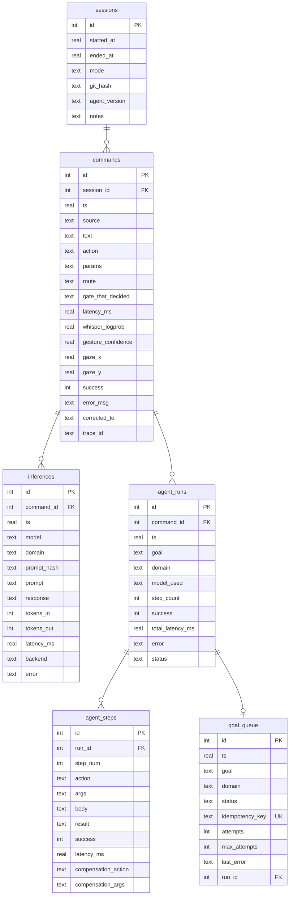

### 11.3 Group B — knowledge base / few-shot & vocabulary

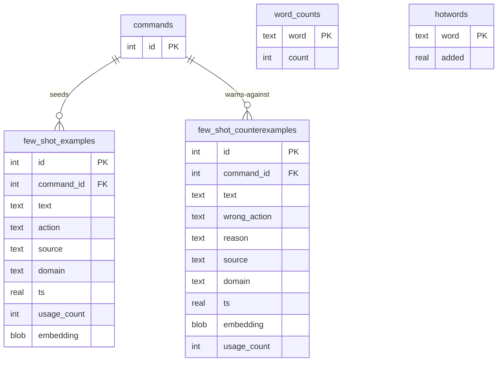

`few_shot_counterexamples` is the negative-example counterpart to `few_shot_examples` (schema v5). It captures `(text, wrong_action)` pairs from two sources: pipeline failures (`reason = "pipeline_failure"`, the action that failed) and user corrections (`reason = "user_correction"`, the action the user rejected). `UNIQUE(text, wrong_action)` so a repeated mistake bumps `usage_count` rather than duplicating. Retrieval mirrors the positive store — cosine over embeddings with Jaccard fallback, × recency × `log(usage_count)` — and the top matches are injected into the local-LLM prompt as a "do NOT produce" block so the model stops re-mapping a phrasing to an action already known to be wrong. The store stays strictly separate from the success-biased positive few-shot store, `PreferenceModel`, and `SemanticMemory`.

### 11.4 Group C — gesture & sensor telemetry

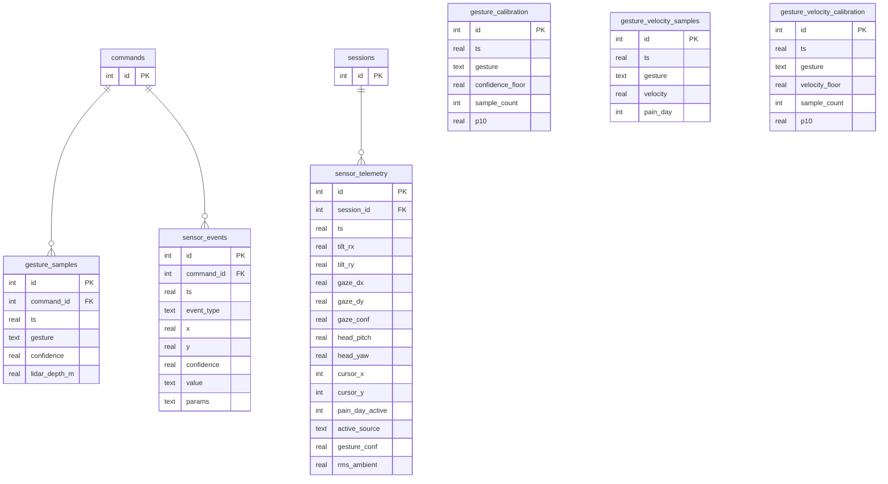

### 11.5 Group D — behavioral twin & settings

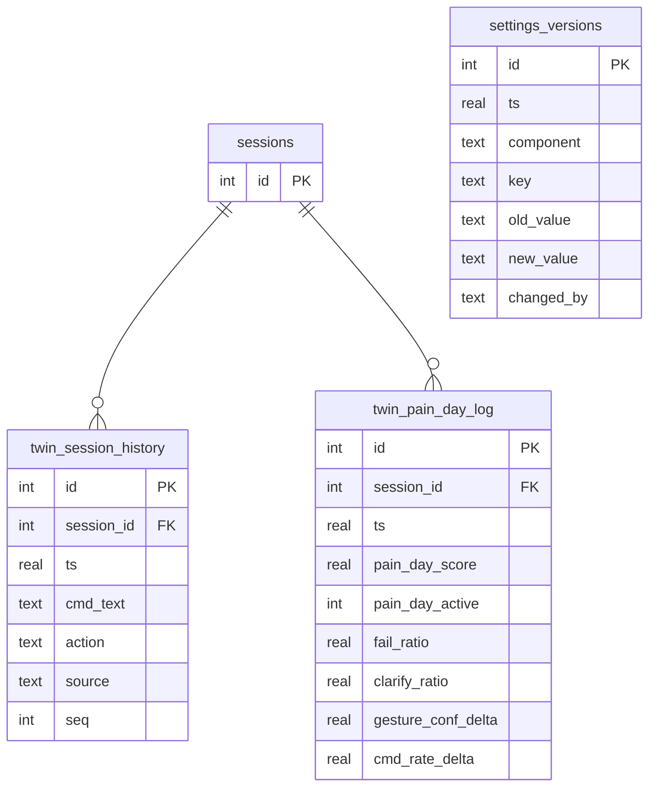

### 11.6 Group E — voice / acoustic calibration

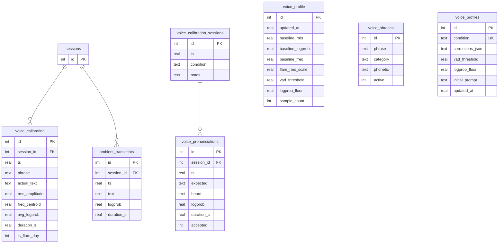

> `voice_profile` (singular — one derived acoustic baseline, written by `AcousticProfiler`) and `voice_profiles` (plural — per-condition compiled profiles keyed by `condition`, written by `VoiceCalibrator`) are **distinct tables**; the names are easy to conflate.

### 11.7 Group F — onboarding, flare & ops rollups

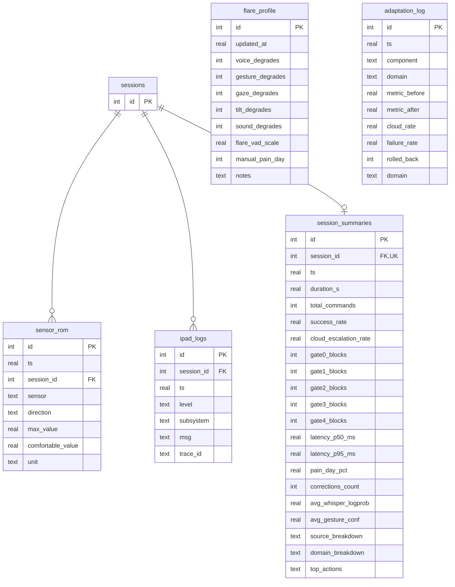

### 11.8 `analytics.duckdb` — OLAP benchmark store

Dashed edges denote **by-convention** foreign keys (no SQL `FOREIGN KEY` is declared); IDs come from `CREATE SEQUENCE` + `nextval()`. Note `correct` is an `INTEGER` count in `benchmark_results` but a `BOOLEAN` in `benchmark_prompts`.

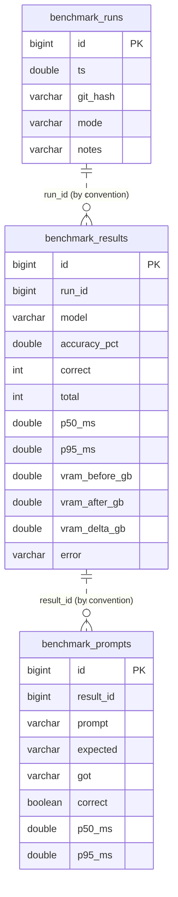

### 11.9 `audit.db` — append-only security trail

Single table; immutability is enforced at the DB layer by `BEFORE UPDATE` / `BEFORE DELETE` triggers that `RAISE(ABORT)`. No foreign key by design — the trail must survive even if `sessions`/`commands` are gone.

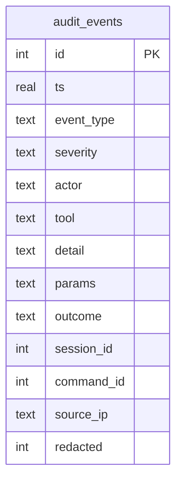

### 11.10 Group G — Goal queue (v2+)

`goal_queue` is the durable pre-execution backlog for DevAgent goals. A goal is persisted here **before** it runs, so a crash or scheduler shed never silently drops it. `idempotency_key` (UNIQUE) prevents duplicate enqueues on crash recovery. The lifecycle is `queued → running → done / failed / cancelled`; rows left `running` at startup are requeued by `mark_interrupted_runs()`, bounded by `max_attempts`.

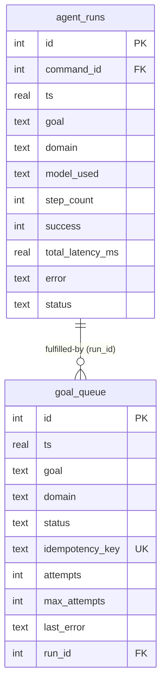

### 11.11 Group H — Orchestration v3 (event bus, saga, tool tracking, rate limiting)

Eight tables added in schema v3 (`PRAGMA user_version = 3`, PR #38). Together they implement the five orchestration gaps: event bus, saga/compensation, per-call idempotency + timeout, cache-policy config, and rate-limit config.

**Event bus** (`event_log` + `event_consumers`): `event_log` is an append-only structured log; in-process delivery uses `asyncio.Queue` fan-out keyed on `topic_pattern`. Consumers persist their cursor in `event_consumers.last_event_id` for durable replay. Pruned at 7 days.

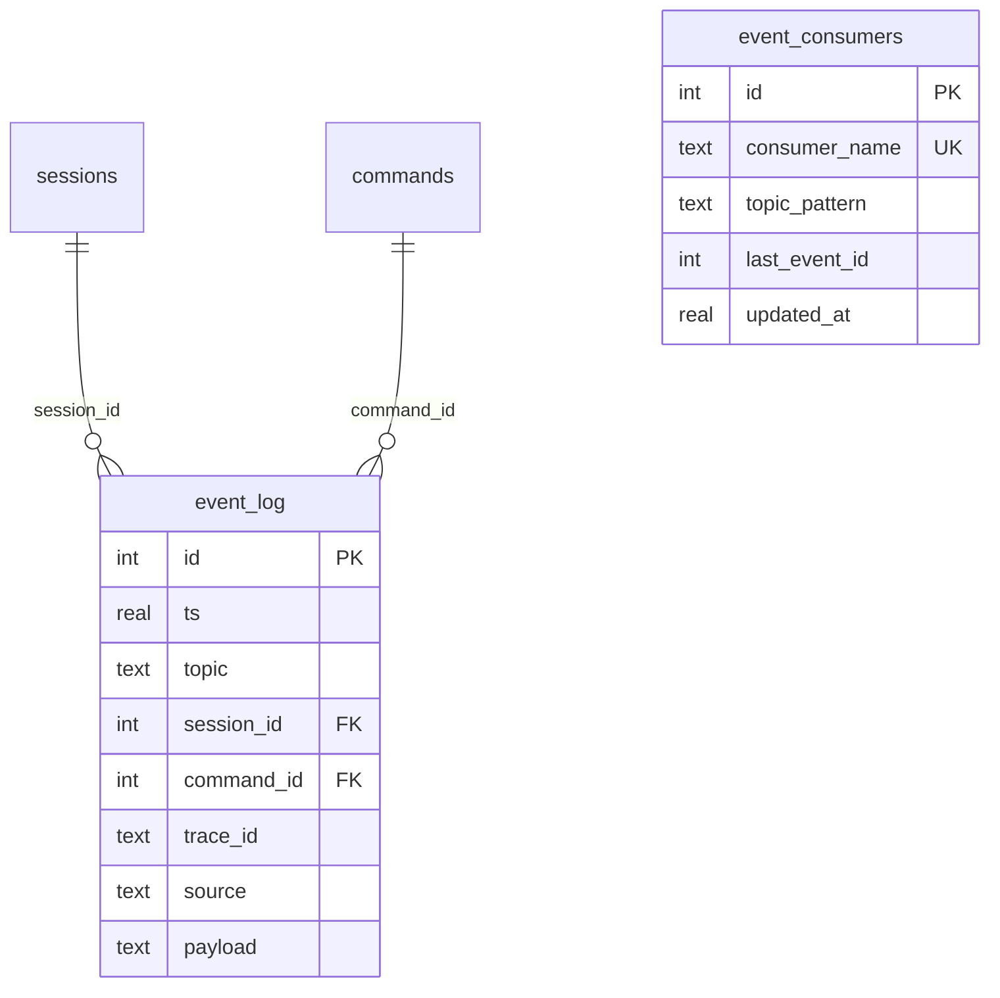

**Saga compensations** (`saga_compensations`): one row per successfully executed reversible step. Populated as each step completes; triggered in reverse step order when `MAX_REPLANS` is exhausted. Never pruned (forensic value; volume ≤ 200 rows/day).

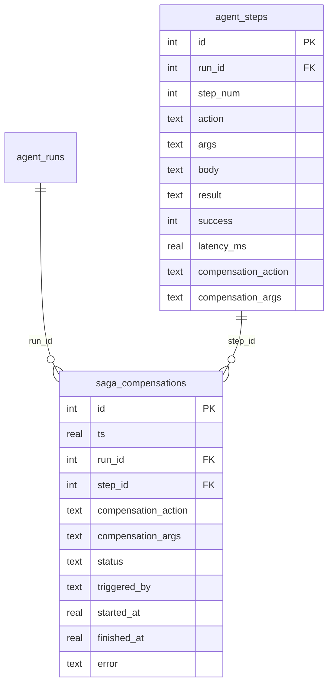

**Tool call log + timeout config** (`tool_calls`, `tool_timeout_config`): every MCP/desktop tool invocation is recorded with its actual timeout, idempotency key, and result. The `UNIQUE INDEX` on `(idempotency_key) WHERE status='completed'` prevents re-running a successful idempotent call on plan restart. `tool_timeout_config` and `tool_cache_config` are config tables seeded once via `INSERT OR IGNORE` on `AgentDB.open()`.

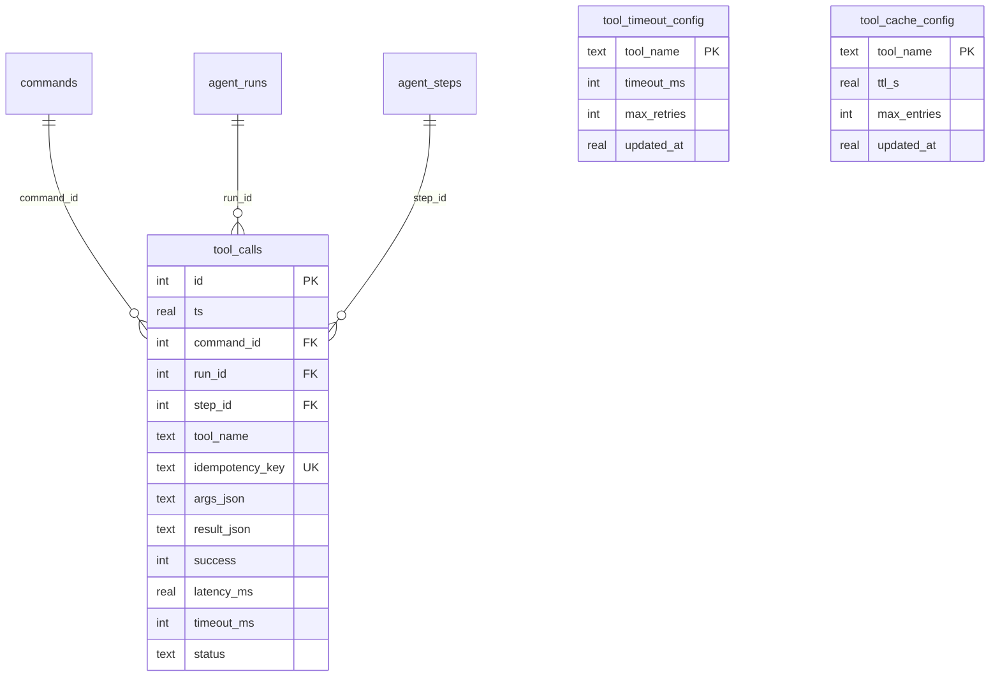

**Rate limit config + breach log** (`rate_limit_config`, `rate_limit_events`): token-bucket parameters per resource; breach log for observability. Pruned at 7 days.

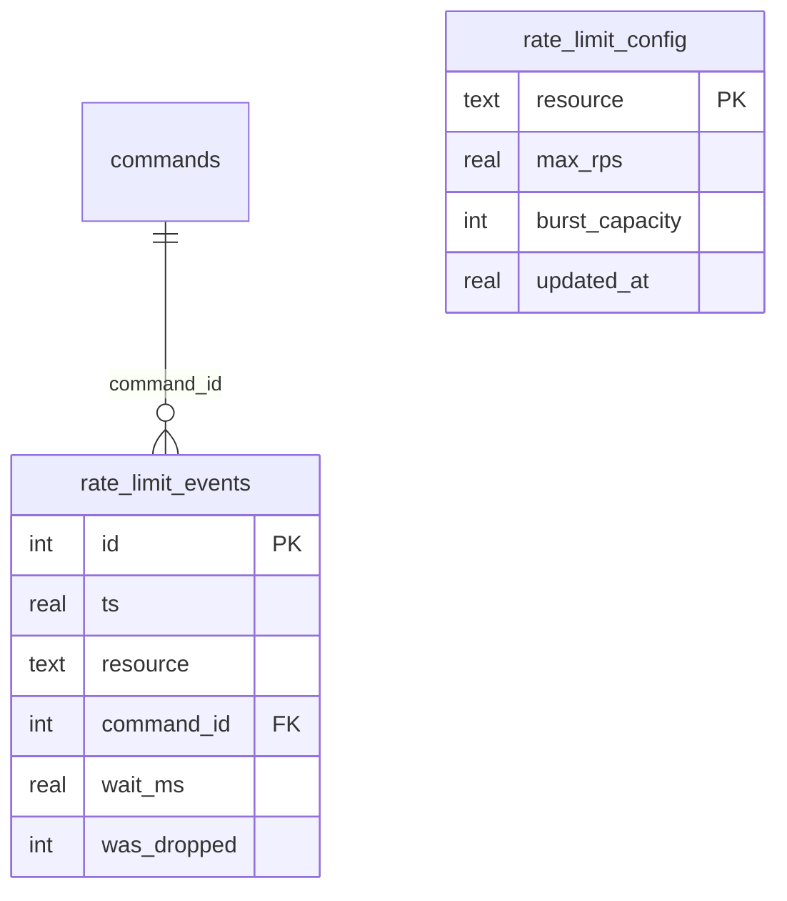

---

## 12. Two-Tier Knowledge Store (vector + structured)

The persistence layer is deliberately two-tier, unified for callers by the `MemoryManager` syscall facade (`storage/memory_manager.py`):

- **Vector / semantic tier (ChromaDB + `all-MiniLM-L6-v2`, 384-dim, cosine).** Three logical stores under `./chroma_db`: the RAG **`codebase`/`documents`** collections (`inference/codebase_indexer.py`), the **`behavioral_memory`** few-shot collection (`storage/semantic_memory.py`), and the behavioral-twin backing (which reuses `behavioral_memory`). All degrade to a Jaccard word-overlap fallback over SQLite rows when ChromaDB is unavailable, with a time-gated re-probe that restores the vector path after a transient outage.
- **Structured tier.** `agent.db` (SQLite/`aiosqlite`, OLTP — §11.1–11.11), `analytics.duckdb` (DuckDB, OLAP — §11.8), and `audit.db` (append-only, trigger-immutable — §11.9). `agent.db` migrations are versioned via `PRAGMA user_version` (`AgentDB._migrate`); current version is **5** (40 tables). v4 added `inferences.prompt` (full prompt text for fine-tuning capture); v5 added the `few_shot_counterexamples` table (negative few-shot, §11.3).

The SQLite `few_shot_examples` table (§5) is the embedding store on the **per-command prompt hot path**; the ChromaDB `behavioral_memory` collection feeds the **behavioral-twin context layer**. Same embedding model, two independent storage paths — see §5.
