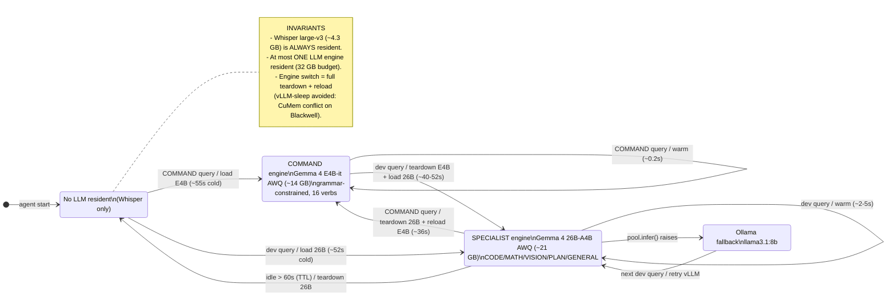

# Inference Engine Residency — State Machine

How the vLLM inferencing workflow manages GPU residency on the single RTX 5090
(32 GB) under WSL2. The defining constraint: **only one LLM engine can be
GPU-resident at a time** (alongside the always-resident Whisper), and engine
switches use **full teardown + reload** rather than vLLM-sleep — because two
concurrent `enable_sleep_mode` (CuMem) engines conflict on Blackwell
(`CUDA Error: device not ready at cumem_allocator.cpp`).

## States

| State | Engine | VRAM | Reached when |
|-------|--------|------|--------------|
| **No LLM resident** | none (Whisper only) | ~4.3 GB | startup; or specialist TTL-expires |
| **COMMAND engine** | `gemma-4-E4B-it-AWQ-INT4` via `VLLMInference` | ~14 GB | an accessibility/COMMAND-domain query arrives |
| **SPECIALIST engine** | `gemma-4-26B-A4B-it-AWQ` via `VLLMSpecialistPool` | ~21 GB | a CODE/MATH/VISION/PLAN/GENERAL query arrives |
| **Ollama fallback** | `llama3.1:8b` | (Ollama-managed) | the vLLM pool raises; `ModelRouter` degrades gracefully |

## Transitions

- **Warm** (same engine stays resident): the common case — fast.
- **Switch** (cross-domain): the resident engine is fully torn down
  (`shutdown()` → `del` → `gc.collect()` → `torch.cuda.empty_cache()`) before the
  other loads. This is the latency cost the design trades for fitting a 26B
  specialist + Whisper on 32 GB.

## Where this lives in code

- `inference/local_inference.py` — `VLLMInference` (command engine; `sleep()` =
  full teardown; `set_pre_wake_hook()` for the reverse handoff).
- `inference/model_router.py` — `VLLMSpecialistPool` (`_activate()` tears down the
  command engine + other specialists before loading; `_teardown_specialist()`;
  TTL watchdog; `_strip_thinking()`). `ModelRouter.infer()` does the Ollama fallback.
- `main.py` — wires `VLLMSpecialistPool(command_engine=local)` +
  `local.set_pre_wake_hook(pool.sleep_all_specialists)`.

## Latency note (measured 2026-05-30, RTX 5090, WSL2)

Interleaved 7-turn session, Whisper resident throughout:

| Turn | Domain | Latency | Note |
|------|--------|---------|------|
| command, cold first load | cmd | 62.3 s | E4B first load |
| command, warm | cmd | 0.2 s | — |
| dev, switch from command | dev | 111.3 s | teardown E4B + load 26B + long thinking gen |
| dev, warm (no reload) | dev | 78.7 s | **pure thinking-mode generation** |
| command, switch back | cmd | 37.0 s | teardown 26B + reload E4B |
| command, warm | cmd | 0.2 s | — |
| dev, switch from command | dev | 55.3 s | reload + shorter gen |

Takeaways:
- **Command path (the accessibility common case) is instant when warm (~0.2 s).**
- **Engine switch reload** ≈ 37–52 s.
- **26B thinking-mode generation originally dominated dev latency** (~55–111 s;
  even a warm dev turn was 78.7 s) — bigger than the reload.

### Post-tune (2026-05-30)

thinking is now ON only where the trace is the value (math, plan) and OFF for
routine generation (code, general, vision); token budgets capped:

| Domain | thinking | max_tokens | warm latency |
|--------|----------|-----------|--------------|
| code    | off | 1536 | **2–6 s** (was 78.7 s) |
| math    | on  | 2048 | **29 s** (was ~111 s) |
| general | off | 1536 | — |
| vision  | off | 1024 | — |
| plan    | on  | 2048 | — |

`_CODE_PROMPT` was also tightened (strict code-only output, "simplest correct
approach") which dropped warm code from 26 s → **2–6 s** AND improved quality
(no prose preamble; simple trial-division prime check instead of an
over-engineered Miller-Rabin). Net: code latency 78.7 s → ~5 s warm.
