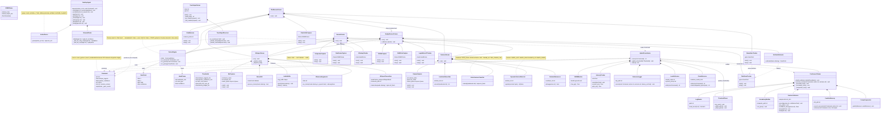

# Class Diagram — Accessibility Desktop Agent

```mermaid
classDiagram

%% ─────────────────────────────────────────
%%  SHARED DATA TYPES
%% ─────────────────────────────────────────
class Command {
    +str text
    +float whisper_logprob
    +float gesture_confidence
    +str source
    +list~str~ session_context
    +tuple|None _gaze_coords
}
note for Command "source: voice | gesture | touch | multimodal\nUniversal DTO between all pipeline stages"

class GazePoint {
    +float x
    +float y
    +bool valid
    +float confidence
}

class HandFrame {
    +list landmarks_mm
    +str hand_type
    +float confidence
}

class RGBDFrame {
    +ndarray color
    +ndarray depth_mm
    +float timestamp
}

class Thresholds {
    +float whisper_logprob_min
    +float gesture_confidence_min
    +int max_local_tokens
    +float vram_free_min_gb
    +float latency_budget_ms
}

%% ─────────────────────────────────────────
%%  VOICE PIPELINE  (whisper_stream.py)
%% ─────────────────────────────────────────
class MicCapture {
    +str device_name
    +int sample_rate
    +start() void
    +stop() void
    +audio_queue asyncio.Queue
}

class SileroVAD {
    -model torch.Module
    +process_chunk(chunk ndarray) bool
}

class AudioBuffer {
    -ring_buffer deque
    +push(chunk ndarray) void
    +drain() ndarray
}

class UtteranceSegmenter {
    -state str
    +on_chunk(chunk ndarray, is_speech bool) ndarray|None
}
note for UtteranceSegmenter "States: IDLE → CAPTURING → EMIT"

class WhisperTranscriber {
    -model faster_whisper.WhisperModel
    +hotwords_path str
    +transcribe(audio ndarray) tuple~str_float~
}

class WhisperStream {
    +run() void
    -_capture_task()
    -_dispatch_task()
}

WhisperStream *-- MicCapture
WhisperStream *-- SileroVAD
WhisperStream *-- AudioBuffer
WhisperStream *-- UtteranceSegmenter
WhisperStream *-- WhisperTranscriber
WhisperStream ..> Command : produces

%% ─────────────────────────────────────────
%%  GESTURE PIPELINE  (gesture_stream.py)
%% ─────────────────────────────────────────
class CameraCapture {
    +int camera_index
    +bool use_nvdec
    +start() void
    +stop() void
    +frame_queue asyncio.Queue
}

class LandmarkSmoother {
    -window_size int
    +smooth(landmarks list) list
}

class StaticGestureClassifier {
    +classify(landmarks list) tuple~str_float~
}
note for StaticGestureClassifier "Gestures: OPEN_PALM, POINT,\nPINCH, FIST, THUMB_UP, TWO_FINGER_TAP"

class DynamicGestureDetector {
    -window_ms int
    +update(centroid tuple) str|None
}
note for DynamicGestureDetector "Detects: SWIPE_LEFT, SWIPE_RIGHT,\nSWIPE_UP, SWIPE_DOWN"

class GestureDebouncer {
    -cooldown_ms int
    +allow(gesture str) bool
}

class GestureStream {
    +run() void
}

GestureStream *-- CameraCapture
GestureStream *-- LandmarkSmoother
GestureStream *-- StaticGestureClassifier
GestureStream *-- DynamicGestureDetector
GestureStream *-- GestureDebouncer
GestureStream ..> Command : produces

%% ─────────────────────────────────────────
%%  FUSION ENGINE  (sensor_fusion.py / budget)
%% ─────────────────────────────────────────
class FusionEngine {
    +tick() Command|None
    +on_voice(cmd Command) void
    +on_gesture(cmd Command) void
    +on_gaze(gp GazePoint) void
}
note for FusionEngine "Priority rules:\n1. iPad touch → immediate\n2. Gaze + voice 'click'\n3. Gaze + POINT gesture\n4. Gesture alone\n5. Voice alone"

FusionEngine ..> Command : emits
FusionEngine --> GazePoint : reads
FusionEngine --> HandFrame : reads

%% ─────────────────────────────────────────
%%  COORDINATOR  (hybrid_coordinator.py)
%% ─────────────────────────────────────────
class VRAMMonitor {
    -handle pynvml.nvml
    +free_gb() float
}

class LatencyTracker {
    -ema float
    +record(ms float) void
    +current_ms() float
    +p95_ms() float
}

class OutcomeLogger {
    +log_path str
    +record(cmd Command, action str, outcome str, latency_ms float) void
}

class LocalInference {
    +model_name str
    +system_prompt str
    +infer(cmd Command) str
}

class CloudInference {
    +bedrock_model_id str
    +infer(cmd Command) str
    +transcribe(audio_bytes bytes) str
}

class HybridCoordinator {
    +route(cmd Command) str
    +update_thresholds(t Thresholds) void
    +status() dict
}

HybridCoordinator *-- Thresholds
HybridCoordinator *-- VRAMMonitor
HybridCoordinator *-- LatencyTracker
HybridCoordinator *-- OutcomeLogger
HybridCoordinator *-- LocalInference
HybridCoordinator *-- CloudInference
HybridCoordinator ..> Command : consumes
HybridCoordinator ..> ContinuousTrainer : notifies

%% ─────────────────────────────────────────
%%  DESKTOP AGENT  (desktop_agent.py)
%% ─────────────────────────────────────────
class ActionParser {
    +parse(action_str str) tuple~str_str~
}
note for ActionParser "Verbs: CLICK, SCROLL, TYPE, OPEN,\nCLOSE, HOTKEY, DICTATE, CLARIFY"

class ElementFinder {
    +find(target str) tuple~int_int~|None
    -_find_via_a11y_tree(target str) tuple|None
    -_find_via_ocr(target str) tuple|None
}

class DesktopAgent {
    +execute(action_str str, cmd Command) void
    -_click(target str, coords tuple|None) void
    -_scroll(direction str, amount int) void
    -_type(text str) void
    -_open(app str) void
    -_close(target str) void
    -_hotkey(keys str) void
    -_dictate(text str) void
    -_clarify(question str) void
}

DesktopAgent *-- ActionParser
DesktopAgent *-- ElementFinder

%% ─────────────────────────────────────────
%%  CONTINUOUS TRAINER  (continuous_trainer.py)
%% ─────────────────────────────────────────
class LogReader {
    +path str
    +read_recent(n int) list~dict~
}

class ThresholdTuner {
    +run_pass() void
    -_adapt_gate1() void
    -_adapt_gate4() void
}

class VocabularyBuilder {
    +run_pass() void
    +hotwords_path str
}

class GestureCalibrator {
    -samples dict~str_list~
    +record(gesture str, confidence float) void
    +run_pass() void
    +confidence_floor(gesture str) float
    +save(path str) void
    +load(path str) void
}

class FewShotMemory {
    +db_path str
    +record_success(cmd Command, action str) void
    +retrieve(cmd Command, k int) list~tuple~
}

class PromptAugmenter {
    +patch(inference LocalInference) void
}

class ContinuousTrainer {
    +start(coordinator HybridCoordinator) void
    +outcome_hook(cmd Command, action str, outcome str) void
    -_threshold_loop() void
    -_vocabulary_loop() void
    -_compaction_loop() void
}

ContinuousTrainer *-- LogReader
ContinuousTrainer *-- ThresholdTuner
ContinuousTrainer *-- VocabularyBuilder
ContinuousTrainer *-- GestureCalibrator
ContinuousTrainer *-- FewShotMemory
ContinuousTrainer *-- PromptAugmenter
ContinuousTrainer --> HybridCoordinator : hooks into route()
ThresholdTuner --> HybridCoordinator : update_thresholds()

%% ─────────────────────────────────────────
%%  IPAD BRIDGE  (ipad_bridge.py)
%% ─────────────────────────────────────────
class BeamGazeTracker {
    +start() void
    +stop() void
    +gaze GazePoint
}

class IPadLiDARCapture {
    +start() void
    +stop() void
    +frame RGBDFrame
}

class IPadWebcam {
    +camera_index int
    +start() void
    +stop() void
}

class IPadSensorFusion {
    +run() void
}

IPadSensorFusion *-- BeamGazeTracker
IPadSensorFusion *-- IPadLiDARCapture
IPadSensorFusion *-- IPadWebcam
IPadSensorFusion *-- GestureStream
IPadSensorFusion *-- WhisperStream
IPadSensorFusion *-- FusionEngine

%% ─────────────────────────────────────────
%%  IPAD TOUCH  (ipad_touch.py)
%% ─────────────────────────────────────────
class TouchInputServer {
    +host str
    +port int
    +start() void
    -_build_html() str
    -_ws_handler(request) void
    -_http_handler(request) void
}

class TouchInputReceiver {
    +on_event(event dict) void
    -_handle_trackpad(event dict) void
    -_handle_command(event dict) void
}

TouchInputServer *-- TouchInputReceiver
TouchInputReceiver ..> Command : produces (non-trackpad)
TouchInputReceiver ..> HybridCoordinator : routes Command

%% ─────────────────────────────────────────
%%  SENSOR HARDWARE WRAPPERS  (sensor_fusion.py)
%% ─────────────────────────────────────────
class ReSpeakerCapture {
    +start() void
    +stop() void
}

class RealSenseCapture {
    +start() void
    +stop() void
    +frame RGBDFrame
}

class UltraleapTracker {
    +start() void
    +stop() void
    +hand HandFrame
}

class TobiiGazeTracker {
    +start() void
    +stop() void
    +gaze GazePoint
}

class SensorFusion {
    +run() void
}

SensorFusion *-- ReSpeakerCapture
SensorFusion *-- RealSenseCapture
SensorFusion *-- UltraleapTracker
SensorFusion *-- TobiiGazeTracker
SensorFusion *-- WhisperStream
SensorFusion *-- GestureStream
SensorFusion *-- FusionEngine

%% ─────────────────────────────────────────
%%  BUDGET SENSOR STACK  (budget_sensor_fusion.py)
%% ─────────────────────────────────────────
class FIFINECapture {
    +start() void
    +stop() void
}

class OAKDLiteCapture {
    +start() void
    +stop() void
    +frame RGBDFrame
}

class LeapMotionV1Tracker {
    +start() void
    +stop() void
    +hand HandFrame
}

class IrisGazeEstimator {
    +estimate(frame ndarray) GazePoint
}

class BudgetSensorFusion {
    +run() void
    +calibrate_9point() void
}

BudgetSensorFusion *-- FIFINECapture
BudgetSensorFusion *-- OAKDLiteCapture
BudgetSensorFusion *-- LeapMotionV1Tracker
BudgetSensorFusion *-- IrisGazeEstimator
BudgetSensorFusion *-- WhisperStream
BudgetSensorFusion *-- GestureStream
BudgetSensorFusion *-- FusionEngine

%% ─────────────────────────────────────────
%%  INHERITANCE / ALTERNATIVE STACKS
%% ─────────────────────────────────────────
IPadSensorFusion --|> BudgetSensorFusion : drop-in replacement

BeamGazeTracker ..|> TobiiGazeTracker : same interface
IPadLiDARCapture ..|> RealSenseCapture : same interface
IrisGazeEstimator ..|> TobiiGazeTracker : fallback
```
