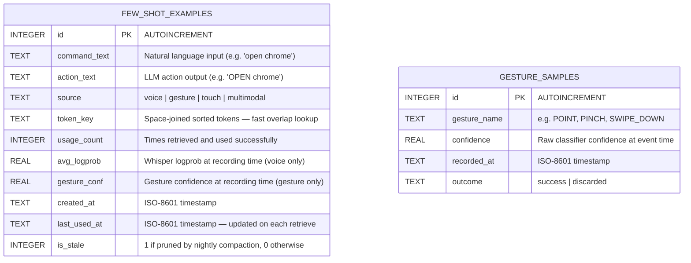
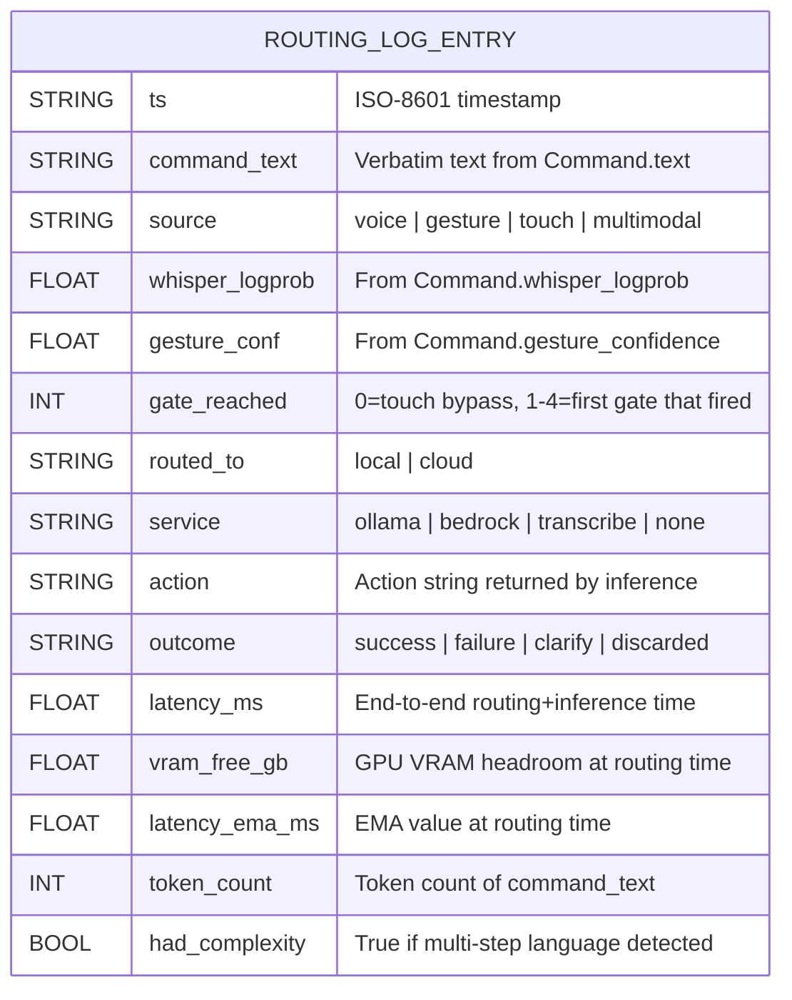
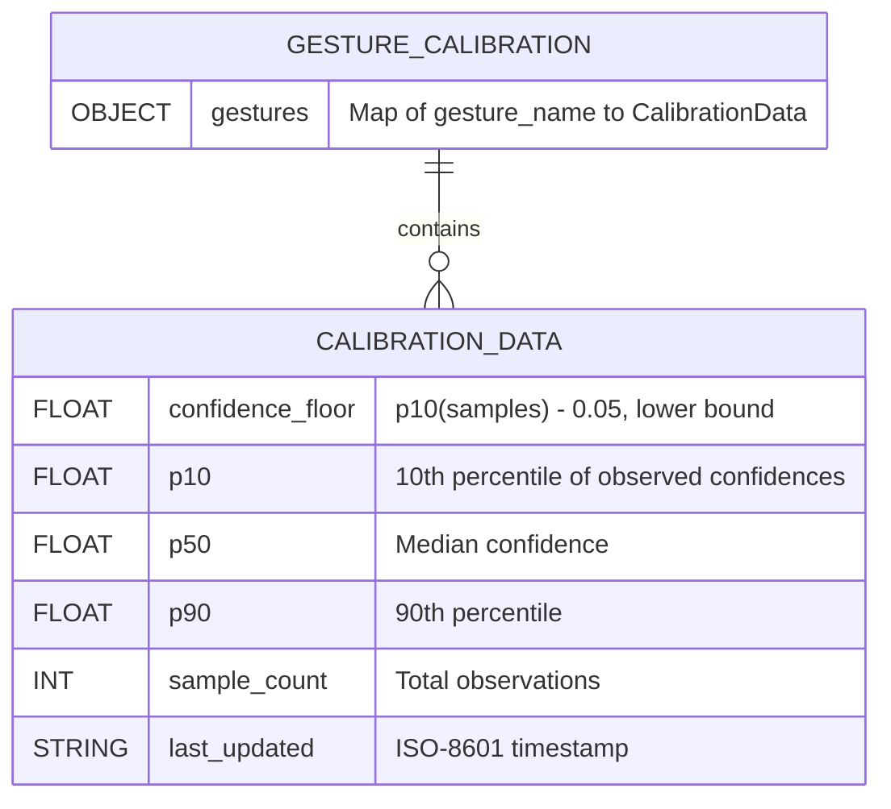
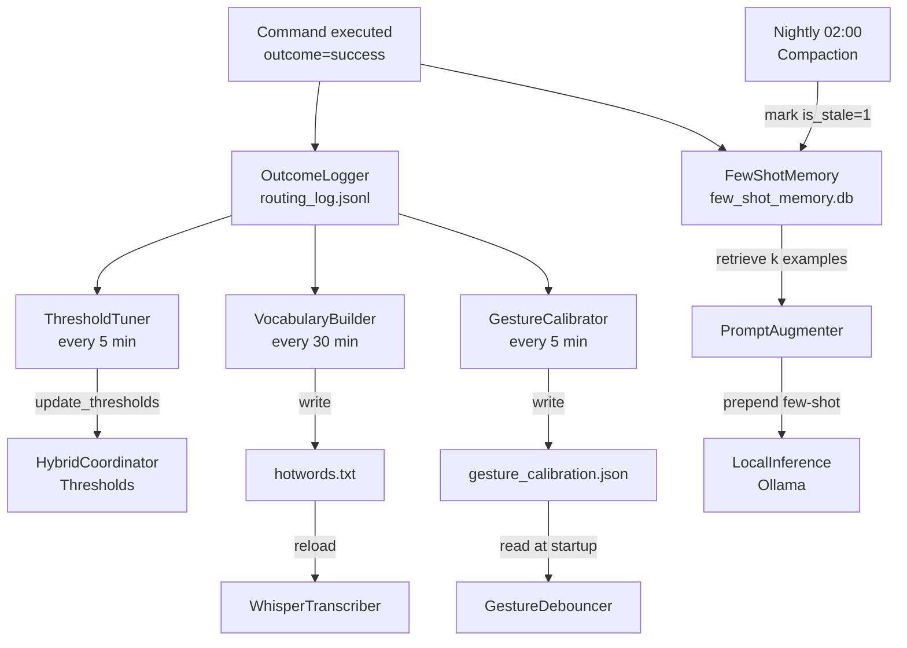

# Database & Persistent Storage Schema

## Overview

The system uses three persistent stores:
- **`few_shot_memory.db`** — SQLite, async (aiosqlite), stores successful command→action pairs for LLM augmentation
- **`routing_log.jsonl`** — append-only JSONL, every routing decision logged for threshold tuning
- **`gesture_calibration.json`** — JSON snapshot of per-gesture confidence statistics
- **`hotwords.txt`** — plain text, one word per line, fed to Whisper transcriber

---

## 1. few_shot_memory.db (SQLite)



### Retrieval logic (FewShotMemory.retrieve)

```
SELECT * FROM few_shot_examples
WHERE is_stale = 0
ORDER BY
  -- token overlap score (computed in Python, then ranked here)
  usage_count DESC,
  last_used_at DESC
LIMIT k
```

Ranking formula applied in Python:
```
score = token_overlap(query_tokens, example.token_key)
      * log(1 + example.usage_count)
      * recency_decay(example.last_used_at, half_life=7_days)
```

---

## 2. routing_log.jsonl (JSONL schema)

Each line is a single JSON object with the following fields:



### Example record
```json
{
  "ts": "2025-01-15T09:32:14.221Z",
  "command_text": "open chrome",
  "source": "voice",
  "whisper_logprob": -0.12,
  "gesture_conf": 1.0,
  "gate_reached": 0,
  "routed_to": "local",
  "service": "ollama",
  "action": "OPEN chrome",
  "outcome": "success",
  "latency_ms": 310.4,
  "vram_free_gb": 3.8,
  "latency_ema_ms": 295.1,
  "token_count": 2,
  "had_complexity": false
}
```

---

## 3. gesture_calibration.json (JSON)



### Example structure
```json
{
  "gestures": {
    "POINT": {
      "confidence_floor": 0.62,
      "p10": 0.67,
      "p50": 0.81,
      "p90": 0.93,
      "sample_count": 47,
      "last_updated": "2025-01-15T09:30:00Z"
    },
    "PINCH": {
      "confidence_floor": 0.58,
      "p10": 0.63,
      "p50": 0.75,
      "p90": 0.89,
      "sample_count": 23,
      "last_updated": "2025-01-15T08:15:00Z"
    }
  }
}
```

---

## 4. hotwords.txt (plain text)

One word or phrase per line. Written by `VocabularyBuilder` every 30 minutes.
Read by `WhisperTranscriber` at startup and on reload.

```
chrome
vscode
scroll
click
close
zoom
slack
open
```

---

## Data lifecycle diagram


