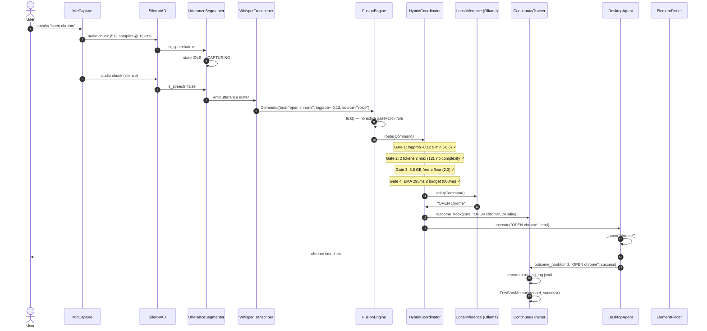
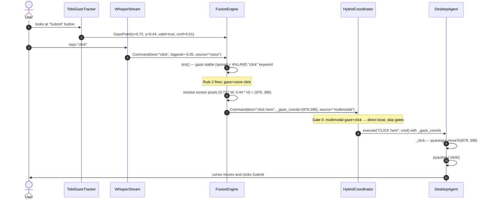
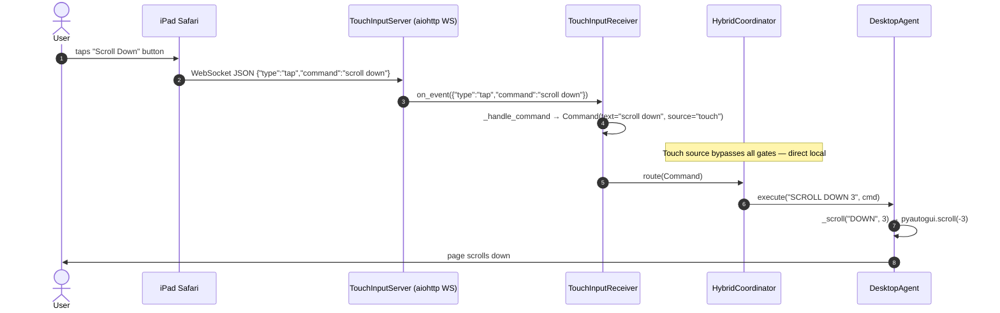
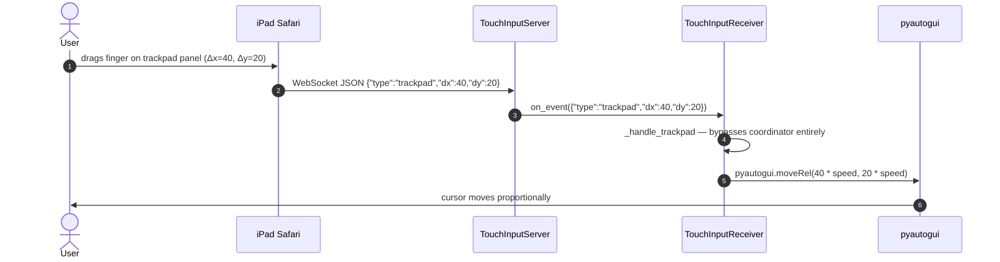
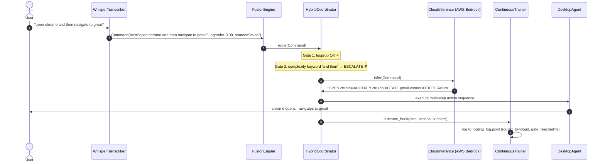
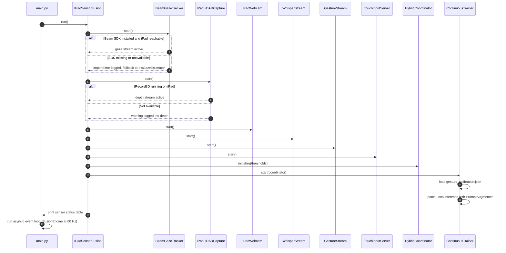
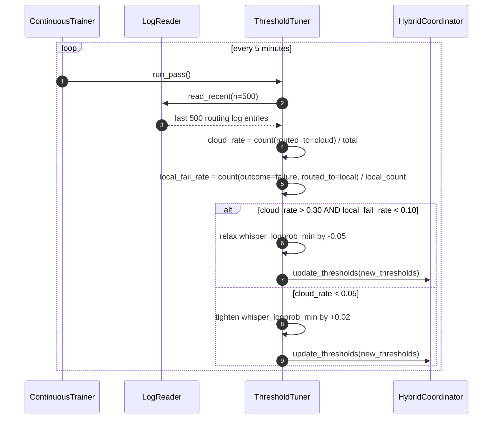

# Sequence Diagrams — Key Interaction Flows

---

## 1. Voice Command — Local Path (happy path)

---

## 2. Gaze + Voice Click

---

## 3. iPad Touch Command

---

## 4. iPad Trackpad Drag (direct path — no LLM)

---

## 5. Cloud Fallback — Complex Multi-Step Command

---

## 6. Startup and Sensor Initialization

---

## 7. Continuous Trainer Threshold Adaptation

