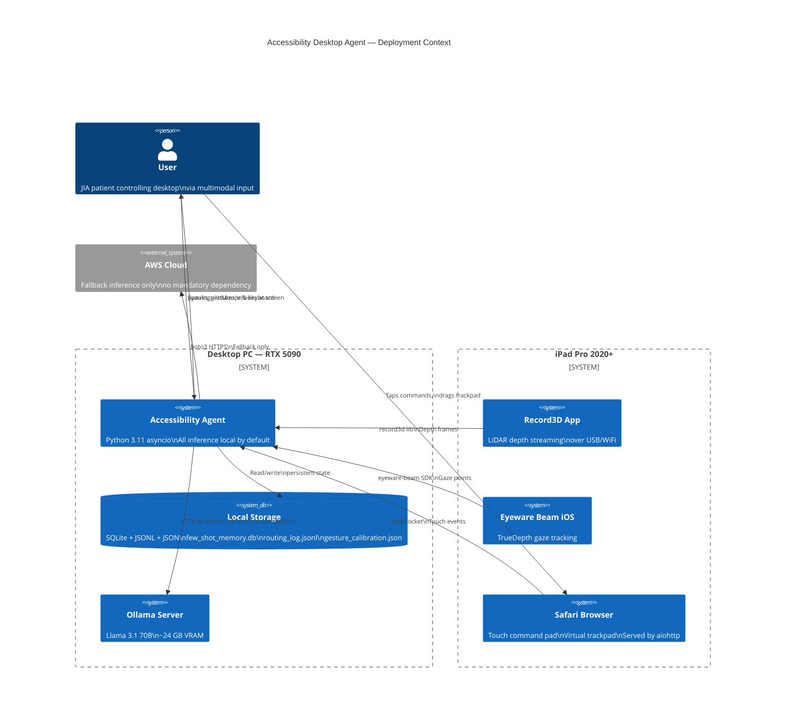
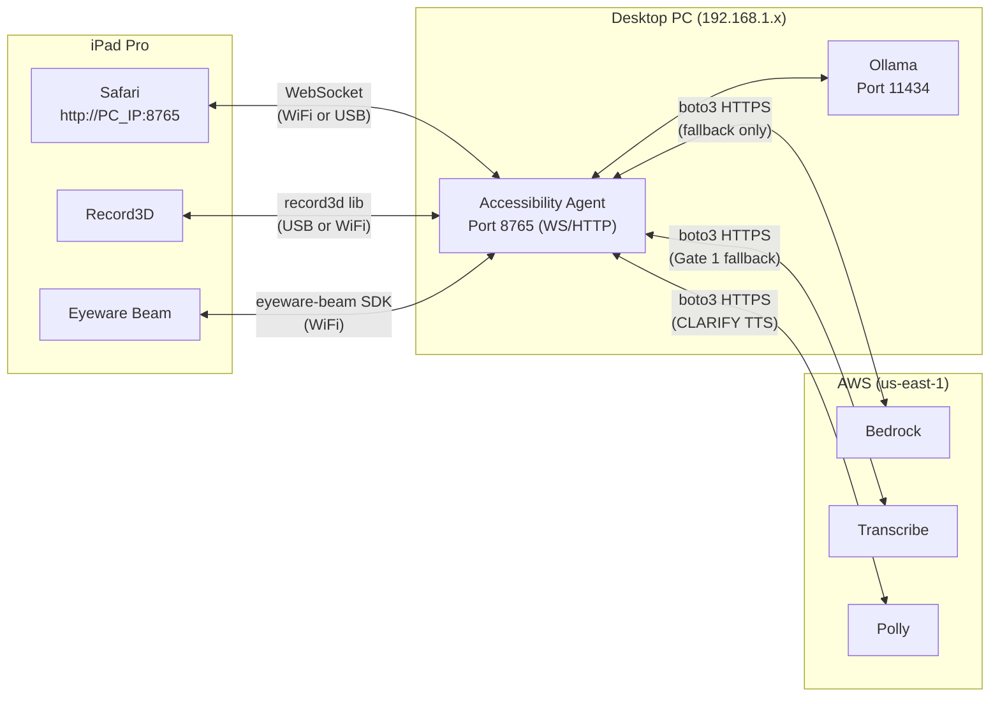

# Component & Deployment Diagram

## Deployment Overview

```mermaid
C4Context
    title Accessibility Desktop Agent — Deployment Context

    Person(user, "User", "JIA patient controlling desktop\nvia multimodal input")

    System_Boundary(desktop, "Desktop PC — RTX 5090") {
        System(agent, "Accessibility Agent", "Python 3.11 asyncio\nAll inference local by default")
        SystemDb(storage, "Local Storage", "SQLite + JSONL + JSON\nfew_shot_memory.db\nrouting_log.jsonl\ngesture_calibration.json")
        System(ollama, "Ollama Server", "Llama 3.1 70B\n~24 GB VRAM")
    }

    System_Boundary(ipad_boundary, "iPad Pro 2020+") {
        System(record3d, "Record3D App", "LiDAR depth streaming\nover USB/WiFi")
        System(beam_ios, "Eyeware Beam iOS", "TrueDepth gaze tracking")
        System(safari, "Safari Browser", "Touch command pad\nVirtual trackpad\nServed by aiohttp")
    }

    System_Ext(aws, "AWS Cloud", "Fallback inference only\nno mandatory dependency")

    Rel(user, safari, "Taps commands,\ndrags trackpad")
    Rel(user, agent, "Speaks, gestures,\nlooks at screen")
    Rel(safari, agent, "WebSocket\nTouch events")
    Rel(record3d, agent, "record3d lib\nDepth frames")
    Rel(beam_ios, agent, "eyeware-beam SDK\nGaze points")
    Rel(agent, ollama, "HTTP localhost:11434\nChat completions")
    Rel(agent, storage, "Read/write\npersistent state")
    Rel(agent, aws, "boto3 HTTPS\nFallback only")
    Rel(agent, user, "pyautogui\nMouse & keyboard")
```

---

## Component Diagram — Internal Module Boundaries

```mermaid
C4Component
    title Accessibility Agent — Internal Components

    Container_Boundary(input_layer, "Input Layer") {
        Component(mic, "MicCapture / ReSpeakerCapture / FIFINECapture", "sounddevice", "Captures 16kHz audio stream")
        Component(cam, "CameraCapture / OAKDLiteCapture / IPadWebcam", "opencv / depthai", "Captures RGB-D frames")
        Component(leap, "UltraleapTracker / LeapMotionV1Tracker", "leapc-cffi / Leap SDK", "3D hand skeleton data")
        Component(gaze, "TobiiGazeTracker / BeamGazeTracker / IrisGazeEstimator", "tobii-research / eyeware-beam / mediapipe", "Normalized gaze point")
        Component(lidar, "RealSenseCapture / IPadLiDARCapture / OAKDLiteCapture", "pyrealsense2 / record3d / depthai", "Depth frames in mm")
        Component(touch, "TouchInputServer", "aiohttp WebSocket", "Serves Safari touch UI, receives touch events")
    }

    Container_Boundary(processing_layer, "Processing Layer") {
        Component(vad, "SileroVAD + UtteranceSegmenter", "torch (CPU)", "Speech activity detection, utterance gating")
        Component(asr, "WhisperTranscriber", "faster-whisper CUDA", "Speech-to-text < 400ms")
        Component(gesture_cls, "StaticGestureClassifier + DynamicGestureDetector", "mediapipe + ultralytics", "Gesture recognition")
        Component(fusion, "FusionEngine", "Python asyncio", "5-priority rule multimodal fusion at 60Hz")
    }

    Container_Boundary(intelligence_layer, "Intelligence Layer") {
        Component(local_llm, "LocalInference", "Ollama Llama 3.1 70B", "Command intent resolution < 600ms")
        Component(cloud_llm, "CloudInference", "AWS Bedrock / Transcribe", "Fallback for complex/low-conf commands")
        Component(augmenter, "PromptAugmenter", "FewShotMemory + aiosqlite", "Prepends relevant examples to LLM prompt")
    }

    Container_Boundary(coordinator_layer, "Coordinator") {
        Component(coord, "HybridCoordinator", "Python", "4-gate routing decision engine")
        Component(vram_mon, "VRAMMonitor", "pynvml", "Real-time VRAM headroom")
        Component(lat_track, "LatencyTracker", "EMA", "Latency budget enforcement")
        Component(outcome_log, "OutcomeLogger", "JSONL", "Append-only routing audit log")
    }

    Container_Boundary(execution_layer, "Execution Layer") {
        Component(agent, "DesktopAgent", "pyautogui + pywinauto / pyatspi", "Mouse, keyboard, application control")
        Component(finder, "ElementFinder", "UI Automation / AT-SPI + EasyOCR", "Accessibility tree + OCR target resolution")
    }

    Container_Boundary(learning_layer, "Continuous Learning") {
        Component(trainer, "ContinuousTrainer", "asyncio background loops", "Adapts thresholds, vocab, gestures, few-shot")
        Component(fsm, "FewShotMemory", "aiosqlite", "Stores successful command→action pairs")
        Component(vocab, "VocabularyBuilder", "JSONL reader", "Mines hotwords from success log")
        Component(thresh, "ThresholdTuner", "JSONL reader", "Gate threshold adaptation")
        Component(gcal, "GestureCalibrator", "JSON", "Per-gesture confidence floor calibration")
    }

    Rel(mic, vad, "16kHz audio chunks")
    Rel(vad, asr, "Gated utterance buffer")
    Rel(asr, fusion, "Command(source=voice)")
    Rel(cam, gesture_cls, "RGB frames")
    Rel(leap, gesture_cls, "HandFrame 3D")
    Rel(gesture_cls, fusion, "Command(source=gesture)")
    Rel(gaze, fusion, "GazePoint")
    Rel(lidar, gesture_cls, "depth assists pinch calc")
    Rel(touch, coord, "Command(source=touch)")
    Rel(fusion, coord, "Command(merged)")
    Rel(coord, vram_mon, "reads free VRAM")
    Rel(coord, lat_track, "reads EMA latency")
    Rel(coord, outcome_log, "writes every decision")
    Rel(coord, local_llm, "infer() — primary path")
    Rel(coord, cloud_llm, "infer() — fallback")
    Rel(augmenter, local_llm, "patches infer() at startup")
    Rel(fsm, augmenter, "retrieve k examples")
    Rel(coord, agent, "action string")
    Rel(agent, finder, "resolve target name")
    Rel(trainer, coord, "update_thresholds()")
    Rel(trainer, vocab, "trigger pass")
    Rel(trainer, thresh, "trigger pass")
    Rel(trainer, gcal, "trigger pass")
    Rel(trainer, fsm, "record_success()")
    Rel(outcome_log, trainer, "read routing_log.jsonl")
```

---

## Network Topology

```mermaid
flowchart LR
    subgraph desktop["Desktop PC (192.168.1.x)"]
        agent["Accessibility Agent\nPort 8765 (WS/HTTP)"]
        ollama["Ollama\nPort 11434"]
        agent <--> ollama
    end

    subgraph ipad["iPad Pro"]
        safari["Safari\nhttp://PC_IP:8765"]
        record3d_app["Record3D"]
        beam_app["Eyeware Beam"]
    end

    subgraph aws["AWS (us-east-1)"]
        bedrock["Bedrock"]
        transcribe["Transcribe"]
        polly["Polly"]
    end

    safari <-->|"WebSocket\n(WiFi or USB)"| agent
    record3d_app <-->|"record3d lib\n(USB or WiFi)"| agent
    beam_app <-->|"eyeware-beam SDK\n(WiFi)"| agent
    agent <-->|"boto3 HTTPS\n(fallback only)"| bedrock
    agent <-->|"boto3 HTTPS\n(Gate 1 fallback)"| transcribe
    agent <-->|"boto3 HTTPS\n(CLARIFY TTS)"| polly
```
