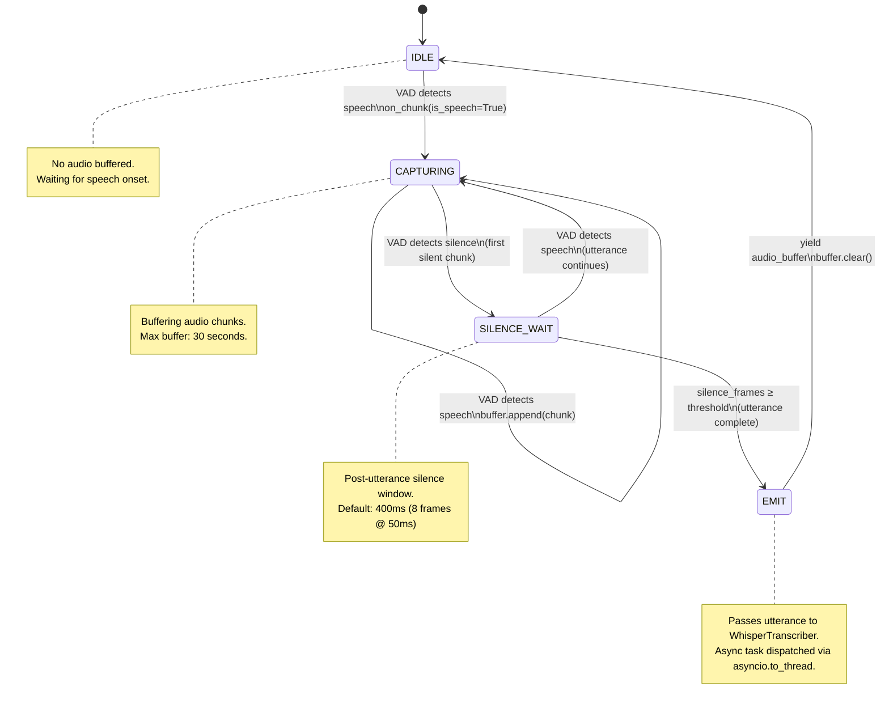
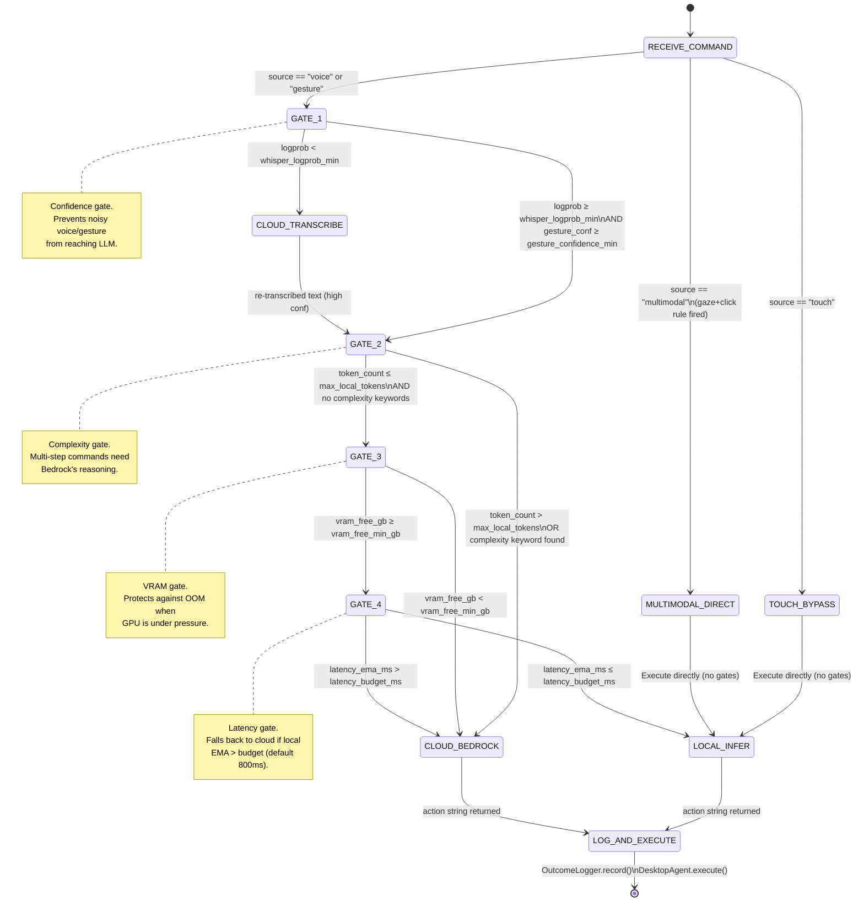
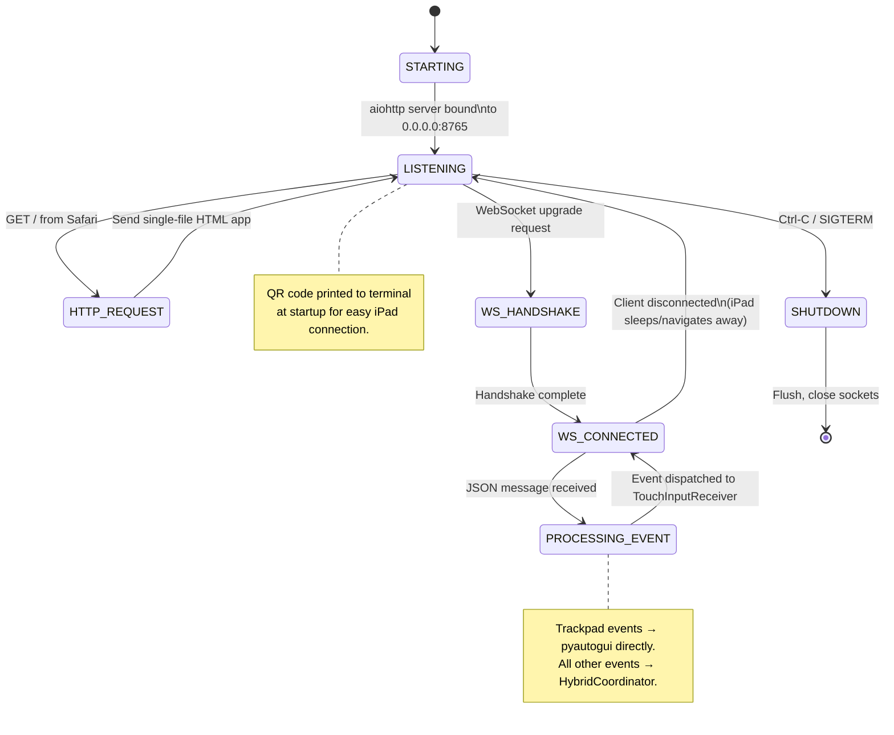
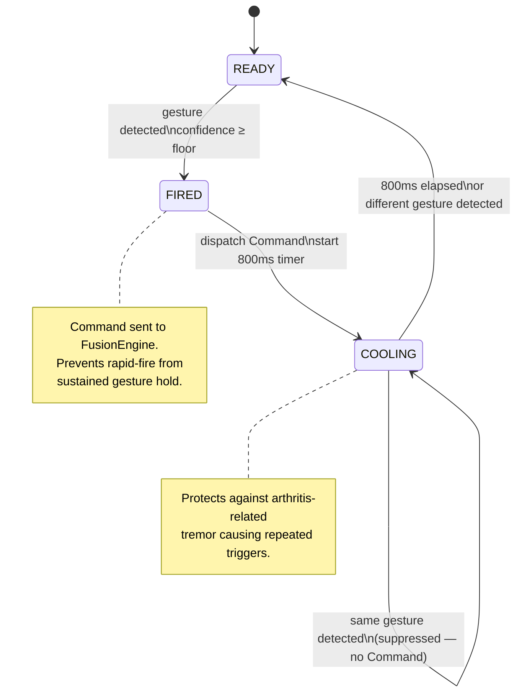

# State Machine Diagrams

---

## 1. UtteranceSegmenter — Voice Activity State Machine



---

## 2. HybridCoordinator — Routing Gate State Machine



---

## 3. TouchInputServer — Connection State Machine



---

## 4. Sensor Degradation State Machine

```mermaid
stateDiagram-v2
    [*] --> FULL_STACK

    state FULL_STACK {
        [*] --> RESPEAKER_MIC
        [*] --> REALSENSE_DEPTH
        [*] --> ULTRALEAP_HAND
        [*] --> TOBII_GAZE
    }

    FULL_STACK --> BUDGET_STACK : Any full-stack sensor\nfails to connect

    state BUDGET_STACK {
        [*] --> FIFINE_MIC
        [*] --> OAKD_DEPTH
        [*] --> LEAP_V1_HAND
        [*] --> IRIS_GAZE
    }

    BUDGET_STACK --> IPAD_STACK : OAK-D absent\nAND iPad available

    state IPAD_STACK {
        [*] --> FIFINE_MIC
        [*] --> IPAD_LIDAR_DEPTH
        [*] --> MEDIAPIPE_HAND
        [*] --> BEAM_GAZE
    }

    IPAD_STACK --> VOICE_ONLY : All sensors except mic fail

    state VOICE_ONLY {
        [*] --> SYSTEM_MIC
        note "Whisper still processes\nvoice commands. No gaze,\nno gesture, no depth."
    }

    VOICE_ONLY --> TOUCH_ONLY : Mic also fails

    state TOUCH_ONLY {
        [*] --> IPAD_TOUCH_PAD
        note "Minimum viable mode.\nAll commands via iPad\ncommand pad only."
    }

    note right of FULL_STACK
        ~$820 hardware
        Best accuracy, 3D gesture,
        hardware gaze tracking
    end note

    note right of BUDGET_STACK
        ~$251 hardware
        Good accuracy, iris gaze,
        2D/3D gesture fallback
    end note

    note right of IPAD_STACK
        iPad Pro 2020+ replaces
        OAK-D and webcam.
        Adds touch command pad.
    end note
```

---

## 5. GestureDebouncer State Machine


