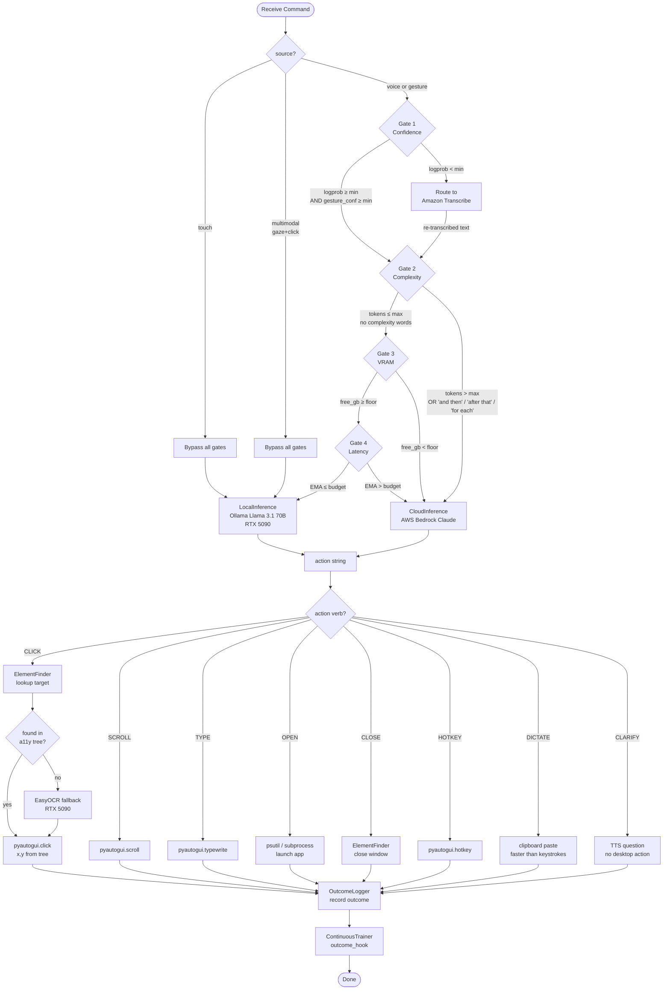
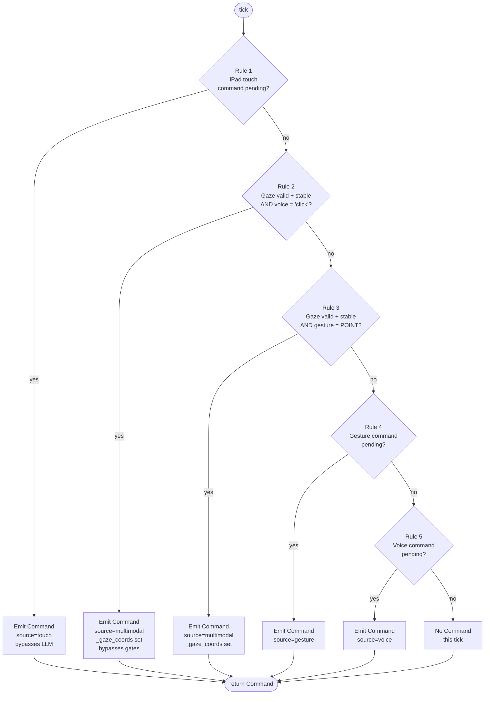
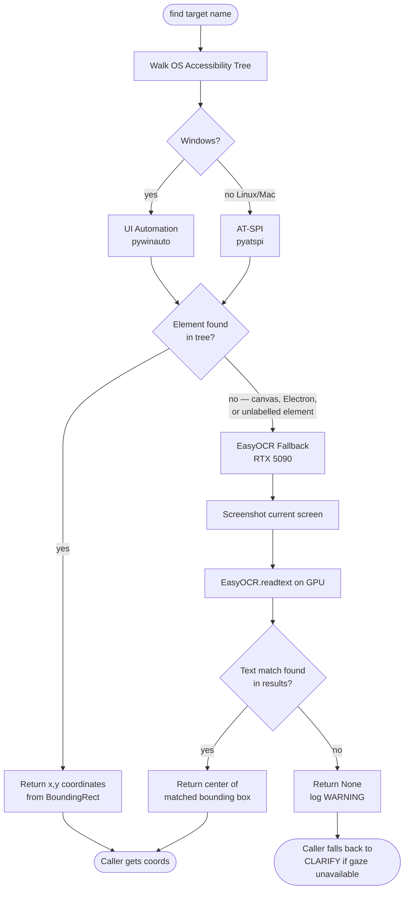

# Routing & Decision Flowcharts

---

## 1. HybridCoordinator — Complete Routing Decision

---

## 2. FusionEngine — Priority Rule Evaluation (60 Hz tick)

---

## 3. Continuous Trainer — Adaptation Decision Tree

```mermaid
flowchart TD
    OHook([outcome_hook called]) --> Log1[Write to routing_log.jsonl]
    Log1 --> FSM{outcome?}
    FSM -->|success| FSM2[FewShotMemory\nrecord_success]
    FSM -->|failure or clarify| Skip[skip few-shot record]

    subgraph THRESHOLD_PASS ["Threshold Pass — every 5 min"]
        T1([run_pass]) --> T2[Read last 500 log entries]
        T2 --> T3{cloud_rate > 30%\nAND local_fail < 10%?}
        T3 -->|yes — over-routing to cloud| T4[Relax Gate 1 min\n-0.05]
        T3 -->|no| T5{cloud_rate < 5%?}
        T5 -->|yes — local doing well| T6[Tighten Gate 1 min\n+0.02]
        T5 -->|no| T7[No change]
        T4 --> T8{latency_ema > budget?}
        T8 -->|yes| T9[Increase latency_budget_ms\n+50ms]
        T8 -->|no| TEnd([update_thresholds])
        T6 --> TEnd
        T7 --> TEnd
        T9 --> TEnd
    end

    subgraph VOCAB_PASS ["Vocabulary Pass — every 30 min"]
        V1([run_pass]) --> V2[Read successful voice commands]
        V2 --> V3[Count word freq in transcriptions]
        V3 --> V4{word appears ≥ 3 times?}
        V4 -->|yes| V5[Add to hotwords.txt]
        V4 -->|no| V6[Skip]
        V5 --> VEnd([WhisperTranscriber reloads])
        V6 --> VEnd
    end

    subgraph GESTURE_PASS ["Gesture Calibration Pass — every 5 min"]
        G1([run_pass]) --> G2[For each gesture with ≥ 10 samples]
        G2 --> G3[Compute p10 of confidences]
        G3 --> G4[confidence_floor = p10 - 0.05]
        G4 --> G5[Clamp: min=0.40, max=0.85]
        G5 --> GEnd([Write gesture_calibration.json])
    end

    subgraph COMPACTION ["Nightly Compaction — 02:00"]
        C1([run_pass]) --> C2[For each example in few_shot_memory.db]
        C2 --> C3{last_used_at > 30 days ago\nAND usage_count < 3?}
        C3 -->|yes| C4[Mark is_stale = 1]
        C3 -->|no| C5[Keep]
        C4 --> CEnd([VACUUM])
        C5 --> CEnd
    end
```

---

## 4. ElementFinder — Target Resolution Strategy

