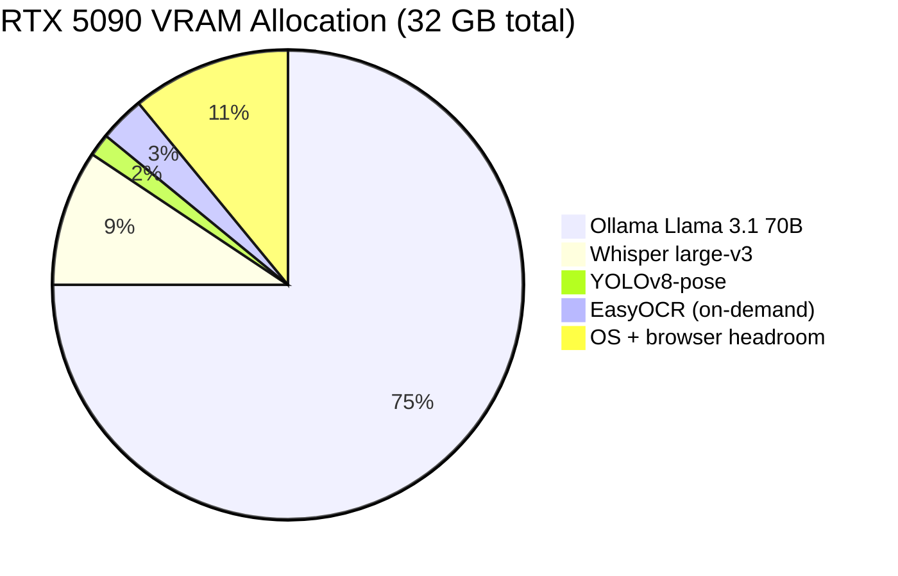
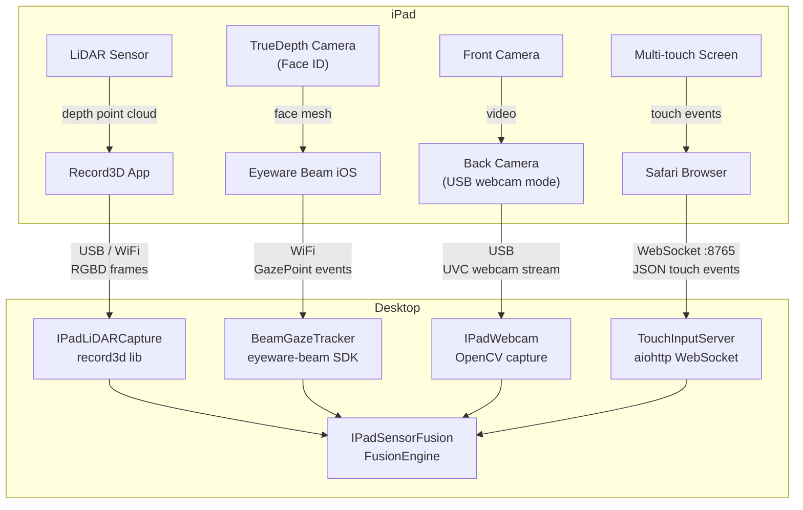

# Hardware & Sensor Matrix Diagrams

---

## 1. Sensor Fallback Chain

```mermaid
flowchart LR
    subgraph AUDIO ["🎤 Audio Input"]
        A1["ReSpeaker USB Array v2\n(Full stack — best noise rejection)"]
        A2["FIFINE AM8 USB Mic\n(Budget — good quality)"]
        A3["System Default Mic\n(Last resort)"]
        A1 -->|absent| A2
        A2 -->|absent| A3
    end

    subgraph DEPTH ["📷 Depth / RGB-D"]
        D1["Intel RealSense D455\n(Full stack — 30fps, IR stereo)"]
        D2["iPad Pro LiDAR via Record3D\n(iPad stack — TrueDepth)"]
        D3["OAK-D Lite\n(Budget — stereo depth)"]
        D4["Webcam only\n(No depth data)"]
        D1 -->|absent| D2
        D2 -->|Record3D not running| D3
        D3 -->|absent| D4
    end

    subgraph HAND ["✋ Hand Tracking"]
        H1["Ultraleap Controller 2\n(Full stack — 3D, 200fps)"]
        H2["Leap Motion v1\n(Budget — 3D, 120fps)"]
        H3["MediaPipe Hands\n(Software only — 2D pixels)"]
        H1 -->|absent| H2
        H2 -->|absent| H3
    end

    subgraph GAZE ["👁️ Eye Gaze"]
        G1["Tobii Eye Tracker 5\n(Full stack — 90Hz, high accuracy)"]
        G2["Eyeware Beam on iPad\n(TrueDepth, ~60Hz)"]
        G3["MediaPipe Iris\n(Software, ~30fps, ±3° accuracy)"]
        G4["No gaze\n(Voice/gesture/touch only)"]
        G1 -->|absent| G2
        G2 -->|Beam not installed| G3
        G3 -->|face not visible| G4
    end

    subgraph TOUCH ["📱 Touch Input"]
        T1["iPad Safari Touch UI\n(WebSocket command pad,\nvirtual trackpad, dwell)"]
        T2["None\n(voice/gesture/gaze only)"]
        T1 -->|iPad absent| T2
    end
```



---

## 2. Hardware Cost vs Capability Matrix

```mermaid
quadrantChart
    title Sensor Cost vs Accuracy
    x-axis Low Cost --> High Cost
    y-axis Low Accuracy --> High Accuracy

    quadrant-1 Best Value
    quadrant-2 Premium
    quadrant-3 Minimum Viable
    quadrant-4 Overpay

    Tobii Eye Tracker 5: [0.80, 0.92]
    Ultraleap Controller 2: [0.75, 0.88]
    Intel RealSense D455: [0.72, 0.85]
    ReSpeaker USB Array: [0.45, 0.82]
    OAK-D Lite: [0.35, 0.72]
    Eyeware Beam (SW): [0.18, 0.74]
    FIFINE AM8: [0.12, 0.70]
    Leap Motion v1 used: [0.15, 0.65]
    iPad LiDAR Record3D: [0.20, 0.78]
    MediaPipe iris (SW): [0.05, 0.48]
    System Mic: [0.02, 0.45]
```

---

## 3. VRAM Budget — RTX 5090



---

## 4. Latency Budget per Modality

```mermaid
gantt
    title End-to-End Latency Targets (milliseconds)
    dateFormat X
    axisFormat %L ms

    section iPad Touch
    WebSocket recv + pyautogui : 0, 20

    section Gaze + Voice Click
    Gaze point recv         : 0, 5
    Whisper transcription   : 5, 405
    FusionEngine tick       : 405, 422
    pyautogui click         : 422, 435

    section Voice → Local LLM
    Silero VAD              : 0, 1
    Utterance buffer        : 1, 401
    Whisper transcription   : 1, 401
    Gate evaluation         : 401, 410
    Ollama inference        : 410, 1010
    ElementFinder + click   : 1010, 1060

    section Voice → Cloud LLM
    Whisper transcription   : 0, 400
    Gate evaluation         : 400, 410
    Bedrock invoke_model    : 410, 2410
    ElementFinder + click   : 2410, 2460
```



---

## 5. iPad Integration Data Flows


