# Class Diagram — iPad-Focused Architecture

---

## 1. iPad-Side Classes (Swift/SwiftUI)

```mermaid
classDiagram
    direction TB

    class iPadApp {
        +WebSocketManager wsManager
        +SensorCoordinator sensors
        +TouchUIView touchUI
        +SettingsStore settings
    }

    class WebSocketManager {
        +URL serverURL
        +ConnectionState state
        +connect() void
        +disconnect() void
        +send(message SensorMessage) void
        +onReceive(handler) void
        -reconnectWithBackoff() void
    }

    class ConnectionState {
        <<enumeration>>
        connected
        disconnected
        reconnecting
    }

    class SensorCoordinator {
        +TiltSensor tilt
        +KeywordListener keywords
        +CameraStreamer camera
        +startAll() void
        +stopAll() void
    }

    class TiltSensor {
        +CMMotionManager motionManager
        +Double sensitivity
        +Double deadZone
        +Bool axisInverted
        +start() void
        +stop() void
        +onTilt(handler) void
    }
    note for TiltSensor "Core Motion\nrotationRate @ 60Hz\nAlso detects table taps\nvia accelerometer impulse"

    class KeywordListener {
        +SFSpeechRecognizer recognizer
        +[String] keywords
        +Double confidenceThreshold
        -Int lastScannedLength
        -[String:Date] keywordCooldowns
        -TimeInterval keywordCooldownDuration
        +start() void
        +stop() void
        +onKeyword(handler) void
        +onUnmatched(audioBuffer) void
    }
    note for KeywordListener "Speech Framework\nOn-device recognition\nIncremental scan + 0.5s cooldown\nStreams unmatched audio\nto PC for Whisper"

    class CameraStreamer {
        +AVCaptureSession session
        +Int frameRate
        +start() void
        +stop() void
        +onFrame(handler) void
    }

    class TouchUIView {
        +CommandPadView commandPad
        +TrackpadView trackpad
        +SettingsView settings
        +AppMode currentMode
    }

    class CommandPadView {
        +[[ButtonConfig]] buttons
        +Bool dwellEnabled
        +Double dwellTimeout
        +Double palmRejectRadius
        +onCommand(handler) void
    }
    note for CommandPadView "SwiftUI\nMin 80x80pt targets\nHit box expansion via\n.contentShape + .padding"

    class TrackpadView {
        +Double sensitivity
        +Double scrollSpeed
        +Bool tapToClick
        +onDrag(handler) void
        +onTap(handler) void
        +onTwoFingerScroll(handler) void
    }
    note for TrackpadView "Full-screen trackpad mode\niPad flat on desk = mouse\nPalm rejection active"

    class SettingsStore {
        +Double tiltSensitivity
        +Double tiltDeadZone
        +Double dwellTimeout
        +Double trackpadSpeed
        +Double palmRejectRadius
        +[String] keywords
        +save() void
        +load() void
    }
    note for SettingsStore "Persists to UserDefaults\nAll sensor preferences\nin one place"

    class AppMode {
        <<enumeration>>
        commandPad
        fullScreenTrackpad
    }

    iPadApp *-- WebSocketManager
    iPadApp *-- SensorCoordinator
    iPadApp *-- TouchUIView
    iPadApp *-- SettingsStore
    WebSocketManager --> ConnectionState
    SensorCoordinator *-- TiltSensor
    SensorCoordinator *-- KeywordListener
    SensorCoordinator *-- CameraStreamer
    TouchUIView *-- CommandPadView
    TouchUIView *-- TrackpadView
    TouchUIView --> AppMode

```

---

## 2. PC-Side Classes (Python)

The Python-side class diagrams moved to
[16-python-class-diagrams.md](16-python-class-diagrams.md) (2026-07-02), decomposed
into 8 concern-focused diagrams that reflect the post-PR-#153 HybridCoordinator
decomposition. The monolithic diagram formerly here predated `CommandExecutor`,
`GateEvaluator`, and the 16-verb vocabulary and is retired.
