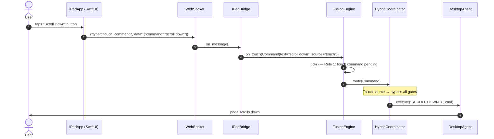
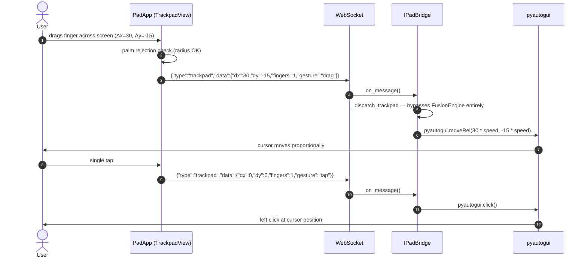
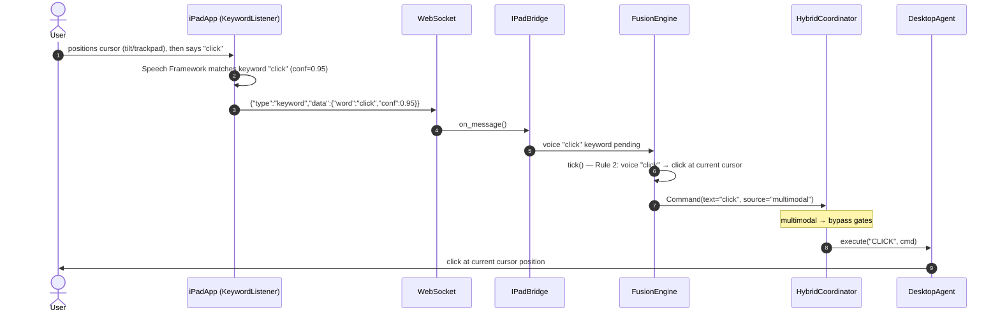
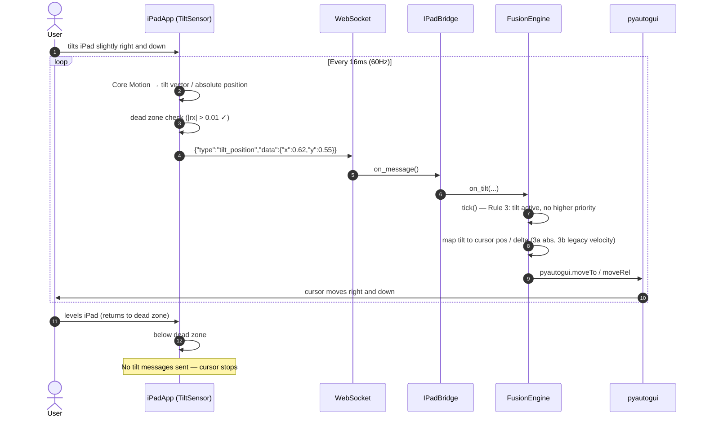
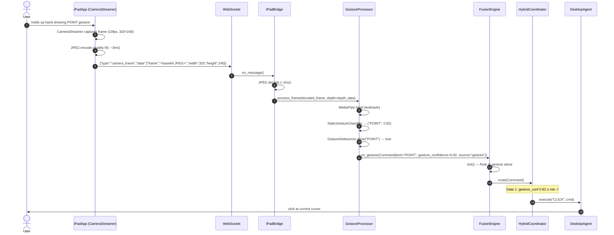
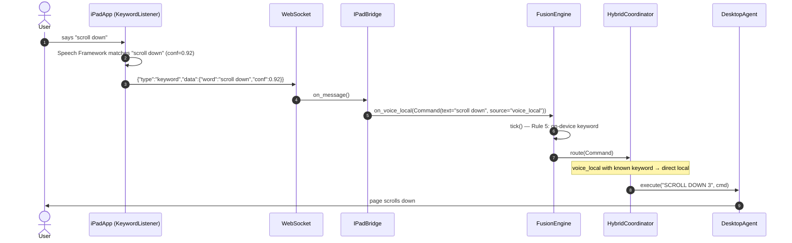
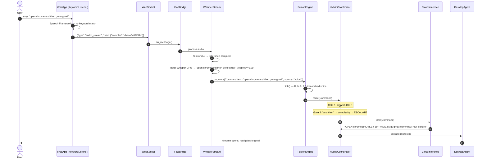
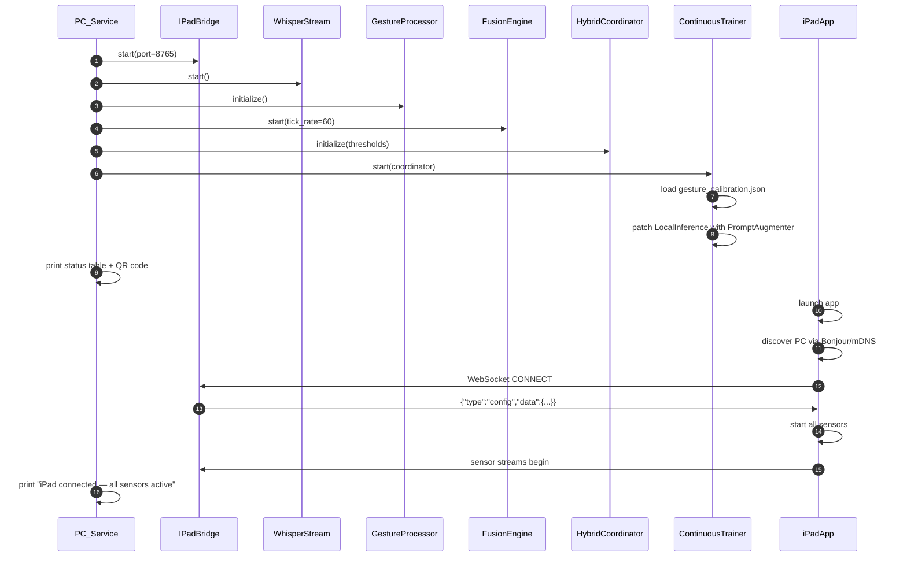

# Sequence Diagrams — iPad-Focused Flows

> Eye-gaze, head-pose, and mouth-sound control were **removed** (the standard
> iPad lacks the required TrueDepth sensor). The flows below reflect the current
> **6-level** FusionEngine priority. Source of truth: `core/fusion_engine.py`.

---

## 1. Touch Command (Rule 1 — highest priority, bypasses everything)

---

## 2. Full-Screen Trackpad (direct path — no LLM)

---

## 3. Voice "click" Keyword (Rule 2 — click at current cursor)

---

## 4. Tilt Navigation (Rule 3 — cursor movement)

---

## 5. Gesture via iPad Camera (Rule 4 — PC-side MediaPipe)

---

## 6. On-Device Voice Keyword (Rule 5 — fast path)

---

## 7. Full Whisper Transcription (Rule 6 — complex command)

---

## 8. Startup and Connection

