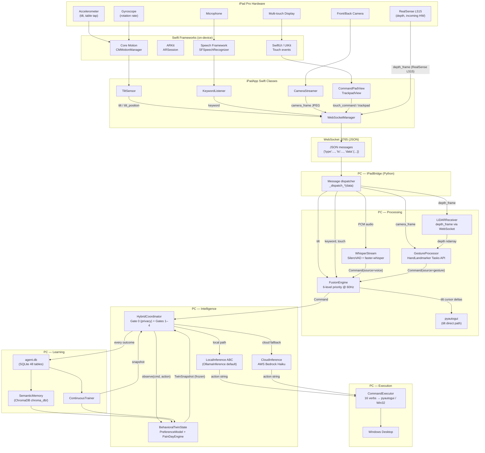
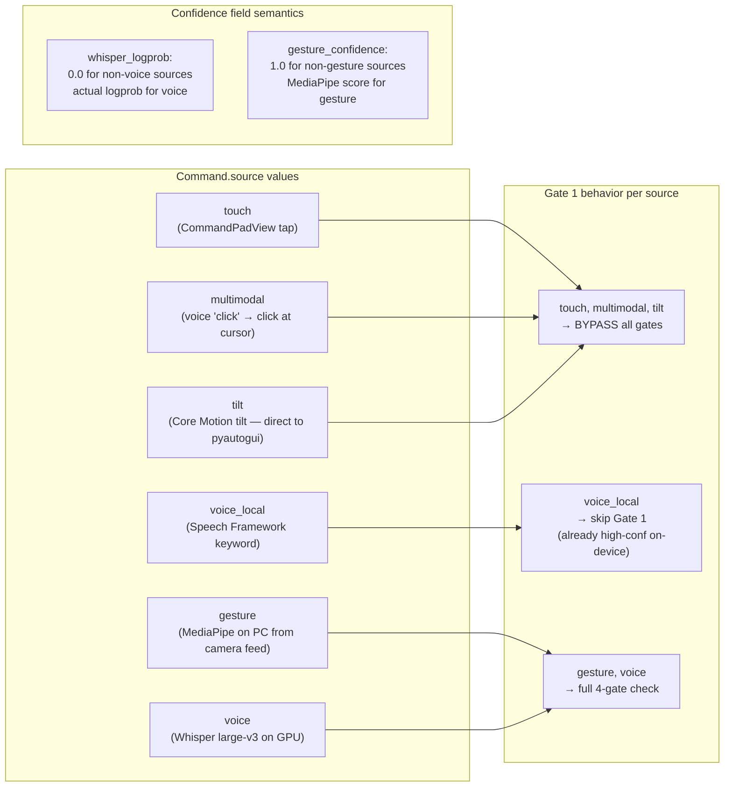
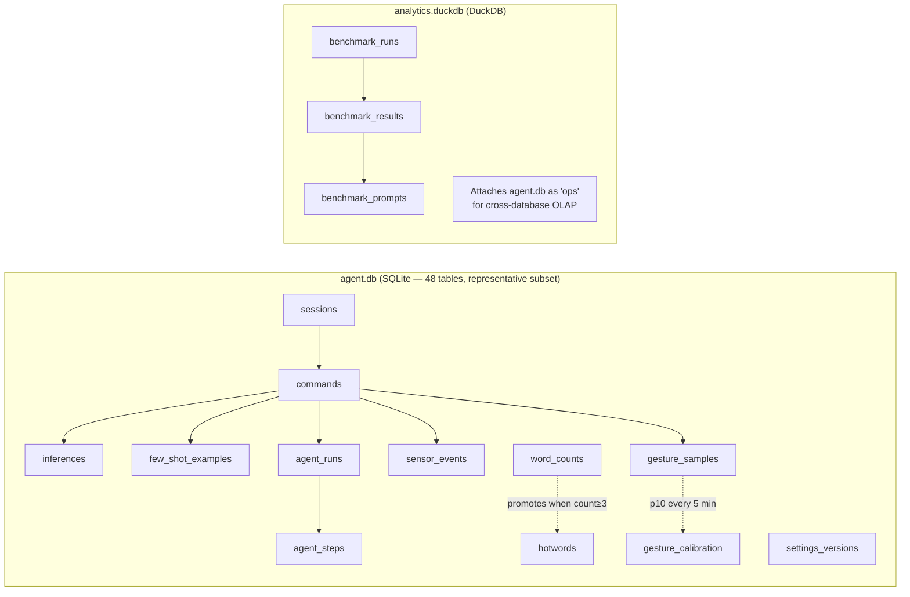
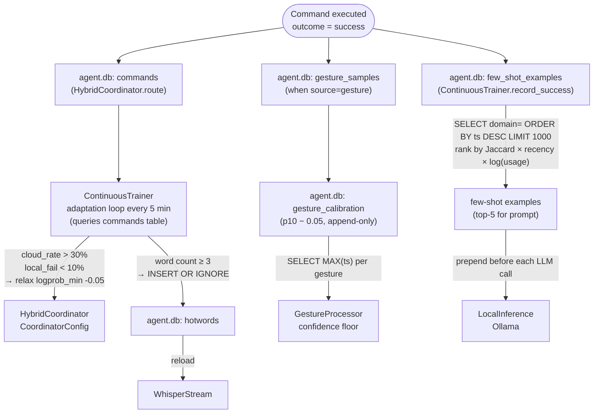
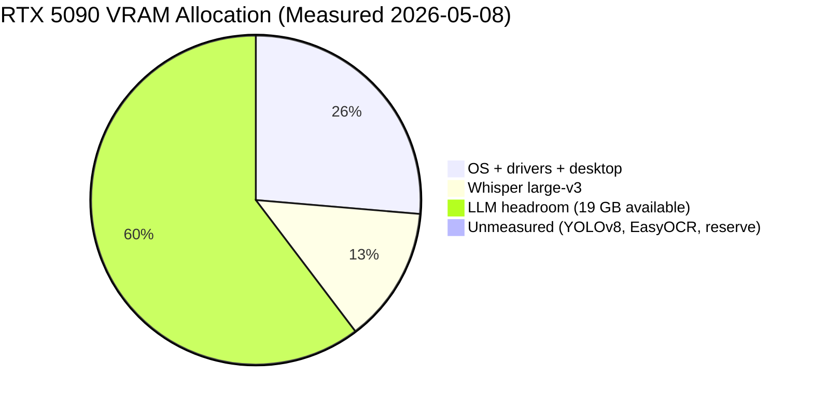

# Data Flow Diagrams — iPad-Focused Architecture

---

## 1. iPad Sensor Data Flows (end-to-end)

---

## 2. WebSocket Message Schema

```mermaid
erDiagram
    WEBSOCKET_MESSAGE {
        STRING type     "Sensor or event type (see table)"
        INT    ts       "Unix timestamp in milliseconds"
        OBJECT data     "Type-specific payload"
    }

    TILT_DATA {
        FLOAT  rx       "Rotation rate around X axis (rad/s)"
        FLOAT  ry       "Rotation rate around Y axis (rad/s)"
    }

    KEYWORD_DATA {
        STRING word     "Matched keyword text"
        FLOAT  conf     "Speech recognition confidence"
    }

    TOUCH_COMMAND_DATA {
        STRING command  "Command text (e.g. 'scroll down')"
    }

    TRACKPAD_DATA {
        FLOAT  dx       "X delta in screen points (0 for taps)"
        FLOAT  dy       "Y delta in screen points (0 for taps)"
        INT    fingers  "Number of touch contacts (1 or 2)"
        STRING gesture  "drag | tap | scroll (distinguishes intent)"
    }

    AUDIO_STREAM_DATA {
        STRING samples  "Base64-encoded 16kHz PCM"
        INT    frames   "Number of samples"
    }

    CAMERA_FRAME_DATA {
        STRING frame    "Base64-encoded JPEG (quality 60, ~30-50KB per frame)"
        INT    width    "Frame width (320px — downscaled for streaming)"
        INT    height   "Frame height (240px — downscaled for streaming)"
    }

    DEPTH_FRAME_DATA {
        INT    w        "Frame width in pixels"
        INT    h        "Frame height in pixels"
        STRING blob     "Base64-encoded float32 depth (mm)"
        STRING conf_map "Base64-encoded uint8 confidence"
    }

    WEBSOCKET_MESSAGE ||--o| TILT_DATA         : "type=tilt"
    WEBSOCKET_MESSAGE ||--o| KEYWORD_DATA      : "type=keyword"
    WEBSOCKET_MESSAGE ||--o| TOUCH_COMMAND_DATA: "type=touch_command"
    WEBSOCKET_MESSAGE ||--o| TRACKPAD_DATA     : "type=trackpad"
    WEBSOCKET_MESSAGE ||--o| AUDIO_STREAM_DATA : "type=audio_stream"
    WEBSOCKET_MESSAGE ||--o| CAMERA_FRAME_DATA : "type=camera_frame"
    WEBSOCKET_MESSAGE ||--o| DEPTH_FRAME_DATA  : "type=depth_frame"
```

### Camera Streaming Notes

- **Throttled to 10 fps** by default (configurable in iPadApp settings). MediaPipe hand landmarks work well at low frame rates.
- **Downscaled to 320×240** on-device before JPEG encoding. Full resolution is unnecessary for landmark detection.
- **JPEG quality 60** keeps each frame under 50 KB → ~500 KB/s bandwidth at 10 fps.
- **Encoding latency**: ~3 ms on iPad (hardware JPEG encoder), ~2 ms decode on PC.
- If gesture recognition is not needed (e.g., user relies on tilt + voice), camera streaming can be disabled entirely to save bandwidth.

---

## 3. Command Dataclass — Source Tags and Confidence Semantics

---

## 4. Persistent Storage Schema

> **Updated 2026-05-11:** The project now uses two databases (`agent.db` + `analytics.duckdb`) instead of JSONL and JSON files.
> Full ER diagrams and design rationale: [14-database-schema.md](14-database-schema.md) and `docs/database-design.md`.

---

## 5. Continuous Learning Data Cycle

---

## 6. VRAM Budget — RTX 5090 (31.8 GB measured 2026-05-08)

> **Measured values** — captured via `python main.py --measure-vram` on the target machine.
> All prior estimates were extrapolated from Ada Lovelace; these are Blackwell actuals.

| Component | Estimated | **Measured** | Delta |
|-----------|-----------|-------------|-------|
| OS + drivers + desktop (baseline) | 3.5 GB | **8.3 GB** | +4.8 GB |
| Whisper large-v3 (float16) | 3.0 GB | **4.2 GB** | +1.2 GB |
| LLM (30B-class model via Ollama) | n/a | **~19 GB** | — |
| YOLOv8-pose | 0.5 GB | *not measured* | — |
| EasyOCR (on-demand) | 1.0 GB | *not measured* | — |

**Key finding:** Whisper + a 30B LLM + baseline fills all 31.8 GB.
`llama3.1:70b` (~40 GB weights) **cannot co-reside with Whisper** on this GPU.

**Revised model strategy:**
- Use `nemotron-mini` (4B, ~4 GB) or `llama3.1:8b` (4.9 GB) alongside Whisper
- Total usable VRAM after baseline + Whisper: **~19 GB** (enough for a 14–18B model)
- For 70B inference: unload Whisper first, or use RAM-offload via llama.cpp

---

## 7. Latency Budget per Modality

```mermaid
gantt
    title End-to-End Latency (ms) — iPad-Focused
    dateFormat  X
    axisFormat  %L ms

    section Touch Command
    WS recv + route + pyautogui  :0, 20

    section Voice Click (keyword)
    Speech Framework match       :0, 50
    WS + FusionEngine tick       :50, 67
    pyautogui click              :67, 80

    section Gesture (camera frame)
    iPad JPEG encode (320x240)   :0, 3
    WS transmit (~50KB)          :3, 8
    PC JPEG decode               :8, 10
    MediaPipe landmarks          :10, 15
    Classify + debounce          :15, 20
    FusionEngine + route         :20, 35

    section On-Device Keyword → Local LLM
    Speech Framework match       :0, 50
    WS + gate evaluation         :50, 60
    Ollama inference             :60, 660
    ElementFinder + execute      :660, 710

    section PC Whisper → Cloud LLM
    Audio stream over WS         :0, 50
    Silero VAD + Whisper GPU     :50, 450
    Gate eval + Bedrock          :450, 2450
    Execute                      :2450, 2500
```

