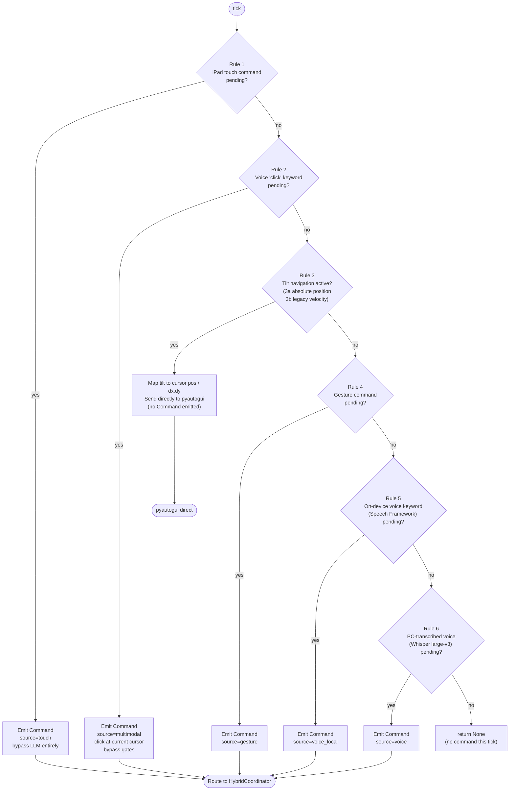
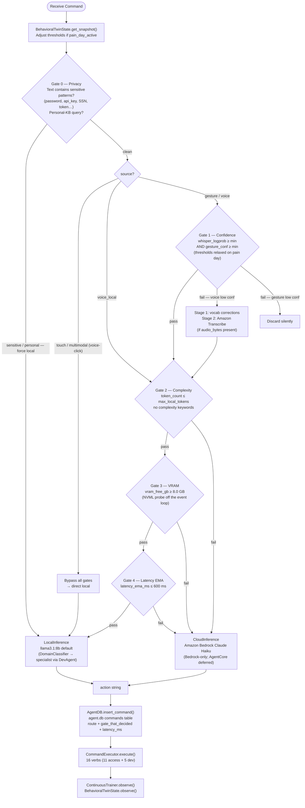
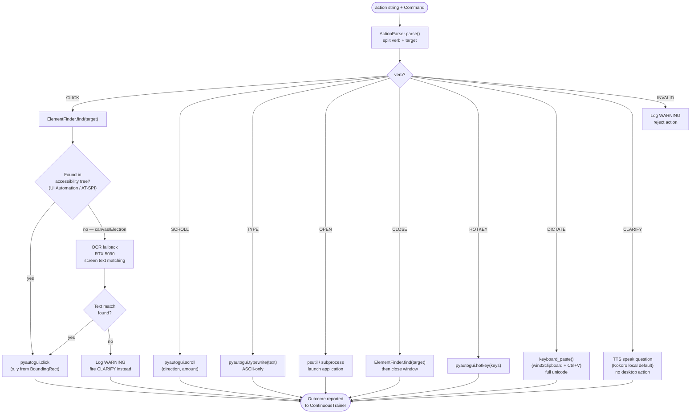
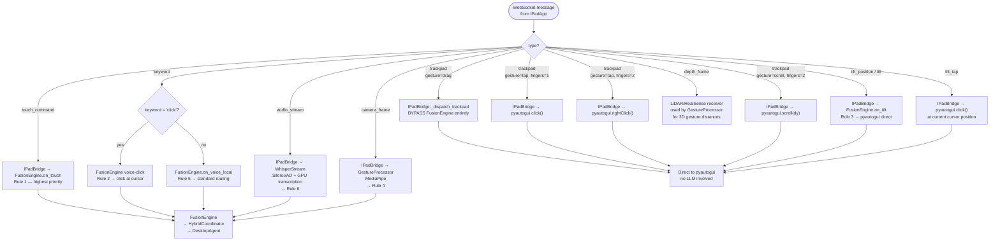
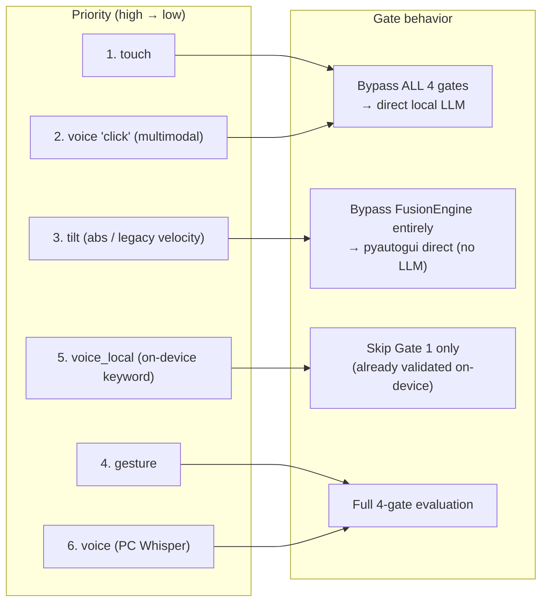

# Fusion & Routing Flowcharts — iPad-Focused Architecture

> Source of truth for the priority order: `core/fusion_engine.py` and the
> "Sensor Priority" section of `CLAUDE.md`. Eye-gaze, head-pose, and mouth-sound
> control were **removed** (the standard iPad lacks the required TrueDepth sensor);
> the priority ladder shrank from 10 levels to **6**. Gesture control is KEPT.

---

## 1. FusionEngine — 6-Level Priority Decision (60 Hz tick)

---

## 2. HybridCoordinator — Gate 0 + 4-Gate Routing Decision

---

## 3. DesktopAgent — Action Dispatch and Target Resolution

---

## 4. Touch / Sensor Input Routing — Decision Tree

---

## 5. Source Priority vs Gate Bypass Summary

