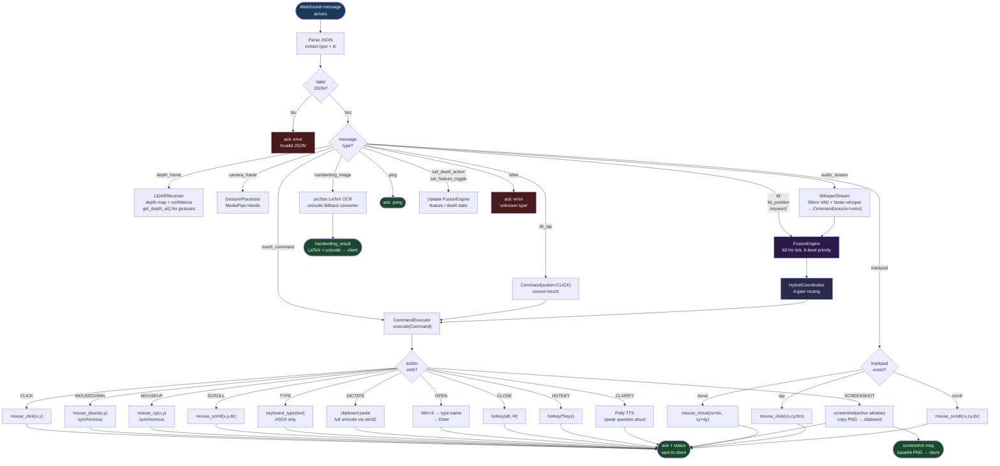

# Bridge Message Routing

**Message routing categories:**

| Category | Types | Destination |
|----------|-------|-------------|
| Direct execution | `touch_command`, `tilt_tap` | CommandExecutor (bypasses FusionEngine) |
| Direct hardware | `trackpad` | pyautogui (bypasses LLM + executor) |
| Sensor stream | `tilt`, `tilt_position`, `keyword` | FusionEngine → HybridCoordinator → CommandExecutor |
| Specialist receivers | `depth_frame` → LiDARReceiver, `camera_frame` → GestureProcessor, `audio_stream` → WhisperStream → FusionEngine | per-subsystem |
| Inline | `handwriting_image` | pix2tex OCR → `handwriting_result` reply |
| Control | `ping`, `set_dwell_action`, `set_feature_toggle` | ack / FusionEngine state update |

The core iPad→PC sensor-stream types are: `tilt`, `tilt_position`, `keyword`, `touch_command`, `trackpad`, `audio_stream`, `camera_frame`, `depth_frame`, `handwriting_image`, `tilt_tap` (plus `tilt_ratchet`, `dwell_click`, `a2ui_event` and settings/diagnostics control types — 26 iPad→PC message types in total).
