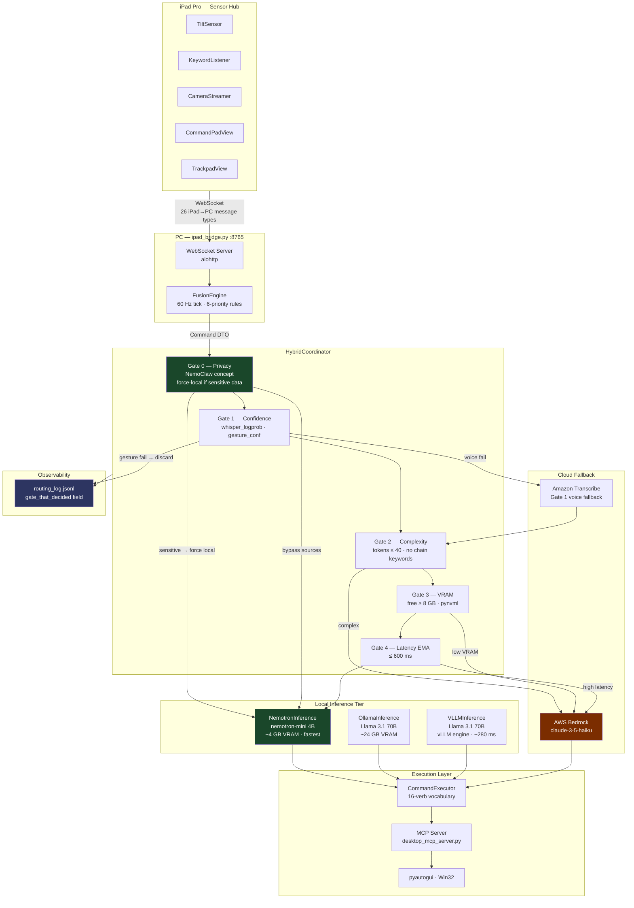

# Diagram 10 — NemoClaw Integration: System Architecture

End-to-end view showing how NemoClaw concepts (Gate 0 privacy routing and
`gate_that_decided` logging) slot into the full pipeline.
Green nodes = NemoClaw additions. Dark red = cloud paths. Blue = observability.

> **Note (2026-06-24):** the **local-tier model roster below is historical** —
> `NemotronInference`/`nemotron-mini` was removed and `llama3.1:70b` does not fit
> alongside Whisper. See the "VRAM model roster" gotcha in `CLAUDE.md` for the
> current models (command: `llama3.1:8b`; specialists: `qwen3-coder:30b`,
> `deepseek-r1:8b`, `qwen3-vl:30b`, `gemma3:27b`). Operational writes go to
> `agent.db`, not `routing_log.jsonl`.

