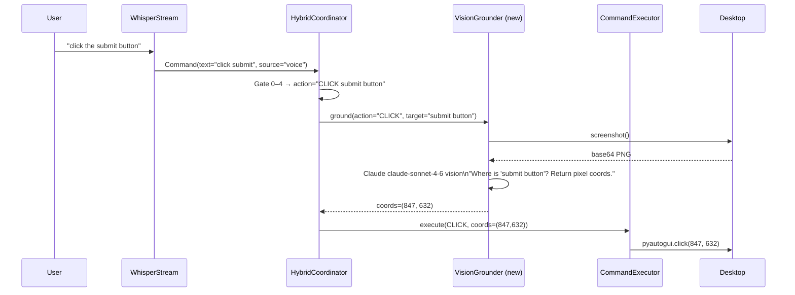
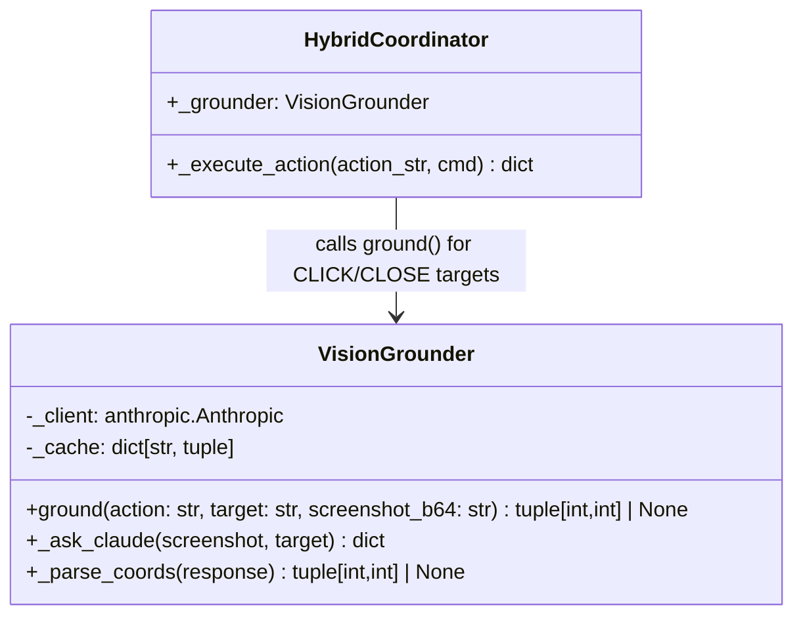
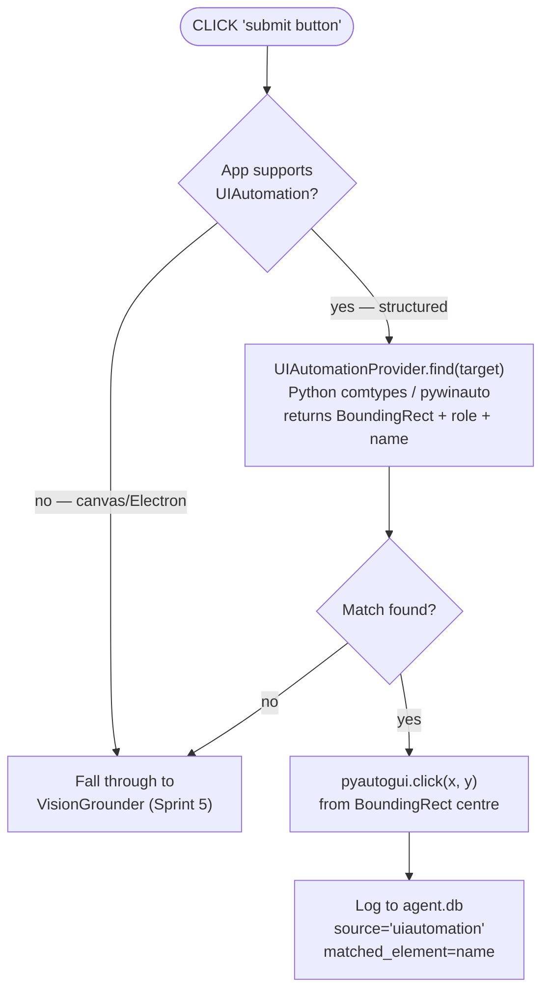
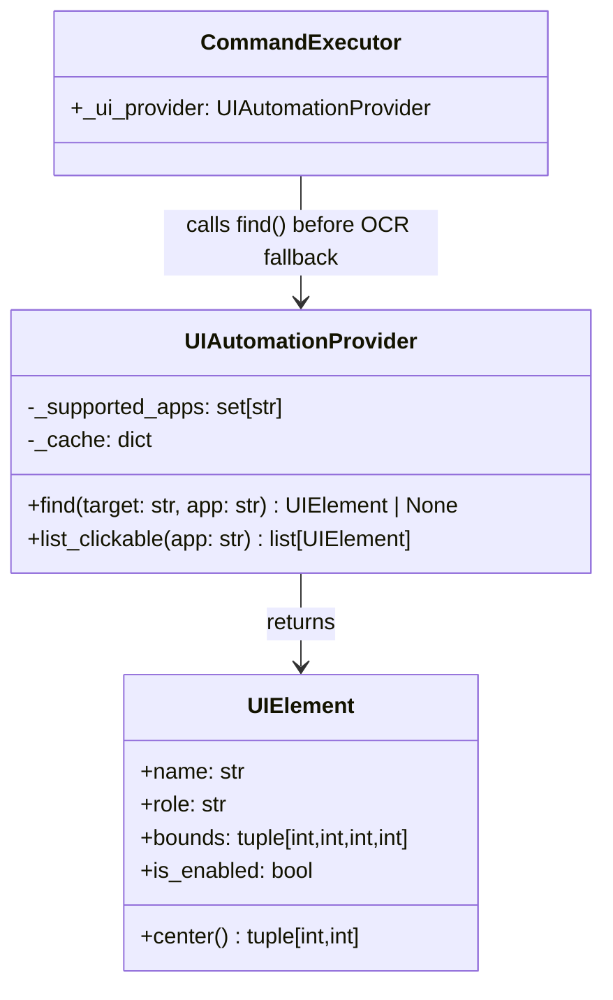
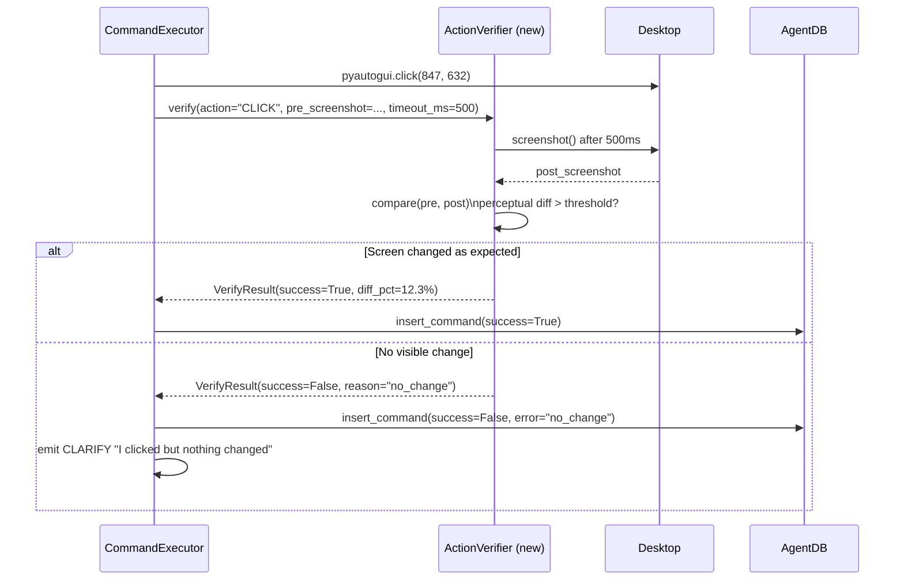
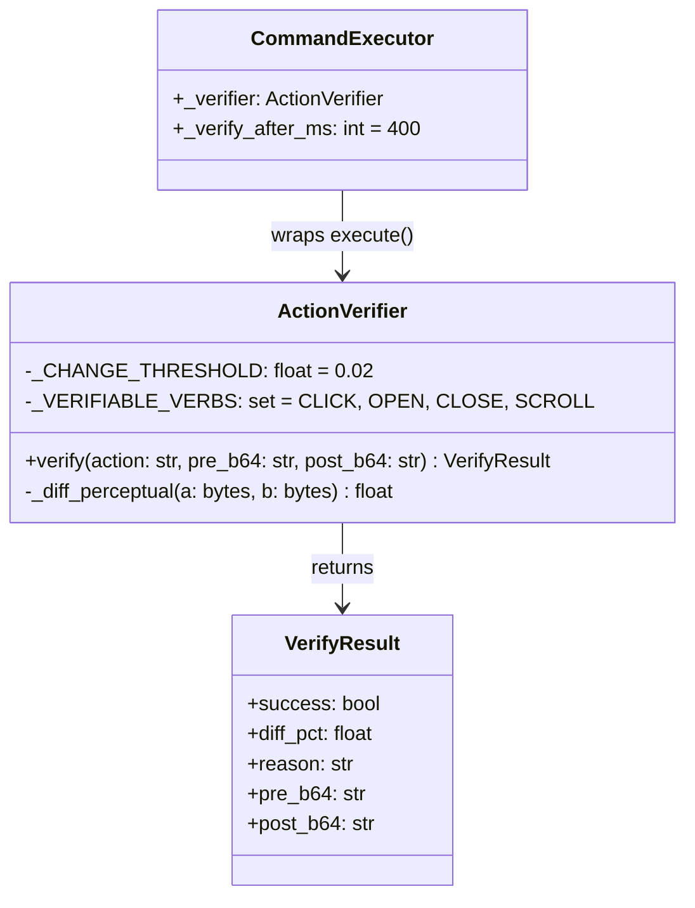
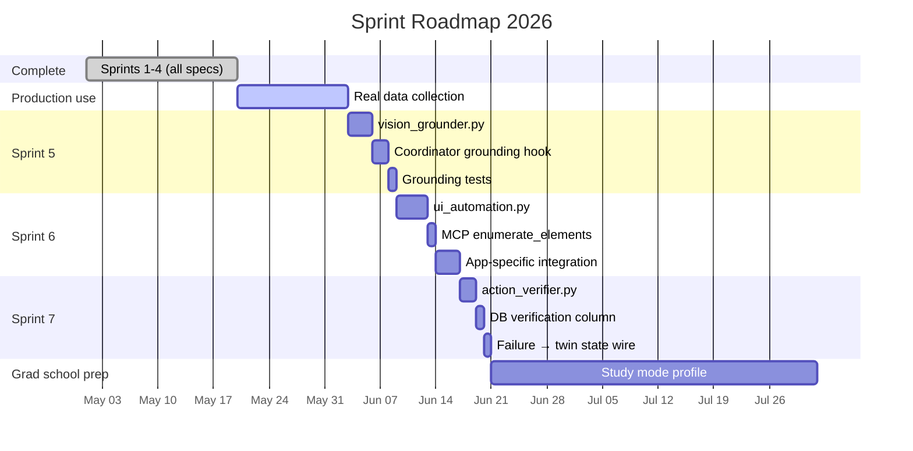
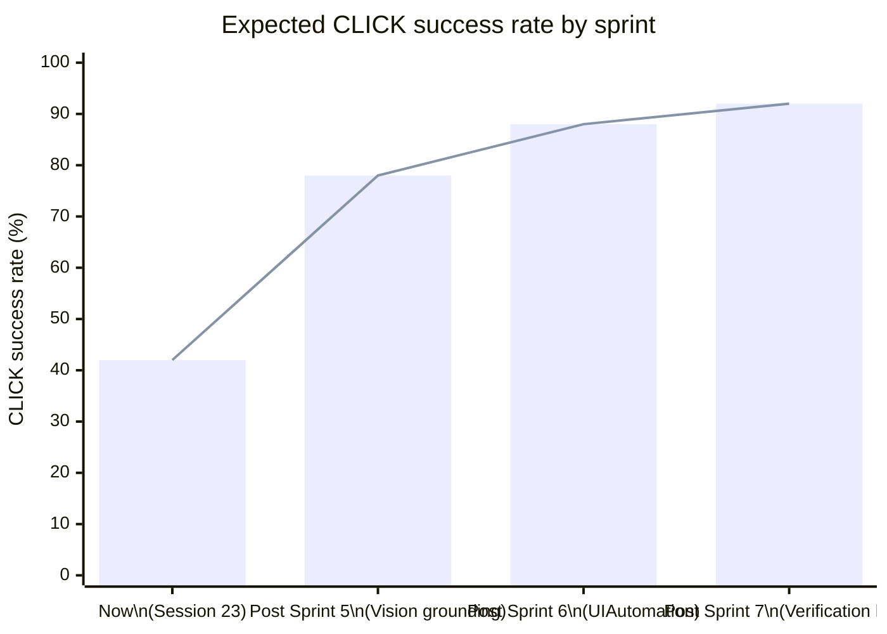

# Sprint Roadmap — Next Phases

_As of 2026-05-20. Sprints 1–4 complete. Sessions 22–23 running in production._

---

## Current System State (baseline for sprint planning)

```mermaid
block-beta
    columns 4

    block:sensors["Sensors (iPad)"]:1
        tilt["Tilt ✅"]
        touch["Touch ✅"]
        voice["Voice ✅"]
        gesture["Gesture ✅\n(HandLandmarker)"]
        lidar["Depth ✅\n(RealSense L515)"]
    end

    block:pipeline["Pipeline (PC)"]:1
        bridge["IPadBridge ✅"]
        fusion["FusionEngine ✅\n60Hz / 6-level"]
        coord["HybridCoordinator ✅\nGate 0 + 1–4"]
        twin["BehavioralTwinState ✅\nChromaDB live"]
        trainer["ContinuousTrainer ✅"]
        whisper["WhisperStream ✅\nlarge-v3 CUDA"]
    end

    block:execution["Execution (PC)"]:1
        executor["CommandExecutor ✅\n16 verbs"]
        mcp["MCP Server ✅\n14 tools"]
        ocr["Tesseract OCR\n(word-match only) ⚠️"]
        grounding["Vision grounding ❌\nGap 1"]
    end

    block:cloud["Cloud (AWS)"]:1
        bedrock["Bedrock Haiku ✅\nfallback active"]
        transcribe["Transcribe ✅\nGate 1 fallback"]
        polly["Polly / Kokoro / SAPI ✅\nTTS live"]
        agentcore["AgentCore ⏸️\ndeploy deferred"]
    end
```

---

## Sprint 5 — Vision Grounding (Gap 1)

**Goal:** Voice commands reliably land on targets instead of CLARIFYing.

**The problem today:** `"click the submit button"` → Whisper → llama3.1:8b emits `CLICK submit button` → CommandExecutor calls `find_text_on_screen("submit")` (Tesseract, word-match only) → often fails → CLARIFY. There is no vision-model-in-the-loop to actually look at the screen and find the element.

**Solution:** After gate evaluation produces an action with a named target, take a screenshot and send it to Claude vision to get pixel coordinates before executing.

**New component:** `vision_grounder.py`

**Key implementation decisions:**
- Only invoke vision grounding for `CLICK` and `CLOSE` verbs with a named target (not for `SCROLL`, `TYPE`, `HOTKEY` which don't need coordinates)
- Cache screenshot + target → coords for 2 seconds to handle rapid re-clicks
- Fallback chain: vision coords → Tesseract OCR → screen centre + CLARIFY
- Use `claude-sonnet-4-6` vision (fast, cheap); prompt: structured JSON response `{"x": N, "y": N, "confidence": 0.0–1.0}`
- Add `GROUNDING_MIN_CONFIDENCE = 0.7`; below threshold, fall through to Tesseract

**Files touched:** `vision_grounder.py` (new), `hybrid_coordinator.py`, `command_executor.py`, `requirements.txt` (add `anthropic`)

**Success metric:** >80% of voice `CLICK` commands land without CLARIFY after 50 real commands logged.

---

## Sprint 6 — Accessibility Tree Integration (Gap 2)

**Goal:** For the top 3–4 daily apps (browser, IDE, PDF reader), enumerate UI elements structurally instead of relying on OCR or vision.

**The problem:** Win32 UIAutomation gives bounding boxes, roles, and labels for all interactive elements without a screenshot. For apps that implement accessibility (VS Code, Chrome, Acrobat), this is more reliable than OCR and faster than vision grounding.

**New component:** `ui_automation.py`

**Target app list (prioritised for grad school workflows):**
1. VS Code — coding, ML experiments
2. Chrome / Edge — research papers, web
3. Zotero / Acrobat — PDF reading
4. Windows Terminal — CLI operations

**Files touched:** `ui_automation.py` (new), `command_executor.py`, `mcp_server/tools/windows.py` (add `enumerate_elements`)

**Success metric:** CLICK lands without vision API call for >70% of VS Code and Chrome interactions.

---

## Sprint 7 — Action Verification Loop (Gap 3)

**Goal:** After every action, take a screenshot, compare with pre-action state, and confirm the command succeeded before moving on. Enable multi-step dev-agent chains without silent failures.

**The problem today:** The pipeline executes and logs, but success/failure is inferred (HTTP 200 from pyautogui) not observed (did the screen actually change?). Multi-step voice commands like "open the terminal then run pytest" can silently fail on step 1 and waste step 2.

**New component:** `action_verifier.py`

**Implementation notes:**
- Perceptual diff using `ImageChops.difference` from Pillow — no ML model needed
- `CHANGE_THRESHOLD = 2%` pixel change → success (scrolling, window changes, button state changes all exceed this)
- Only verify `CLICK`, `OPEN`, `CLOSE`, `SCROLL` — `TYPE` and `HOTKEY` are inherently unverifiable by visual diff
- Verification timeout: 400 ms (fast enough to not feel sluggish, long enough for animations)
- Store `pre_b64` + `post_b64` in `agent.db` for the first 30 days (truncate after → keep only the outcome flag)
- Failed verifications feed into `BehavioralTwinState` as failure signal → pain day score

**Files touched:** `action_verifier.py` (new), `command_executor.py`, `db.py` (add `verification_result` column to commands), `behavioral_twin_state.py` (wire failure signal)

**Success metric:** ContinuousTrainer receives real success/failure signal for >90% of CLICK commands; CLARIFY rate on failed actions drops as grounding (Sprint 5) + verification (Sprint 7) close the loop.

---

## Sprint Dependency Graph

---

## Gap Closure Trajectory

_Baseline 42% estimated from research: 56.7% of UI interactions miss their target in SOTA systems; this system is lower due to Tesseract word-match-only grounding. Post-Sprint 5 estimate based on Claude vision grounding benchmark (~78%). Post-Sprint 6 adds UIAutomation structured access for supported apps. Post-Sprint 7 verification closes the feedback loop._
