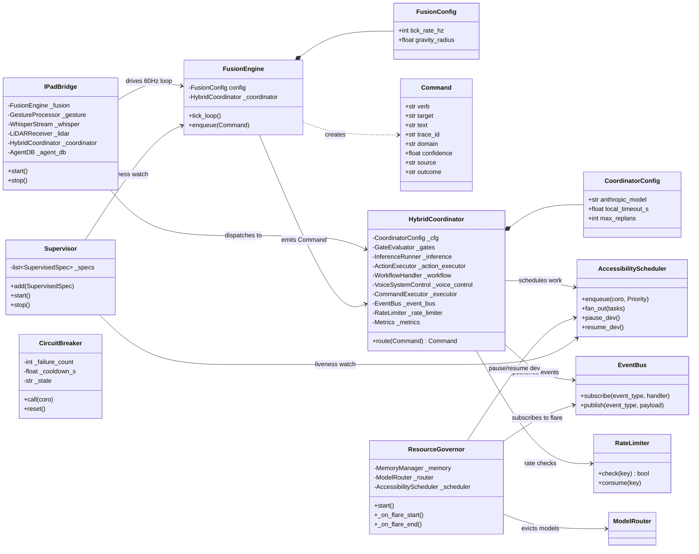
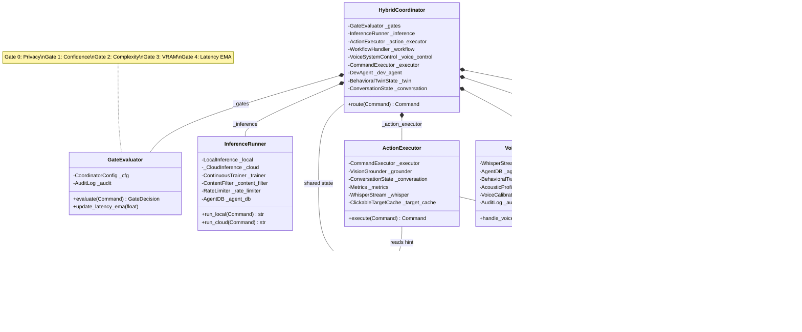
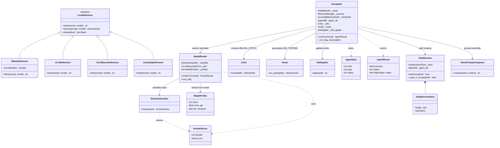
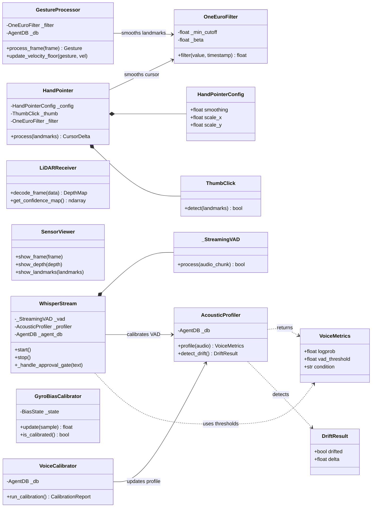
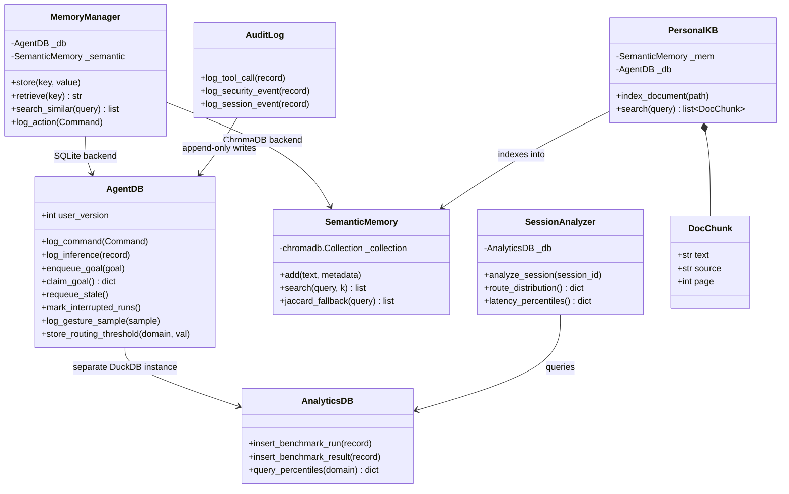
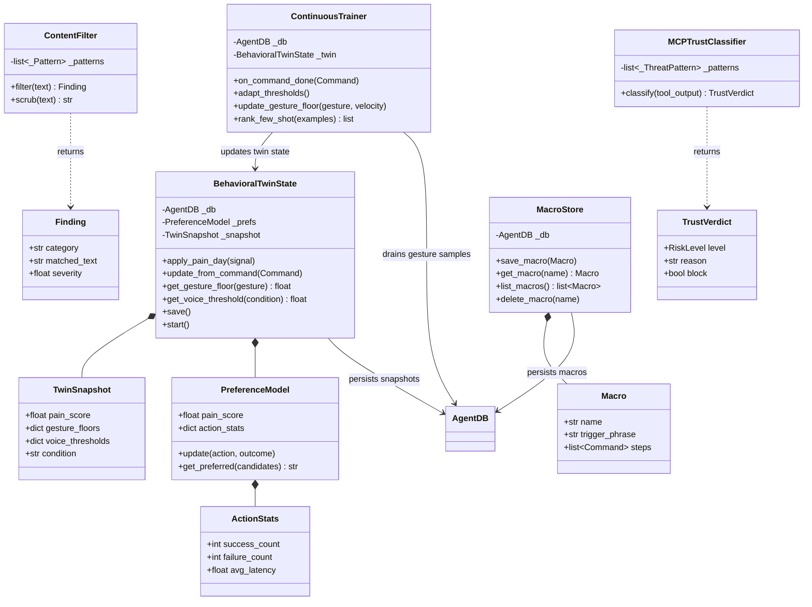
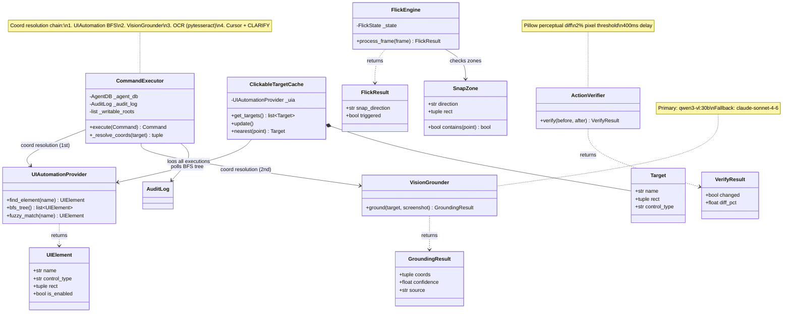
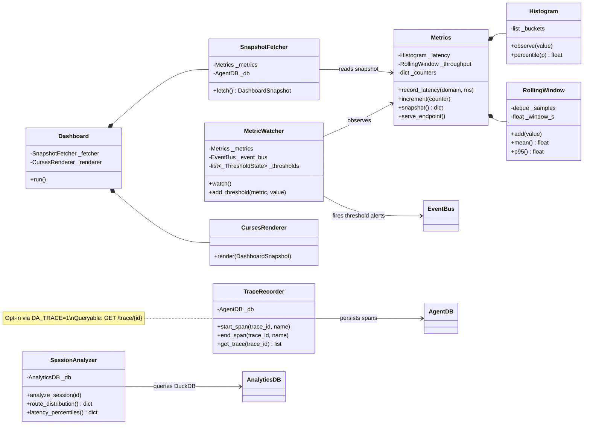

# Python Class Diagrams — by Concern

Eight focused class diagrams covering the PC-side (Python) architecture, decomposed
by layer. Supersedes the monolithic Python section formerly in
[02-class-diagram.md](02-class-diagram.md) (which retains the iPad/Swift side).

Reflects the post-PR-#153 `HybridCoordinator` decomposition. All class names were
verified against the codebase on 2026-07-02 (26 spot-checked, including
`VoicePromptComposer`, `MCPTrustClassifier`, `FlickEngine`, `VLLMSpecialistPool`,
`GyroBiasCalibrator`); the Gate 0–4 note matches `core/gate_evaluator.py`, the
VisionGrounder fallback matches `desktop/vision_grounder.py`, and
`CoordinatorConfig.anthropic_model` matches `core/hybrid_coordinator.py`.

| # | Diagram | Key modules |
|---|---------|-------------|
| 1 | Top-Level Pipeline | `main.py`, `core/ipad_bridge.py`, `core/fusion_engine.py`, `core/supervisor.py`, `core/resource_governor.py` |
| 2 | HybridCoordinator Decomposition | `core/hybrid_coordinator.py`, `core/gate_evaluator.py`, `core/inference_runner.py`, `core/action_executor.py`, `core/workflow_handler.py`, `core/voice_system_control.py` |
| 3 | Inference & Dev-Agent Layer | `inference/model_router.py`, `inference/local_inference.py`, `inference/dev_agent.py`, `core/goal_session.py` |
| 4 | Sensor Layer | `sensors/`, `calibration/`, `core/whisper_stream.py` |
| 5 | Storage Layer | `storage/db.py`, `storage/analytics_db.py`, `storage/memory_manager.py`, `storage/personal_kb.py` |
| 6 | Adaptive / Learning Layer | `adaptive/behavioral_twin_state.py`, `adaptive/continuous_trainer.py`, `adaptive/mcp_trust_classifier.py` |
| 7 | Desktop Automation Layer | `desktop/` (`command_executor`, `ui_automation`, `vision_grounder`, `target_cache`, `flick_engine`) |
| 8 | Monitoring & Observability | `monitoring/` (`metrics`, `trace`, `metric_watcher`, `dashboard`), `storage/session_analyzer.py` |

> Per AGENTS.md #1, `storage/db.py` remains the source of truth for the DB schema;
> these diagrams show class collaboration, not schema.

---

## 1 · Top-Level Pipeline (Entry → Orchestration)

---

## 2 · HybridCoordinator Decomposition

---

## 3 · Inference & Dev-Agent Layer

---

## 4 · Sensor Layer

---

## 5 · Storage Layer

---

## 6 · Adaptive / Learning Layer

---

## 7 · Desktop Automation Layer

---

## 8 · Monitoring & Observability Layer

