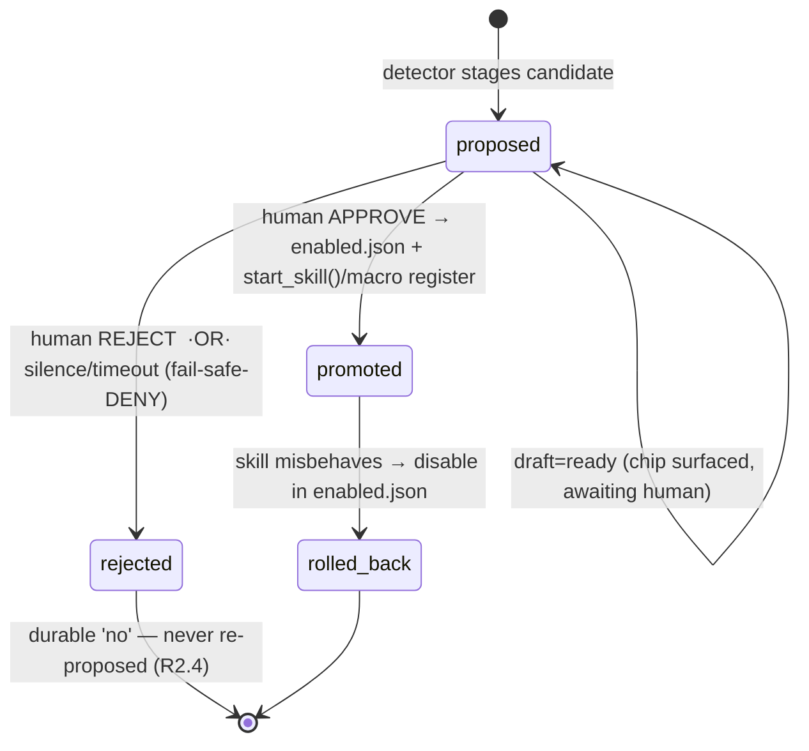

# Design: Self-Skilling

> Companion to `requirements.md`. This layer fixes the detector algorithms, the
> candidate lifecycle (mapped onto the existing `self_evolution_candidates` columns
> with **no schema change**), the module layout, and the security boundary.

---

## 1. Data sources (all already exist)

The detectors are **read-only miners** over tables that already journal experience.
No new capture path is added.

| Source | Columns the miner reads | What it yields |
|---|---|---|
| `agent_runs` | `goal, domain, success, status, step_count, ts` | the unit of "an attempt" — success/fail + which plan |
| `agent_steps` | `run_id, step_num, action, args, body, success` | **the ordered trajectory** — the raw material for a macro |
| `few_shot_counterexamples` | `text, reason='pipeline_failure', domain` | recurring *wrong/failed* mappings → gap signal |
| `episodic_memory` | `goal, kind='recovery', summary, pain_day_*` | how a failure was eventually worked around (gap context) |
| `self_evolution_candidates` | existing rows | dedup + "already rejected, don't re-propose" (R2.4) |

`SkillRegistry.list_actions()` + the 16-verb set give the **current capability
surface** the GapDetector checks against.

---

## 2. MacroDetector (rung 2)

### 2.1 Plan signature

Each successful run is reduced to a canonical **signature** — the verb sequence
with literals abstracted to typed slots, so two runs that differ only in their
arguments collapse to the same shape.

```python
# per run_id, ordered by step_num, success=1 only
def canonicalize(step) -> str:
    verb = step["action"]                      # e.g. OPEN, WRITE_FILE, CLICK
    slots = arg_template(step["args"])         # {"path": "<PATH>", "app": "<STR>"}
    return f"{verb}({','.join(sorted(slots))})"

signature = " → ".join(canonicalize(s) for s in steps)
# e.g.  OPEN(app) → CLICK(target) → TYPE(text) → HOTKEY(keys)
```

`arg_template` replaces concrete values with typed placeholders (`<PATH>`,
`<STR>`, `<INT>`, `<URL>`). The **literals are retained separately** as the macro's
parameter bindings — the varying ones become macro parameters, the constant ones
become baked-in defaults.

### 2.2 Clustering & threshold

1. **Exact pass (cheap, deterministic):** group successful runs by identical
   signature. Count distinct runs per signature.
2. **Fuzzy merge (optional):** merge two signatures whose token-sequence similarity
   ≥ `macro.similarity` (default 0.9), using a normalized sequence ratio over the
   verb tokens (SequenceMatcher-style — *not* an LLM). Conservative: only merge,
   never split.
3. A cluster with ≥ `macro.min_occurrences` distinct runs (default 4) and ≥ 2 steps
   is a **macro candidate**. (1-step "macros" are noise — already a single verb.)

### 2.3 Naming & staging

- `text` = a human-readable name derived from the most common `agent_runs.goal` in
  the cluster (e.g. "open clinic scheduler and start a note").
- `action_or_wrong` = the **signature** (serves as the `UNIQUE` dedup key, so
  re-detecting the same shape returns the existing row — satisfies R1.4).
- `kind = "macro"`, `status = "proposed"`,
  `source_refs = {"run_ids": [...], "param_slots": [...], "defaults": {...}}`.
- All referenced verbs/tools must currently exist (R1.3) — checked against the verb
  set + `SkillRegistry` before staging.

Runs offline in a supervised loop (cloned from `ProactiveScheduler`); skipped while
a flare is active (R1.5).

---

## 3. GapDetector (rung 3 trigger)

```
failed_runs  = agent_runs WHERE success=0 OR status IN ('failed','interrupted')
gap_signals  = failed_runs ⨝ few_shot_counterexamples(reason='pipeline_failure')
clusters     = cluster_by_intent(gap_signals.goal)   # embedding (reuse personal_kb
                                                      # vectors) else keyword Jaccard
for c in clusters where size(c) >= gap.min_occurrences:        # default 3
    if composable_from_existing_tools(c):    # a plan of current verbs/tools exists
        stage(kind="macro", ...)             # R2.3 — prefer composition, no new code
    elif not already_seen(c):                # R2.4 — respect a prior 'rejected'
        stage(kind="skill_proposal",
              text=capability_description(c),         # NL, offline-summarized
              action_or_wrong=proposed_skill_id,      # dedup key
              source_refs={"run_ids":[...], "counterex_ids":[...]})
```

`composable_from_existing_tools` is the anti-sprawl guard: it asks the planner
(offline, already-loaded model) whether the recurring intent can be satisfied by a
plan over *current* tools. If yes → it was never a capability gap, only a routing
gap → emit a macro, not a new skill.

`already_seen` checks `self_evolution_candidates` for a matching
`(kind, action_or_wrong)` in status `proposed` **or** `rejected` — a human "no" is
durable.

---

## 4. SkillProposer (rung 3 drafting) — reuses existing gates

When a `skill_proposal` is selected for drafting, it routes through the **exact**
DevAgent WRITE_FILE pipeline already shipped — no new validation logic:

```
SkillProposer.draft(candidate):
    spec_prompt  = build_skill_spec(candidate)            # capability + I/O contract
    server_src   = DevAgent.generate(spec_prompt, model=plan_model)
    # 1. PRE-WRITE lint gate — inference/edit_format.py (ast.parse, fail-closed)
    if EditApplier.apply(...) raises EditError:
        record(candidate, draft="lint_failed"); return        # R3.2 no file written
    # 2. Independent Critic — inference/critic.py (fresh reviewer context, no new VRAM)
    verdict = Critic.review(diff)
    if verdict in (REVISE, BLOCK):
        record(candidate, draft="critic_" + verdict); return   # R3.3
    write(server_src) ; write(manifest, enabled=False) ; write(pytest)
    # 3. Autonomous Tester — inference/tester.py → sandbox.run_sandboxed (one-shot)
    test_outcome = Tester.run(pytest)
    record(candidate, draft="ready", eval_delta=test_outcome)  # R3.4 observation only
    surface_approval_chip(candidate)                           # R4.2
```

Writes are **scope-pinned** to `skills/servers/`, `skills/manifests/`, `tests/`
(R3.1, `AGENTS.md` #7). Every external-effect tool in the drafted manifest is
listed in `send_tools` (R3.5); unknown effect ⇒ `is_send_tool` fail-safe gates it.

---

## 5. Candidate lifecycle (no schema change)

The existing `status` column has exactly four values: `proposed | promoted |
rejected | rolled_back`. The richer drafting lifecycle is tracked as a **substate
in `source_refs` JSON** (`"draft": lint_failed | critic_revise | tester_fail |
ready`), so no migration is needed.



Key invariants on this machine:
- **No edge sets `enabled: true` except the human-APPROVE edge** (R4.1) — the
  rung-4 firewall is literally the absence of an auto-promote transition.
- `proposed → rejected` is the default on silence/timeout (`AGENTS.md` #4).
- `rejected` is terminal and durable (a prior "no" suppresses re-proposal).
- The optional `DA_SELF_EVOLVE` auto-promote that exists for `example`/
  `counterexample` kinds **does not apply** to `macro`/`skill_proposal` — those
  always require the human edge (enforced in the promoter, not just by config).

---

## 6. Promotion & replay

### 6.1 Macro (rung 2)
On approve, a `MacroStore` registers `keyword → (signature, param_slots, defaults)`
and exposes it as a routable intent (same matcher surface as `SkillRegistry`
intents). Replay expands the macro into its constituent steps and dispatches them
**through the normal `CommandExecutor`** (R5.2) — no new execution mechanism, every
existing gate still fires. If any constituent tool is missing at replay time, the
macro fails safe with CLARIFY (R5.3).

### 6.2 Skill (rung 3)
On approve: write `{skill_id: true}` to `~/.claude/skills/enabled.json` (user
state, never the checked-in manifest) and call `SkillRegistry.start_skill(skill_id)`
for hot-load without restart (R4.3). From that moment the self-authored skill is
indistinguishable at runtime from a human-authored one — same inbound taint, same
`ContentFilter` scrub, same send-gate in `DevAgent._execute_skill_step` (R4.6).

---

## 7. Module layout

```
adaptive/macro_detector.py     # §2  — offline miner, plan-signature clustering
adaptive/gap_detector.py       # §3  — offline miner, gap-vs-macro arbitration
inference/skill_proposer.py    # §4  — drafting via lint→Critic→Tester (reuse)
core/macro_store.py            # §6.1 — register + safe replay of approved macros
# wiring: a supervised background tick in main.py (NOT the fusion loop) drives the
# two detectors; the approval chip reuses spawn_task; promotion reuses
# enabled.json + SkillRegistry.start_skill().
```

No changes to `core/fusion_engine.py`, `core/command_executor.py`, the verb set, or
any per-feature prompt (`AGENTS.md` #2, #10 — and rung-3 drafts are greenfield
files, the one case #10 permits whole-file generation).

---

## 8. Security boundary (the part that matters most)

| Threat | Mitigation |
|---|---|
| Self-authored code runs unreviewed | lint (ast) **+** Critic **+** Tester all pre-enable; arbitrary code never auto-enabled (R4.1) |
| Self-authored skill exfiltrates data | identical send-gate + `ContentFilter` scrub as any skill (R4.6); unknown-effect tools fail-safe-gated (R3.5) |
| Agent grants itself secrets | `auto_provision_credentials: false`, MUST-stay-false; credential needs surfaced to Brad, never self-filled (R4.5) |
| Skill sprawl / clutter | `composable_from_existing_tools` prefers macros (R2.3); `rejected` is durable (R2.4); `min_occurrences` thresholds |
| Drafting escapes scope | writes pinned to `skills/`, `tests/` only (R3.1, `AGENTS.md` #7) |
| Bad macro replays a partial sequence | missing-tool → CLARIFY, never partial exec (R5.3) |

---

## 9. Open questions (resolve before rung 3 implementation)

1. **Intent clustering quality** — embedding (reuse `personal_kb` vectors) vs.
   keyword Jaccard for `cluster_by_intent`. Start keyword (deterministic, no model
   on the miner); revisit if recall is poor. *Eval suite should measure this.*
2. **Drafting retry bound** — how many `lint_failed`/`critic_revise` cycles before a
   `skill_proposal` is parked? Propose reuse of `DA_CRITIC_MAX_REVISIONS` semantics.
3. **Macro parameter inference** — distinguishing a genuine parameter from
   incidental variation across runs. Conservative default: a slot is a parameter
   only if it takes ≥ 2 distinct values across the cluster.
